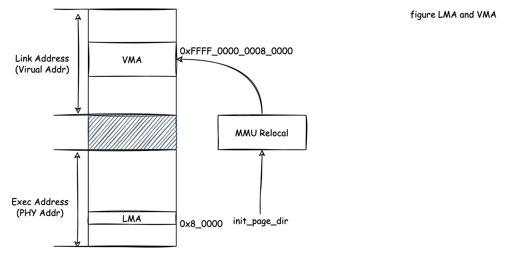
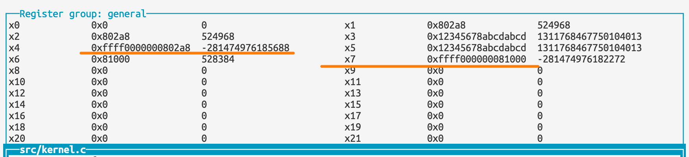
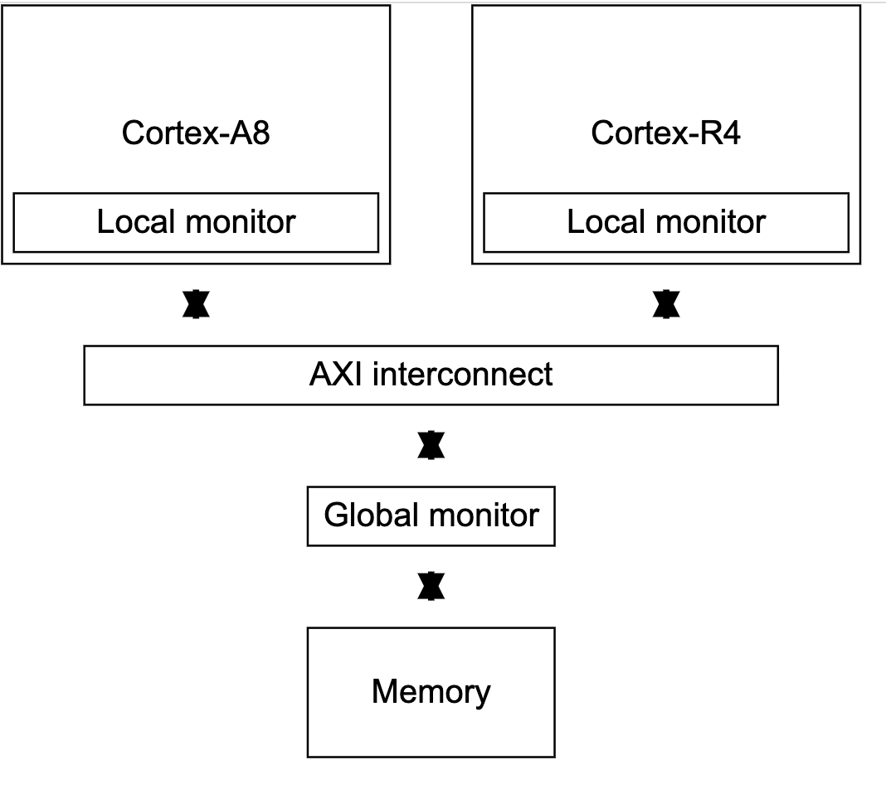

# 06\_ARMv8\_指令集\_一些重要的指令

* PC相对地址加载指令： [ADR](#1.1 ADR), ADRP
* 内存独占加载和存储指令：LDXR, STXR
* 异常处理指令：SVC, HVC, SMC   (不包含在本期内)
* 系统寄存器访问指令：MRS, MSR 
* 内存屏障指令：DMB, DSB, ISB  

## 1. PC相对地址加载指令

### 1.1 指令ADR

从**相对于**PC地址加一个立即数写入目标寄存器，Xd = PC + imm，得到偏移imm的PC地址的地址。实际上，执行的ADD/SUB 对PC地址的指令[^1]。

- Define: `ADR <Xd>, <label> ` .  **Note, <label>的范围是 ±1MB。**
- Example1: `adr x1, #0xff `-> 当前PC值，加上0xff写入x1

这里一直强调一个相对PC，这个相对这个词用的十分有讲究，具体参考，[1.4 ADR和LDR的陷阱](#1.4 ADR和LDR的陷阱).

### 1.2 指令ADRP

ADRP首先找到PC向下4K对齐的位置（寻找4K对齐的基地址）[^1]，然后加上给定的<label>赋给Xd寄存器。寻找4K向下地址可以给值的低12位（2^12=4096）清零，就可以了，这个实现可以参考链接的例子[^2]。

- Define: `ADRP <Xd>, <label> ` .  **Note, <label>的范围是 ±4GB。**
- Example1: `adrp x1, #0xff `-> 当前PC值->找到4k对齐的基地址->加上0xff写入x1。

### 1.3 Example

#### 1.3.1 对比LDR和ADR指令

新建一个汇编文件，在汇编代码中定义一个my_test_data的标签

```assembly
.align 3
.global my_test_data
my_test_data:
	.dword 0x12345678abcdabcd
```

* 使用ADR和ADRP指令来读取.my_test_data的地址以及该地址的值
* 请使用LDR指令读取.my_test_data的地址及该地址的值

【分析】：ADR和ADRP指令读取.my_test_data的地址，函数的地址势必是PC执行的地址，因此地址必须和PC关联，因此，标签自身的值+PC的值就应该是.my_test_data的地址，ADR x1, my_test_datal, 接着使用LDR x2, [x1]把x1寄存器地址里面的值加载到X2寄存器。**x2的值应该是.dword的值**。

```assembly
.global test_adr
.align 3
.global my_test_data

my_test_data:
	.dword 0x12345678abcdabcd

test_adr:
	adr x1, my_test_data
	adrp x2, my_test_data
	// read back offset
	add x2, x2, #:lo12:my_test_data
	ldr x3, [x1]

	// using ldr read label
	// my_test_data -> x4
	ldr x4, =my_test_data
	// *my_test_data -> x4
	ldr x5, my_test_data

	ret
```

####  1.3.2 页地址加载

修改链接文件linker.ld，在树莓派的4MB内存地址上分配一个4096大小的页面init_pg_dir，用来存储页表。请使用adrp和ldr指令来加载init_pg_dir的地址到通用寄存器。

* 创建4096大小的init_pg_dir, 在linker.ld文件中SECTIONS括号内部输入：

  ```
  	. = 0x400000,
  	init_pg_dir = .;
  	. += 4096;
  ```

* 在汇编代码里面直接读取该符号

  ```assembly
  	// read init_pg_dir address
  	adrp x6, init_pg_dir
  	ldr x7, =init_pg_dir
  ```

  Note,  这里必须使用adrp，如果使用adr，会收到下面的错误信息`asm_test.S:22:(.text+0x20): relocation truncated to fit: R_AARCH64_ADR_PREL_LO21 against symbol init_pg_dir defined in .rodata section in build/benos.elf` 。原因是，init_pg_dir可输入的范围是1MB(0x100000)，现在是4MB位置(0x400000)，ADR无法访问到这个地址。

### 1.4 ADRP和LDR的陷阱

从上面的[example2](#1.3.2 页地址加载)，似乎可以得到ADR和LDR可以通用的结论，LDR可以访问64bit整个地址空间的加载，但是ADR可以访问±4GB的地址空间，ADR为什么还有存在的必要呢？实际上这里涉及ELF文件的VMA和LMA的一个知识（在 [03_ELF文件_静态链接](https://github.com/carloscn/blog/issues/11)的2.2 两步链接（Two-pass Linking），提到了VMA和LMA的概念，里面虚拟地址和物理地址在某些嵌入式系统里面可能会不一样），我们在树莓派的BOOTROM场景下，若把程序加载到0x8_0000的地址外运行，此时就会出现一个问题。

* 若init_page_dir没有被MMU重定位，那么使用ldr和adrp指令能得到一个相同的结果。
* 若init_page_dir有被MMU重定位，那么使用ldr和adrp指令就会得到不同的结果，你会发现，使用adrp指令会找当前的PC值加上偏移，因此还是在运行地址范围内；使用ldr指令加载的是VMA的地址，会得到被MMU重定位的地址。
* PC永远都是在运行地址之内的，所以看到这个”相对的“这个词还是很有讲究的。
* 树莓派的BOOTROM下，如果初始化了MMU页表操作之后，adrp和ldr的使用就会出现问题。



我们现在制造一个LMA和VMA不同的情况，以研究ADRP和LDR的差别，基于上面的[example2](#1.3.2 页地址加载)：

* 修改link.ld文件，使整个区域被映射到0xFFFF_0000_0008_0000高地址上，此时被编译出来的elf文件的链接地址全部都被放到高地址上。

  ```cmd
  SECTIONS
  {
  	. = 0xFFFF000000080000,
  	.text.boot : { *(.text.boot) }
  	.text : { *(.text) }
  	.rodata : { *(.rodata) }
  	.data : { *(.data) }
  	. = ALIGN(0x8);
  	bss_begin = .;
  	.bss : { *(.bss*) }
  	bss_end = .;
  
  	. = ALIGN(4096),
  	init_pg_dir = .;
  	. += 4096;
  }
  ```

* 在调试的时候使用GDB调试手段，`add-symbol-file`[^3]强制使ELF文件在0x8_0000地址运行，此时PC也在这个范围内。`aarch64-linux-gnu-readelf -S benos.elf`

  ```
  Section Headers:
    [Nr] Name              Type             Address           Offset
         Size              EntSize          Flags  Link  Info  Align
    [ 1] .text.boot        PROGBITS         ffff000000080000  00010000
         0000000000000030  0000000000000000  AX       0     0     4
    [ 2] .text             PROGBITS         ffff000000080030  00010030
         00000000000002b8  0000000000000000  AX       0     0     8
    [ 3] .rodata           PROGBITS         ffff0000000802e8  000102e8
         000000000000001c  0000000000000000   A       0     0     8
  ```

  在GDB加载符号之前使用`add-symbol-file benos.elf 0x80030 -s .text.boot 0x80000 -s .rodata 0x802e8` ，把.text.boot, .text, .rodata段强制替换到树莓派可以运行的地址上面。

* 使用ldrp指令访问的x2, x1寄存器都是在GDB使用的PC（LMA），而x4和x7使用LDR指令的加载的都是链接地址也就是VMA。

  

## 2. 内存独占加载和存储指令

在介绍内存独占加载和存储指令之前，先科普一下ARMv8架构里面的一个机制-独占监视器(Exclusive monitor)[^4] ，虽然这个这个是ARMv6比较老的架构上面的文章，但是这个原理是不变的。ARM里面有两个独占监视器，一个本地的独占监视器，还有一个是全局的独占监视器。本地的独占监视器用于监视non-shareble/shareble的地址访问，全局的独占监视器用于监视shareble的地址访问（多核，如图Cortex-A8/Cortex-R4）。LDXR指令会让监视器进入到独占状态，STXR存储只有当独占监视器还处于独占状态的时候才可以存储成功。



实际上内存独占和加载指令为操作系统的一些原子操作提供底层的技术支持，Linux内核一些atomic的访问，比如atomic_write(), atomic_set_bit()的这些原子操作在底层的指令都有涉及到内存独占。这里有个文章可以参考，spinlock上面如何应用LDXR, STXR[^5].

### 2.1 指令LDXR

内存独占加载指令。以内存中独占exclusive的方式加载内存地址到通用寄存器。

- Define: `LDXR <Xt>, [<Xn|SP{, #0}>] ` 
- Example1: `ldxr x1, sp `-> 当前sp指针独占地加载到x1寄存器

### 2.2 指令STXR

内存独占存储指令。

- Define: `STXR <Ws>, <Xt>, [<Xn|SP{, #0}>] ` 
- Example1: `stxr w0, x1, sp `-> 独占的把x1的内容写入到sp内，写入结果放在w0寄存器，w0为0表示写入成功，w0为1表示写入失败。**Note， w0是一个32位的寄存器。**

### 2.3 Example

#### 2.3.1 实现atomic_write函数

使用汇编实现atomic_write函数，在汇编定义数据my_data，初始化为0，然后使用atomic_write来写入my_data的这个数据atomic_write(0x34)，使用C语言调用这个函数测试。

这个C语言代码：

```c
int  my_data = 0;
int atomic_write(int a)
{
  my_data = a;
  return a;
}
```

ASM：

```assembly
.section .data
.align 3
.global my_test_data
my_test_data:
	.dword 0
.section .text
.global my_atomic_write
my_atomic_write:
	// get my_test_data addr atomicl
	ldr x2, =my_test_data
1:
	ldxr x1, [x2]
	orr x1, x1, x0
	// save x0 to x2, the result on w0
	stxr w0, x1, [x2]
	cbnz w0, 1b
	mov x0, x2
	ret
```

Note, 汇编里面要映射.data和.text区域，否则在某些环境会报段错误。

## 3. 系统寄存器访问指令

对于系统寄存器的访问不能像是通用寄存器一样，系统寄存器非常特殊，所以就需要特殊的指令进行访问。

* MRS
  * Define:  `MRS <Xt>,(<sestem_reg>|S<op0>_<op1>_<Cn>_<Cm>_<op2>)`
* MSR
  * Define1: `MSR <pstatefiled>,#<imm>`
  * Define2: `MSR (<sestem_reg>|S<op0>_<op1>_<Cn>_<Cm>_<op2>), <Xt> `


## 4. 内存屏障指令

内存屏障指令DMB, DSB还有ISB指令

* DMB (Data Memory Barrier)[^6]

  保证内存屏障前后的内存访问指令的执行顺序

  * Define:  `DMB <option>|#<imm>`

* DSB (Data synchronization Barrier)[^7]

  任何执行都要等待DSB前面的存储访问完成

  * Define1: `DSB <pstatefiled>,#<imm>`

* ISB (Instrution synchronization Barrier)[^8]

  冲洗流水线和预取buffer，才会从高速缓存或者内存中预取ISB指令之后的指令

  * Define1: `DSB <pstatefiled>,#<imm>`

## Ref

[^1]: [汇编七、ADRP指令](https://www.jianshu.com/p/e5452c97cfbd)
[^2]: [test_bits.c: test_4k_align_using_the_clear](https://github.com/carloscn/clab/blob/master/linux/test_bits_operation/test_bits.c)
[^3]: [GDB Maunal - 18.1 Commands to Specify Files](https://sourceware.org/gdb/onlinedocs/gdb/Files.html#Files)
[^4]: [ARM Synchronization Primitives Development Article - Exclusive monitors](https://developer.arm.com/documentation/dht0008/a/arm-synchronization-primitives/exclusive-accesses/exclusive-monitors?lang=en)
[^5]:[Exclusive monitor在spinlock中的应用 - Cache One ](https://cache.one/read/14569538)
[^6]:[Arm Armv8-A A32/T32 Instruction Set Architecture  -  DMB](https://developer.arm.com/documentation/ddi0597/2021-12/Base-Instructions/DMB--Data-Memory-Barrier-?lang=en)
[^7]:[Arm Armv8-A A32/T32 Instruction Set Architecture  -  DSB](https://developer.arm.com/documentation/ddi0597/2021-12/Base-Instructions/DSB--Data-Synchronization-Barrier-?lang=en)
[^8]:[Arm Armv8-A A32/T32 Instruction Set Architecture  -  ISB](https://developer.arm.com/documentation/ddi0597/2021-12/Base-Instructions/ISB--Instruction-Synchronization-Barrier-?lang=en)

