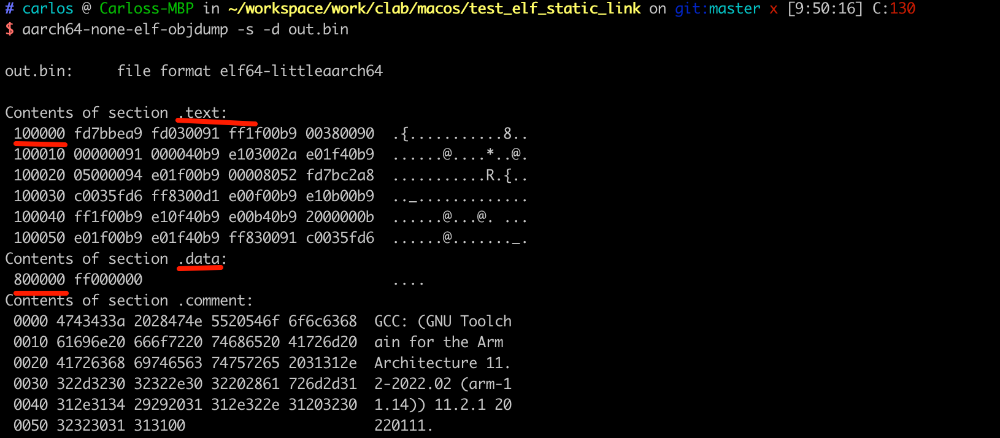
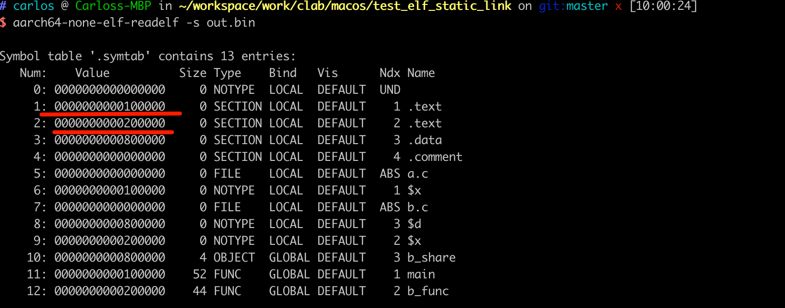
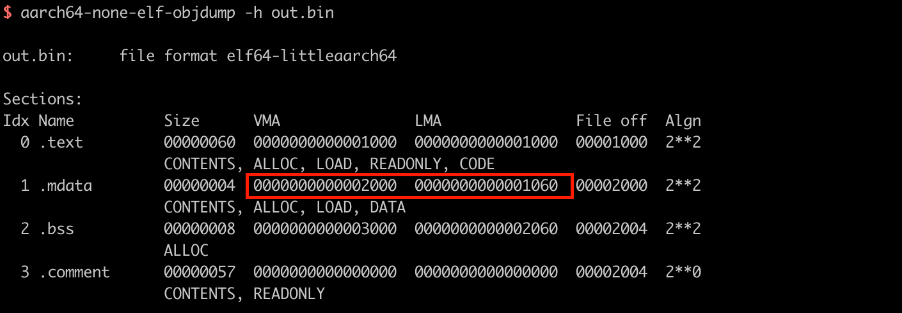

# 08_ARMv8_链接器和链接脚本

我们在[03_ELF文件_静态链接](https://github.com/carloscn/blog/issues/11)里面提到了对于一般性Linux的最终的ELF文件的内部结构，包含了各种段，然后相同的符号是如何进行链接的，怎么生成一个ELF文件的。在Linux里面，使用aarch64-linux-gnu-gcc可以说是一个比较high-level的编译器，里面有个默认的链接配置，而如果使用aarch64-none-elf-gcc这种baremental环境下的编译器，可能就要自己进行链接和写一些链接脚本。我们研究ARMv8的gcc、ld的编译算是对ELF_静态链接的一个扩展，来更熟悉链接这个过程，加深对于ELF文件的理解。

## 01 aarch64-none-elf-ld[^1]

链接器英文是Linker，用于把多个目标文件的代码段、数据段、符号表等链接到一起组合成为一个二进制文件的bin-utils工具。为什么叫LD？根据文献[^2]，LD的原名叫做，loaDer和Link eDitor，所以简写为LD。我们来研究一下ld的命令行：

### 1.1 cmd

```bash
ld -o output.bin /lib/crt0.o hello.o -lc
```

上面是把crt0.o和hello.o以及libc.a连接成output.bin，`-lc`的表示包含libc(这个我试了一下aarch64-编译器无论是linux的还是baremental的都并不支持这个选项，只有x86自身的gcc是支持的)

看一个比较复杂的例子，在benos里面的例子：

`aarch64-linux-gnu-ld -T src/linker.ld -Map benos.map -o build/benos.elf build/printk_c.o build/irq_c.o build/string_c.o`

这里就有几个比较常用的ld的command line的参数，ld的参数实在是太多了看着有点绝望，先暂时掌握以下几个，然后浏览一下文档大概有个印象：

| 选项      | 说明                                                         |
| --------- | ------------------------------------------------------------ |
| -T        | 指令链接脚本                                                 |
| -Map      | 输出一个符号表                                               |
| -o        | 输出的二进制文件                                             |
| -b        | 执行目标代码输入文件的格式                                   |
| -e        | 使用指定的符号作为程序的初试执行点 `aarch64-none-elf-ld -o out.bin a.o b.o -e main` |
| -l        | 执行库文件添加到要链接的文件清单中                           |
| -L        | 指定路径添加到搜索库的目录中                                 |
| -S        | 忽略来自输出文件的调试器符号信息                             |
| -s        | 忽略来自输出文件的所有符号信息                               |
| -t        | 在处理输入文件时显示他们的名称                               |
| -Ttext    | 使用指定的地址作为代码段的起始点                             |
| -Tdata    | 使用指定的地址作为数据段的起始点                             |
| -Tbss     | 使用指定地址作为bss段的起始点                                |
| -Bstatic  | 只使用静态库                                                 |
| -Bdynamic | 只是用动态库                                                 |
| -defsym   | 在输出文件中定义指定的全局符号                               |

### 1.2 链接脚本

#### 1.2.1 基础例子

`-T`参数指定ld的链接脚本，可以告诉链接器，最终生成的可执行文件需要按照工程师的意愿进行空间布局。

```cmd
SECTIONS{
	. = 0x100000;				// . is location counter (lc)
	.text : { *(.text) }		// 所有的o文件的text段
	. = 0x800000;
	.data : { *(.data) }    // 所有o文件的data段
	.bss : { *(.bss) }
}
```

我们现在准备a.c和b.c文件，然后使用gcc -c的方式把两个文件编译成独立的.o文件，然后使用上面的链接脚本，把text段放在0x100000,并把data段放在0x800000。

`$ aarch64-none-elf-ld -o out.bin a.o b.o -e main -T linker.ld`

使用objdump来来查看elf文件结构

`$ aarch64-none-elf-objdump -s -d out.bin`



观察发现，.text已经被映射到0x100000上面，.data已经被映射到0x800000上面。我们对linker的脚本稍微做下修改，让a.o和b.o的text段在不同的位置，a.o的text段在0x100000，而b.o的text段在0x20000，使用ld进行链接，然后查看readelf的结果

```
SECTIONS{
	. = 0x100000;
	.text : { a.o(.text) }
	. = 0x200000;
	.text : { b.o(.text) }
	. = 0x800000;
	.data : { *(.data) }
    . = 0x900000;
	.bss : { *(.bss) }
}
```

对于输入文件我们还可以使用EXCLUDE_FILE的内置函数来排除一些文件，例如`EXCLUDE_FILE (*CRETN.o )`

`$ aarch64-none-elf-ld -o out.bin a.o b.o -e main -T linker.ld`

不使用objdump，使用readelf也可以拿到这个值：

`aarch64-none-elf-readelf -s out.bin`



看到两个.text段，一个是a.o的text，一个是b.o的text段。**如果在linker脚本中不指定lc的位置，那么紧凑排列的**。

#### 1.2.2 指定入口

上面所有命令都是-e main指定程序入口的地址，在链接脚本中也可以指定使用ENTRY()内置函数。

```
ENTRY(main)
SECTIONS{
    . = 0x100000;
    .text : { a.o(.text) }
    . = 0x200000;
    .text : { b.o(.text) }
    . = 0x800000;
    .data : { *(.data) }
    . = 0x900000;
    .bss : { *(.bss) }
}
```

优先级：

* -e指定入口地址
* ENTRY内置函数
* 特定符号 start
* 使用代码段的起始段
* 使用地址0

#### 1.2.3 符号赋值与引用

我们在linker脚本里面定义了start_of_text标识符，然后在c语言文件里面使用extern char start_of_text[];就可以轻松访问到这个位置的地址。

```bash
ENTRY(main)
SECTIONS{
    . = 0x100000;
    start_of_text = .;
    .text : { a.o(.text) }
    end_of_text = .;
    . = 0x200000;
    .text : { b.o(.text) }
    . = 0x800000;
    .data : { *(.data) }
    . = 0x900000;
    .bss : { *(.bss) }
}
```

甚至还可以在这里面 + - * /的计算地址。

#### 1.2.4 section指定格式

```d
section [address] [(type)]:
	[AT(lma)]
	[ALIGN(section_align)]
	[constraint]
	{
		output-section-command
		output-section-comaand
		...
	} [>region] [AT>lma_region] [:phdr :phdr ...] [=fillexp]
```

| 名字                   | 含义                        |
| ---------------------- | --------------------------- |
| section                | 段的名字，例如.text .data段 |
| address                | 虚拟地址的名字              |
| type                   | 输出端的属性                |
| lma                    | 加载地址                    |
| ALIGN                  | 对齐要求                    |
| output-section-command | 描述输入端如何映射到输出段  |
| region                 | 特定的内存区域              |
| phdr                   | 特定的程序段                |

Note, 如果没有AT指定LMA的地址，那么LMA和VMA是一致的。在嵌入式系统中，经常存在加载地址和虚拟地址不同的情况，如将映像文件加载到开发板的闪存中（由LMA指定），而bootloader需要将闪存内的文件复制到SDRAM里面（由VMA指定）。

我们这里根据benos里面提示的，构建一个基于ROM的映像文件，设定VMA和LMA地址不一样，映像文件存储在ROM中，运行程序的时候需要把ROM的映像文件复制到RAM中。ROM对应LMA，RAM对应VMA。

```bash
SECTIONS {
    .text   0x1000 :
    {
        *(.text);
        _etext = .;
    }

    .mdata  0x2000 :
    AT ( ADDR (.text) + SIZEOF (.text) )
    {
        _data = .;
        *(.data)
        _edata = .;
    }

    .bss    0x3000:
    {
        _bstart = .;
        *(.bss)
        *(COMMON)
        _bend = .;
    }
}
```

在链接脚本里面.mdata的区域为.text的基地址加上.text的大小，所以能看见VMA还是保持原来的样子，但是LMA已经变为0x1060了。

`aarch64-none-elf-objdump -h out.bin`



这样我们需要把0x1060地址的内容加载到0x2000的位置。

```
extern char _etext, _data, _edata, _bstart, _bend;
char *src = &_etext;
char *dst = &_data;

while(dst < &_edata)
	*dst ++ = *src++;
```

#### 1.2.5 内建函数

* ABSOLUTE： 绝对值

  ```的
  . = 0xb00000;
  my_offset1 = ABSOLUTE(0x100);				// 等于0x100
  my_offset2 = 0x100;									// 等于0xb00100
  ```

* ADDR：返回虚拟地址

* ALIGN: 声明下一个align对齐的地址

* SIZEOF: 一个段的大小

## 02 重定位

现在就有个问题了，比如我们编译计算机的程序，如果elf文件都把运行地址定好了，那么就会存在一个问题，不同的机型有着不同的内存结构，而且不同的机器上面运行的app也不一样，我们elf文件中锁定的地址说不定已经被某个应用占用了，那么这个问题如何解决的呢？肯定有一个机制去管理这些地址，让这些地址可以根据自己机器的运行状况，使用内存大小做了一个相对化的处理。我们需要了解三个地址：

* 加载地址：LMA，ARM64处理器上电复位后是从异常向量表开始读取第一条指令，所以通常这个地方是存放代码最开始的部分。
* 运行地址：程序运行时的地址，VMA
* 链接地址：在编译和链接的时指定的地址。(我们称它为LKA)
* 存储地址：

LKA=VMA,  

### 2.1 LMA=VMA=LKA

```
SECTIONS
{
	. = 0x80000,
	.text.boot : { *(.text.boot) }
	.text : { *(.text) }
	.rodata : { *(.rodata) }
	.data : { *(.data) }
	. = ALIGN(0x8);
	bss_begin = .;
	.bss : { *(.bss*) } 
	bss_end = .;
}
```

`aarch64-none-elf-ld -o out.bin a.o b.o -T ben.ld -Map ben.map`

输出ben.map查看地址映射：

```bash
$ cat ben.map

Memory Configuration

Name             Origin             Length             Attributes
*default*        0x0000000000000000 0xffffffffffffffff

Linker script and memory map

LOAD a.o
LOAD b.o
                0x0000000000080000                . = 0x80000

.text.boot
 *(.text.boot)

.text           0x0000000000080000       0x60
 *(.text)
 .text          0x0000000000080000       0x34 a.o
                0x0000000000080000                main
 .text          0x0000000000080034       0x2c b.o
                0x0000000000080034                b_func

.iplt           0x0000000000080060        0x0
 .iplt          0x0000000000080060        0x0 a.o

.rela.dyn       0x0000000000080060        0x0
 .rela.iplt     0x0000000000080060        0x0 a.o

.rodata
 *(.rodata)

.data           0x0000000000080060        0x4
 *(.data)
 .data          0x0000000000080060        0x0 a.o
 .data          0x0000000000080060        0x4 b.o
                0x0000000000080060                b_share

.igot.plt       0x0000000000080068        0x0
 .igot.plt      0x0000000000080068        0x0 a.o
                0x0000000000080068                . = ALIGN (0x8)
                0x0000000000080068                bss_begin = .

.bss            0x0000000000080068        0x8
 *(.bss*)
 .bss           0x0000000000080068        0x4 a.o
                0x0000000000080068                bsssss
 .bss           0x000000000008006c        0x4 b.o
                0x000000000008006c                bss_value
                0x0000000000080070                bss_end = .
OUTPUT(out.bin elf64-littleaarch64)
LOAD linker stubs

.comment        0x0000000000000000       0x57
 .comment       0x0000000000000000       0x57 a.o
                                         0x58 (size before relaxing)
 .comment       0x0000000000000057       0x58 b.o
```

### 2.2 LMA≠(LKA=VMA)

```
SECTIONS
{
	. = 0x80000,
   _stext_boot = .;
	.text.boot : { *(.text.boot) }
   _etext_boot = .;

	.text : AT(0x90000) { *(.text) }
   .rodata : { *(.rodata) }
	.data : { *(.data) }
	. = ALIGN(0x8);
	bss_begin = .;
	.bss : { *(.bss*) }
	bss_end = .;
}
```

```
Name             Origin             Length             Attributes
*default*        0x0000000000000000 0xffffffffffffffff

Linker script and memory map

LOAD a.o
LOAD b.o
                0x0000000000080000                . = 0x80000
                0x0000000000080000                _stext_boot = .

.text.boot
 *(.text.boot)
                0x0000000000080000                _etext_boot = .

.text           0x0000000000080000       0x60 load address 0x0000000000090000
 *(.text)
 .text          0x0000000000080000       0x34 a.o
                0x0000000000080000                main
 .text          0x0000000000080034       0x2c b.o
                0x0000000000080034                b_func
```

可以看到load地址已经和vma不一致了。load地址0x90000，而.text的VMA是0x80000，这种情况下如果程序想要启动，需要把代码段从加载地址复制到链接地址。

### 2.3 VMA≠LKA

我们实际的嵌入式设备有很多ROM和RAM的存储器，有这么多VMA、LMA、LKA之类的也是因为有不同的加载stage导致的。我们理解，首先代码有编译阶段->存储到嵌入式NorFlash或者NandFlash阶段->装载DDR阶段->装载SRAM阶段->CPU执行阶段

* 编译阶段
  * LMA和VMA不一致：存储到ROM阶段的时候需要拷贝ROM地址LMA的数据到VMA
  * 不存在链接地址的概念，或者说LMA = LKA
* 存储到ROM阶段
  * 和编译阶段没有任何区别
  * ROM代码通常包含两部分，一部分是正常功能的，一部分是拷贝内存部分。
* 装载SRAM阶段
  * 假设SRAM地址在(0x00)
  * 会把前4K的部分load到SRAM中。**运行地址和链接地址不一样**，因为SRAM在0x00
  * 指令集这面使用位置无关代码，都是根据PC值的相对位置寻址。
* 装载DDR阶段 
  * 假设DDR地址在(0x4000000)
  * CPU上电复位后从0x0取指令，运行的4K后面第部分 load到DDR
  * 等执行到DDR这面的程序之后，**运行地址和链接地址就一致了**。
  * 这里使用位置有关代码和无关代码都可以。

B指令没办法实现在链接地址运行的程序，只能用LDR对PC寄存器修改值。后面MMU还会对这边进行比较深入的解析。

## Ref

[^1]:[GNU Development Tools - ld - The GNU linker ](https://man.archlinux.org/man/aarch64-linux-gnu-ld.1)
[^2]:[Wikipedia - Linker (computing)](https://en.wikipedia.org/wiki/GNU_linker)
[^3]:[ARM Compiler armlink User Guide Version 5.06 ](https://developer.arm.com/documentation/dui0474/m/linking-models-supported-by-armlink?lang=en)
[^4]:[链接地址、运行地址、加载地址、存储地址 ](https://blog.csdn.net/CSDNmianfeixiazai001/article/details/81455692)

