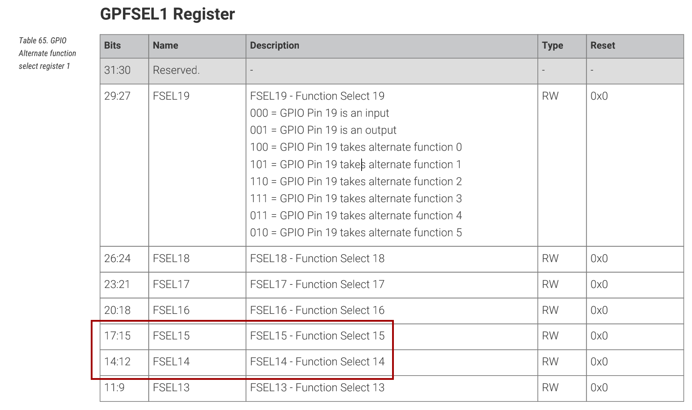
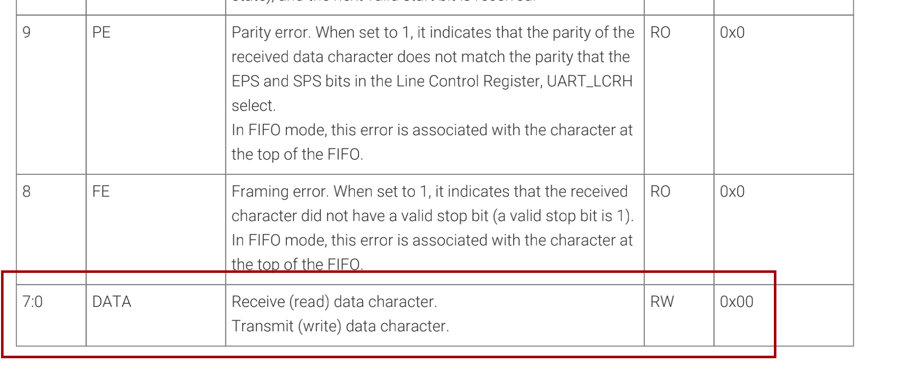
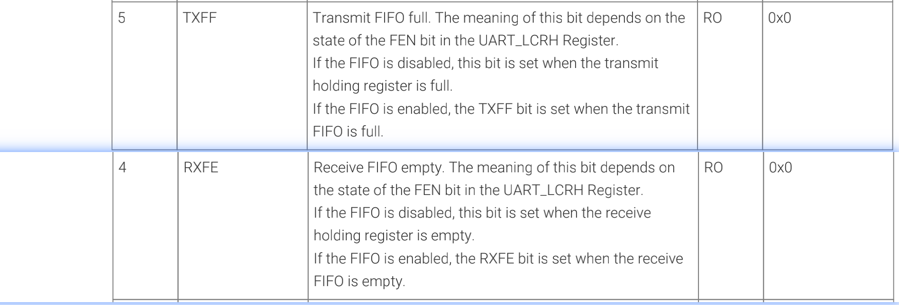
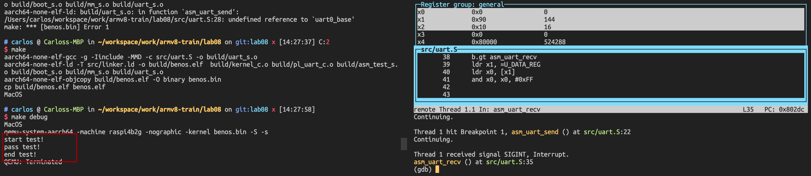

# 0X_ARMv8_指令集_基于汇编的UART驱动

【摘要】：笨叔在完成ARMv8一些指令集操作之后，留了一个编写串口驱动的大作业，我觉得这个也算实操了，根据树莓派的datasheet，我们使用ARMv8的汇编完成UART驱动，也是对这一段时间学习的总结和运用。

【目标】：基于树莓派4B，编写基于UART的汇编驱动，实现UART的初始化、数据发送和数据接收的简单功能（不包含对于串口的FIFO等高级配置）

## 1. 初始化

树莓派串口的初始化操作和一般的bare-mental环境一致的，需要完成以下初始化操作：

* 配置GPIO复用，选择UART0为功能引脚，而不是GPIO口。
* 配置UART的RTL的时钟分频器，还要检查是否UART的时钟被使能。
* 配置UART协议相关项目，115200波特率，8位，1位，无奇偶校验。
* 配置UART中断，这里咱是配置为关闭。
* 使能UART整个模块的开关。

### 1.1 配置GPIO

根据文档[^1]，11.3. Primary UART Inputs and Outputs (*Table 171. UART**Assignment on the** GPIO Pin map*)，查询到UART0的TXD0对应GPIO14， RXD0对应GPIO15，物理属性皆为下拉，选择ALT功能为ALT0。



配置寄存器的GPFSEL1 Register的FSEL15和FSEL14配置GPIO14，GPIO15为100'b(0x4)作为ALT0功能。GPFSEL1的基地址是：0x7e200000 + 0x04。我们可以使用汇编LDR指令，把(1<<17) | (1<< 14) 配置到32位寄存器里面。

```assembly
#define U_BASE       (PBASE+0x00201000)
#define GPFSEL1         (PBASE+0x00200004)
#define GPSET0          (PBASE+0x0020001C)
#define GPCLR0          (PBASE+0x00200028)
#define GPPUD           (PBASE+0x00200094)
#define GPPUDCLK0       (PBASE+0x00200098)
#define GPIO_PUP_PDN_CNTRL_REG0 (PBASE+0x002000E4)
#define U_DATA_REG   (U_BASE)
#define U_FR_REG     (U_BASE+0x18)
#define U_IBRD_REG   (U_BASE+0x24)
#define U_FBRD_REG   (U_BASE+0x28)
#define U_LCRH_REG   (U_BASE+0x2C)
#define U_CR_REG     (U_BASE+0x30)
#define U_IMSC_REG   (U_BASE+0x38)

ldr w15, =GPIO_SEL1
ldr w15, [x15]
mov w16, #1, lsl #17
orr w16, w16, #1, lsl #14
orr w16, w15, w16
ldr w15, =GPIO_SEL1
str w16, [w15]
```

### 1.2 UART配置

这部分内容应该在UART的控制寄存器（CR register）

* 31:16：0000_0000_0000_0000
* 15-CTSEN: CTS硬件流控制，set 0
* 14-RTSEN: RTS流控，set 0
* 13:12  set 00
* 11: RTS: 0
* 10: DTR: 0
* 9: RXE, 使能接受 1
* 8: TXE,使能发送 1
* 7: LBE,数字回环 0
* 6:3 : 0000
* 2: SIRLP: 0
* 1: SIREN: 0
* 0: UARTEN 1

配置如上，应该向CR reg（0x7e201000 + 0x30）写入： 1000_0000_1100_0000_0000_0000_0000_0000'b -> 0x80C00000

```assembly
//diable uart
ldr w16, =U_CR_REG
str wzr, [w16]

mov w16, xzr
add w16, w16, #0x80C00000
ldr w15, =U_CR_REG
str w16, [w15]
```

相应的波特率，中断寄存器也是这样的操作

```assembly
	/* set BRD */
	ldr x1, =U_IBRD_REG
	mov w2, #26
	str w2, [x1]

	ldr x1, =U_FBRD_REG
	mov w2, #3
	str w2, [x1]

	ldr x1, =U_LCRH_REG
	mov w2, #0x70  //(1<<4) | (3<<5)
	str w2, [x1]

	ldr x1, =U_IMSC_REG
	str wzr, [x1]

	ldr x1, =U_CR_REG
	mov w2, #0x301 //1 | (1<<8) | (1<<9)
	str w2, [x1]
```

## 2. 发送和接收

发送和接收使用数据寄存器和标志位寄存器。



判断标志位寄存器：



```assembly
.align 2
.global asm_uart_recv
.global asm_uart_send

asm_uart_send:
    ldr x1, =U_FR_REG               // load FR register address.
    ldr x1, [x1]                    // load address content to x2
    mov x2, #0x01
    and x2, x1, x2, lsl #5          //  get TXFF bit flag.
    cmp x2, #0x0
    b.gt asm_uart_send
    ldr x1, =U_DATA_REG
    str x0, [x1]
    ret

asm_uart_recv:
    ldr x1, =U_FR_REG
    ldr x1, [x1]
    mov x2, #0x01
    and x2, x1, x2, lsl #4
    cmp x2, #0x0
    b.gt asm_uart_recv
    ldr x1, =U_DATA_REG
    ldr x0, [x1]
    and x0, x0, #0xFF
```



## Ref

[^1]:[bcm2711/bcm2711-peripherals.pdf](https://datasheets.raspberrypi.com/bcm2711/bcm2711-peripherals.pdf)