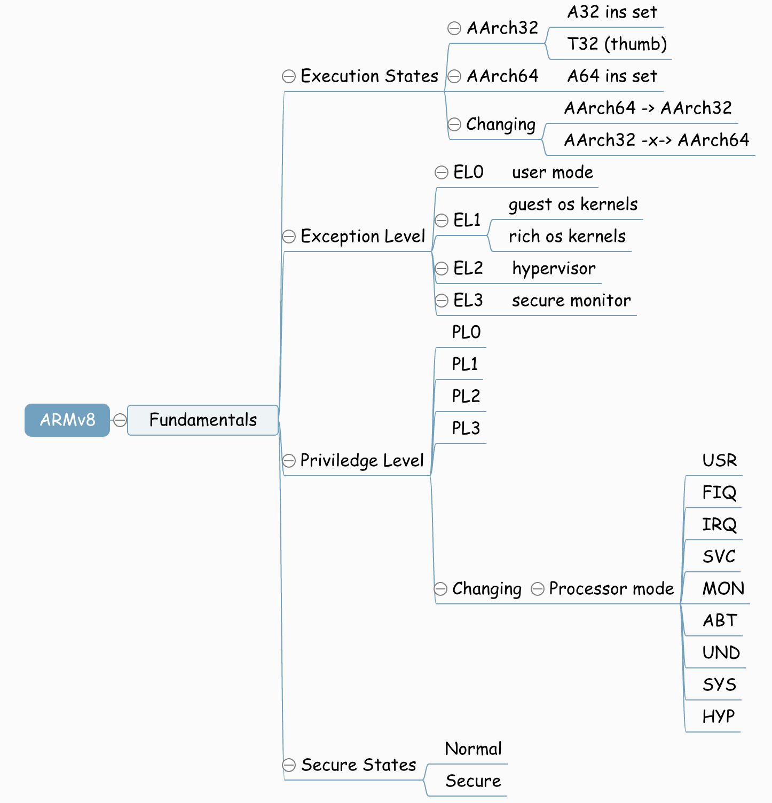
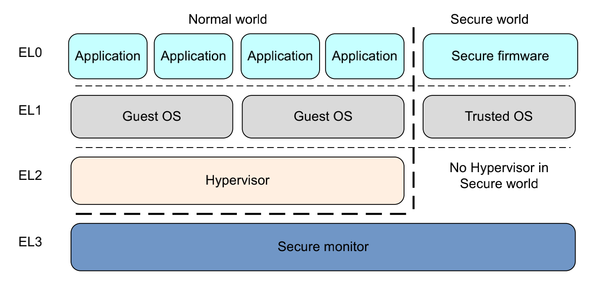
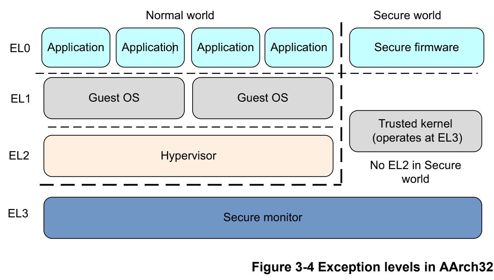
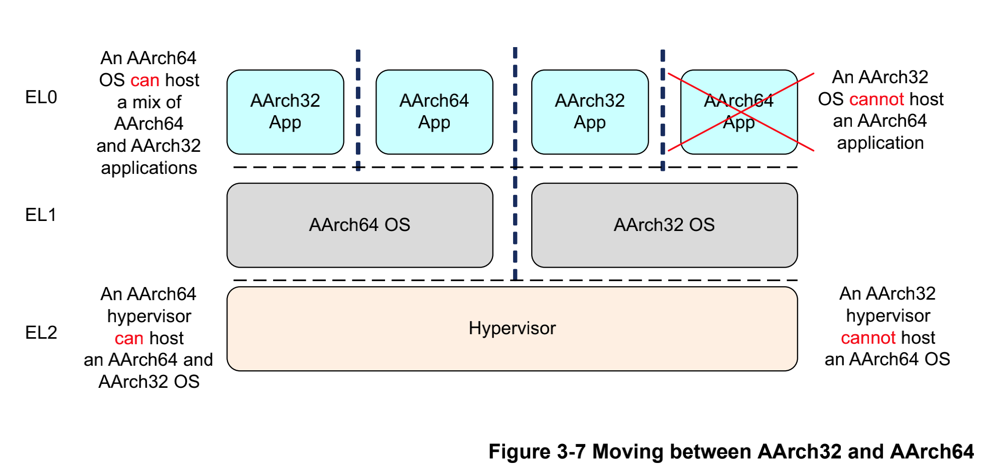

# 10_ARMv8_异常处理

终于，我们从ARMv8的一些汇编指令的学习当中出来了，开始研究ARMv8体系架构的设计。这里面的机制十分的重要，所以不得不依赖笨叔的视频，同样自己也要阅读ARMv8的手册，希望自己一字一句的去理解，不懂的去搜索，争取把这部分知识补充完整。

## 1. ARMv8 fundamentals[^1]

这部分在笨叔的视频和讲义里面只是粗略的讲了一下high-level的版图设计，但我觉得这个十分重要，没有这个基础后面很难去理解异常处理的过程，而且在high-level上面，人为的设定了很多规则，我觉得有必要整理一下。大纲总结如下：

### 1.1 EL/PL/secure/non-secure

这里主要提到了一些概念和术语，我们需要理解这些概念还背后术语的一些潜在的设计意义，挖掘出设计者的意图。文档在这一章开篇就提到：异常等级(Exception level)、特权等级(Privilege level)。ARMv8内部包含4个异常等级：

* EL0：普通用户的应用程序
* EL1：典型的操作系统内核，这个等级被称为“特权等级”(privileged)
* EL2：hypervisor
* EL3：Low-level固件，例如安全监视器 Secure monitor，最高权限

这里就有些需要注意的了，特权等级是在ARMv7里面的概念，ARMv8属于借鉴过来，PLn对应ELn。

ARMv8提供了两个安全状态（Secure States），一个叫普通世界（normal world），一个叫安全世界（secure world），这两个世界并行的运行在同一个硬件设备上面，安全世界的工作重心是抵抗软件和硬件的攻击。在EL3下的secure monitor，游走于secure world和normal world。

在normal world的hypervisor（VMM）代码运行在系统上并且管理着多个Guest OS，所以每一个操作系统都运行在VMM上面，每个操作系统在同一时间都不知道有其他操作系统在运行。

* Guest OS kernels，这部分分为两类：
  * 一般性的操作系统Linux/Windows
  * 在运行hypervisor的情况下，还有一个Rich OS kernels也作为Guest OS。我猜测，比如OPTEE-OS。

* Hypervisor，总是normal world的，when present，主要是给rich os kernels提供服务。
* Secure Firmware，这段程序必须运行在boot时间，用于初始化trusted os，平台，还有secure monitor。
* Trusted OS，在EL1和Guest OS并行运行，提供一个runtime环境执行安全应用。OPTEE-OS

### 1.2 Execution States

ARMv8定义了两个执行状态，aarch64和aarch32。这两个执行状态和异常等级没有概念上面的交织，也就是aarch64和aarch32都有相应的异常等级和特权模式。在aarch64执行状态时，使用A64指令，在aarch32执行状态，使用A32或者T32（Thumb）指令集。

AArch32模式，有一点不同的是关于trust-os的位置，trusted-os软件执行在secure EL3，在aarch64执行模式，是执行在EL1中的。ARMv7和aarch32很像。

### 1.3 Changing Exception levels

对于异常模式的变迁，ARMv8和ARMv7是一致的。异常模式的变迁不光是EL层级的变迁，在EL层级里面还有很多处理器的模式（mode）。这里有个术语叫做[take an exception]，可以理解为异常的激发。当take an exception的时候，处理器的模式（mode）就会被改变。不同的EL层级内包含不同的模式集合。

| Mode            | Function                                                     | Securitystate   | Privilegelevel |
| --------------- | ------------------------------------------------------------ | --------------- | -------------- |
| User (USR)      | Unprivileged mode in which most applications run             | Both            | PL0            |
| FIQ             | Entered on an FIQ interrupt exception                        | Both            | PL1            |
| IRQ             | Entered on an IRQ interrupt exception                        | Both            | PL1            |
| Supervisor(SVC) | Entered on reset or when a Supervisor Call instruction (`SVC`) is executed | Both            | PL1            |
| Monitor (MON)   | Entered when the `SMC` instruction (Secure Monitor Call) is executed or when the processor takes an exception which is configured for secure handling.Provided to support switching between Secure and Non-secure states. | Secure only     | PL1            |
| Abort (ABT)     | Entered on a memory access exception                         | Both            | PL1            |
| Undef (UND)     | Entered when an undefined instruction is executed            | Both            | PL1            |
| System (SYS)    | Privileged mode, sharing the register view with User mode    | Both            | PL1            |
| Hyp (HYP)       | Entered by the Hypervisor Call and Hyp Trap exceptions.      | Non-secure only | PL2            |

ARM64处理器内部的中断分为两种，FIQ和IRQ，FIQ叫快速中断请求，IRQ就是普通的中断请求。FIQ的优先级高于IRQ。

在ARM64处理器中异常模式有以下规则：

* 升权：向EL3方向变迁，视为升权。
* 异常不能被带入比其低的异常等级。
* 在EL0没有异常处理机制，异常处理必须在其更高的异常等级处理。
* 异常会造成程序执行流改变。通常异常处理有一个向量表需要循序，而有特例可以不需要遵循异常向量表：
  * IRQ/FIQ
  * abort memory system
  * 未定义指令
  * 系统调用
  * traps EL1和EL2
* 异常处理结束之后返回前一个异常等级需要执行`ERET`指令
* `ERET`之后只能保留在本层或者是更低的层级。
* 安全状态无法改变EL层级。

### 1.4 Changing execution state

32位的应用程序可以运行在64位的上面，这个在x86的架构似乎也能看见。在ARM64处理器上也是支持这样的使用场景的。这样的执行是有个条件的，也就是在执行32位程序的时候，必须让处理器处于AArch32的执行状态。为了实现这样的执行，处理器只能在更高的EL层级去执行32位的程序。首先，32位的应用程序在EL0产生一个`SVC`指令向supervisor call，接着会产生一个IRQ，这个IRQ就会切换到AARCH64内的EL1，等着程序运行完毕之后任务`ERET`到EL0。32/64混合的程序没办法在ARM64上运行，还有64位程序就没办法在32位系统上运行了。

由于在执行32位程序的时候，处理器会升一个EL，因此即使AArch64状态能够支持AArch32，但是是在低一级的权利模式。一个AArch64的操作系统能够运行32/64两种类型的应用，hypervisor也是一样，AArch64的hypervisor能够管理AArch32和AArch64的guest操作系统。AArch32的并没有这个能力。

## Reference

[^1]:[ARM Cortex-A Series Programmer's Guide for ARMv8-A - Fundamentals of ARMv8 ](https://developer.arm.com/documentation/den0024/a/Fundamentals-of-ARMv8?lang=en)
[^2]:[ARM Cortex-A Series Programmer's Guide for ARMv8-A - AArch64 Exception Handling](https://developer.arm.com/documentation/den0024/a/AArch64-Exception-Handling?lang=en)

