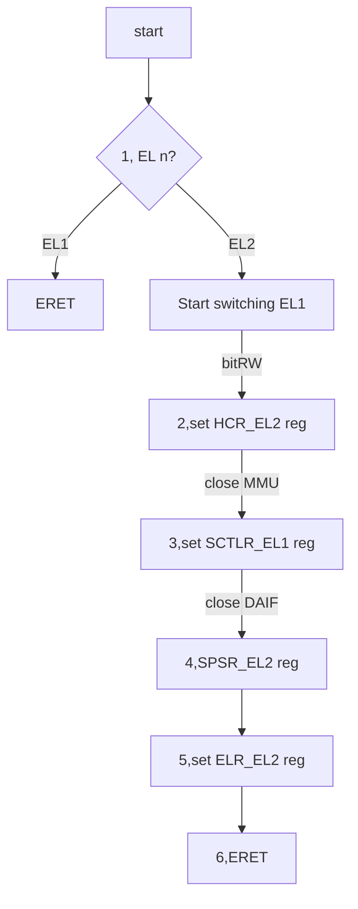

# 10_ARMv8_异常处理

终于，我们从ARMv8的一些汇编指令的学习当中出来了，开始研究ARMv8体系架构的设计。这里面的机制十分的重要，所以不得不依赖笨叔的视频，同样自己也要阅读ARMv8的手册，希望自己一字一句的去理解，不懂的去搜索，争取把这部分知识补充完整。


## 1. ARMv8 fundamentals[^1]

这部分在笨叔的视频和讲义里面只是粗略的讲了一下high-level的版图设计，但我觉得这个十分重要，没有这个基础后面很难去理解异常处理的过程，而且在high-level上面，人为的设定了很多规则，我觉得有必要整理一下。大纲总结如下：


### 1.1 EL/PL/secure/non-secure

这里主要提到了一些概念和术语，我们需要理解这些概念还背后术语的一些潜在的设计意义，挖掘出设计者的意图。文档在这一章开篇就提到：异常等级(Exception level)、特权等级(Privilege level)。ARMv8内部包含4个异常等级：

* EL0：普通用户的应用程序
* EL1：典型的操作系统内核，这个等级被称为“特权等级”(privileged)
* EL2：hypervisor
* EL3：Low-level固件，例如安全监视器 Secure monitor，最高权限

这里就有些需要注意的了，特权等级是在ARMv7里面的概念，ARMv8属于借鉴过来，PLn对应ELn。

ARMv8提供了两个安全状态（Secure States），一个叫普通世界（normal world），一个叫安全世界（secure world），这两个世界并行的运行在同一个硬件设备上面，安全世界的工作重心是抵抗软件和硬件的攻击。在EL3下的secure monitor，游走于secure world和normal world。


在normal world的hypervisor（VMM）代码运行在系统上并且管理着多个Guest OS，所以每一个操作系统都运行在VMM上面，每个操作系统在同一时间都不知道有其他操作系统在运行。

* Guest OS kernels，这部分分为两类：
  * 一般性的操作系统Linux/Windows
  * 在运行hypervisor的情况下，还有一个Rich OS kernels也作为Guest OS。我猜测，比如OPTEE-OS。

* Hypervisor，总是normal world的，when present，主要是给rich os kernels提供服务。
* Secure Firmware，这段程序必须运行在boot时间，用于初始化trusted os，平台，还有secure monitor。
* Trusted OS，在EL1和Guest OS并行运行，提供一个runtime环境执行安全应用。OPTEE-OS

### 1.2 Execution States

ARMv8定义了两个执行状态，aarch64和aarch32。这两个执行状态和异常等级没有概念上面的交织，也就是aarch64和aarch32都有相应的异常等级和特权模式。在aarch64执行状态时，使用A64指令，在aarch32执行状态，使用A32或者T32（Thumb）指令集。


AArch32模式，有一点不同的是关于trust-os的位置，trusted-os软件执行在secure EL3，在aarch64执行模式，是执行在EL1中的。ARMv7和aarch32很像。

### 1.3 Changing Exception levels

对于异常模式的变迁，ARMv8和ARMv7[^10]是一致的。异常模式的变迁不光是EL层级的变迁，在EL层级里面还有很多处理器的模式（mode）。这里有个术语叫做[take an exception]，可以理解为异常的激发。当take an exception的时候，处理器的模式（mode）就会被改变。不同的EL层级内包含不同的模式集合。**我理解这部分在ARMv8里面已经拿掉了，似乎没有这个概念，全部都被异常处理cover**。

| Mode            | Function                                                     | Securitystate   | Privilegelevel |
| --------------- | ------------------------------------------------------------ | --------------- | -------------- |
| User (USR)      | Unprivileged mode in which most applications run             | Both            | PL0            |
| FIQ             | Entered on an FIQ interrupt exception                        | Both            | PL1            |
| IRQ             | Entered on an IRQ interrupt exception                        | Both            | PL1            |
| Supervisor(SVC) | Entered on reset or when a Supervisor Call instruction (`SVC`) is executed | Both            | PL1            |
| Monitor (MON)   | Entered when the `SMC` instruction (Secure Monitor Call) is executed or when the processor takes an exception which is configured for secure handling.Provided to support switching between Secure and Non-secure states. | Secure only     | PL1            |
| Abort (ABT)     | Entered on a memory access exception                         | Both            | PL1            |
| Undef (UND)     | Entered when an undefined instruction is executed            | Both            | PL1            |
| System (SYS)    | Privileged mode, sharing the register view with User mode    | Both            | PL1            |
| Hyp (HYP)       | Entered by the Hypervisor Call and Hyp Trap exceptions.      | Non-secure only | PL2            |

ARM64处理器内部的中断分为两种，FIQ和IRQ，FIQ叫快速中断请求，IRQ就是普通的中断请求。FIQ的优先级高于IRQ。

在ARM64处理器中异常模式有以下规则：

* 升权：向EL3方向变迁，视为升权。
* 异常不能被带入比其低的异常等级。
* 在EL0没有异常处理机制，异常处理必须在其更高的异常等级处理。
* 异常会造成程序执行流改变。通常异常处理有一个向量表需要循序，而有特例可以不需要遵循异常向量表：
  * IRQ/FIQ
  * abort memory system
  * 未定义指令
  * 系统调用
  * traps EL1和EL2
* 异常处理结束之后返回前一个异常等级需要执行`ERET`指令
* `ERET`之后只能保留在本层或者是更低的层级。
* 安全状态无法改变EL层级。

### 1.4 Changing execution state

32位的应用程序可以运行在64位的上面，这个在x86的架构似乎也能看见。在ARM64处理器上也是支持这样的使用场景的。这样的执行是有个条件的，也就是在执行32位程序的时候，必须让处理器处于AArch32的执行状态。为了实现这样的执行，处理器只能在更高的EL层级去执行32位的程序。首先，32位的应用程序在EL0产生一个`SVC`指令向supervisor call，接着会产生一个IRQ，这个IRQ就会切换到AARCH64内的EL1，等着程序运行完毕之后任务`ERET`到EL0。32/64混合的程序没办法在ARM64上运行，还有64位程序就没办法在32位系统上运行了。

由于在执行32位程序的时候，处理器会升一个EL，因此即使AArch64状态能够支持AArch32，但是是在低一级的权利模式。一个AArch64的操作系统能够运行32/64两种类型的应用，hypervisor也是一样，AArch64的hypervisor能够管理AArch32和AArch64的guest操作系统。AArch32的并没有这个能力。


## 2. ARMv8 exception handling

在ARM的世界我们应该纠正一个概念，“中断”。通用的中断的定义就是可以阻止正常软件流程执行的中断。然而在ARM的术语里面，不能仅仅用中断来表示中断，我们需要更上一层的定义，异常（Exception）。异常包含狭义的中断，也包含条件变量（conditions）或者是系统事件（system event），这些行为都有专门的异常处理函数来处理。在ARCH64里面有三类异常，中断（interrupts），中止（aborts） 和复位（reset）。

### 2.1 exception types

#### interrupts

在AArch64体系架构中有两种类型的中断，**IRQ和FIQ**。FIQ的优先级高于IRQ，这部分中断设计的时候我们再说。即便我们对于中断的概念已经很熟悉了，但这里面需要澄清几个有关中断的概念。

* 中断线（request line）[^3]：这个是对处理器而言的，是中断控制器的输入。
* 中断向量表（vector table）：中断名单，操作系统实现，内部包含中断线对应的IRQ号。

对于触发中断，在CPU上有专门的动词术语，assert一个中断，take一个异常。中断线由外部外设assert，中断线的信号被接入到中断控制器，中断控制器根据中断优先级判断先发出哪些信号，再根据中断向量表查找到中断处理函数的地址。由于中断并非执行在给定时间内，因此**中断属于异步异常**。

#### aborts

同样包含两列aborts，取指失败（**Instruction Aborts**）或者是访问数据失败（**Data Aborts**）。

在内存上，发生这种异常的场景可能有两种，在访问内存时，外部存储器返回一个错误，或者指定访问的地址没有关联到真实的内存中（MMU产生该错误，一个操作系统可以使用MMU abort动态的分配内存给应用程序）。

在指令上，aborts发生在取指还未执行的时候。data abort发生在存储和加载指令。

**abort异常属于同步异常**。

#### reset

reset异常有着最高的异常等级。当异常发生的时候ARM处理器就会跳转到指令所在的位置。`RVBAR_ELn`包含跳转地址，n应该是该处理器的最高权限，armv8里面就应该为n=3。该异常不可屏蔽，不可禁止，并且尝尝执行在上电后的初始化的时候。

#### Exception generating instructions

一些异常需要由CPU外部的触发中断线间接性的塑造异常，一些系统调用指令也可以直接的产生异常，这些指令通常会向处理器请求一些运行在更高权限环境中的服务。

* 管理员权限请求（Supervisor Call, SVC）：用户空间请求操作系统内核的服务，EL0 -> EL1
* 虚拟化权限请求（Hypervisor Call, HVC）：操作系统内核请求虚拟化监视器服务，EL1->EL2
* 安全监视器权限请求（Secure Monitor Call，SMC）：非安全世界请求进入安全世界的服务，Normal world -> secure world

有几个需要注意的点：

* 通常情况下，如果在EL0进行请求，那么异常会发生在EL1，有种特殊情况，就是`HCR_EL2.TGE`被置位的时候，这个时候异常会发生在EL2。
* 异常和中断类似都有个异常向量表。程序发生异常的时候，CPU会会跳转到到更高层级的handler里面，查找异常向量表，找到本级异常的handler的地址，再跳转过去。这里先留个疑问，**为什么要找到lower level的handler？**


## 3. Exception handling registers[^2]

我们在做加减乘除的指令的时候从`PSTATE`寄存器的高4位读取NZCV的值，来确定状态。今天要涉及的是`PSTATE`DAIF的值，这部分是异常处理标志位。根据手册的翻译，如果异常发生，PSTATE信息会被存入到*Saved program status register*（SPSR_ELn），只有3个，SPSR_EL1, SPSR_EL2, SPSR_EL3。


DAIF就是exception bit mask bits，还有SPSel

* D： debug exceptions mask
* A： SError interrupt process state mask，例如异步external abort
* I：IRQ中断就处理状态掩码
* F：FIQ中断处理状态掩码

当异常发生的时候，PSTATE寄存器的值（current EL, DAIF, NZCV etc）都会被复制到SPSR_ELn，返回的地址会被也会被存储到ELR_ELn中。


有几点需要注意：

* SPSR_EL1,2,3是三个不同的寄存器实体

* 在同步或者SError异常，ESR_ELn也会被更新，用于表明产生异常的原因。

* 我们已经看见SPSR已经为异常的返回记录了必要的状态信息，还要知道link registers用于存储程序地址信息。**ARM64提供一个独立的链接寄存器用于函数调用和异常返回**。

* 我们在做汇编跳转的实验的时候需要备份X30寄存器的地址，在异常返回的时候它的值也是会被指令地址更新。**X30子函数的返回地址，ret指令返回；ELR_ELx存储异常返回地址，使用ERET指令****。

* ELR_ELn用于存储从一个异常返回到程序的地址。对于一些异常，这个地址是产生异常的下一条指令地址，但有些情况，例如SVC指令的执行，因为发生了异常，我们需要回来的时候继续执行原指令而不是下一条指令，这个就有说法了。异步异常，ELR_ELn指向一个还没有被执行的第一条指令的地址，这个时候我们在**handler的代码里面是可以修改ELR_ELn指向的地址的**，比如发生了abort指令的异常，异常结束之后我们还需要回到发生异常的那条指令上去。所以就必须要对地址进行减4或者减8。

* SPSR和ELR寄存器，**每一个异常等级都有自己的栈寄存器SP_ELn**。这些寄存器用于指示不同EL层级专用的栈。如果没有专用的栈指针，当函数执行到异常处理的handler的时候，SP指针就会被异常处理函数覆盖，所以每一级的SP_EL都会存储自己的原始的地址。

* **handler可能会把SP_ELn切换到SP_EL0**。比如，SP_EL1可能指向一块由内核进行安全维护的比较小的内存区域，SP_EL0指向一块内核没有负责安全维护的比较大的内核任务栈空间（有可能发生溢出），这个时候可能EL1溢出到EL0。这个时候需要写[SPSel]位，来进行SP_EL的切换：

  ```assembly
  msr SPSel, #0   // switch to SP_EL0
  msr SPSel, #1   // switch to SP_EL1
  ```

## 4. Syn and Asyn exceptions

异步和同步异常在ARM64处理器里面处理的方式不太一样，而且使用的寄存器还有寄存器的行为都是不一样的。这一小节笔记主要就是来分析和记录一下同步异步处理的不同点，后面还有关于aarch32和aarch64混合的时候，arm64的一些行为。ARM的手册在最开始的时候就强调一个事情，**return address是否包含具体的发生异常的原因**。这个有什么用不太清楚，手册里面注明，对于同步的异常，回退地址总能包含发生异常的原因，然而对于异步的异常，回退地址可能会包含发生异常的原因。

**异步的异常主要有三种：**

* IRQ中断
* FIQ快速中断
* SError系统错误，（最可能是异步数据错误Data Abort，从cache回写脏数据到外存）

**同步的异常包含：**

* MMU的指令错误（执行标记为不可执行的内存）
* MMU的数据错误（读取权限问题，对齐问题）
* SP/PC对齐检查错误
* 同步外部错误，读translation table
* 无法识别的指令
* 调试异常。

### 4.1 sync aborts

同步异常的触发有很多种情况，这里需要注意的是，**异常不代表错误，异常状态也可能是系统正常处理的一部分**，比如，在Linux里面内存缺页错误，还有我们之前说预计加载指令的page fault[^4]，这都是为了提升性能必须要制造的异常场景。同步的异常处理包含：

* Abort form the MMU
* SP PC alignment checking
* Unallocated instructions
  * opcode缺失
  * 权限不匹配
  * 执行被禁止的指令
  * PSTATE.IL被置位的时候
* Service Calls(SVCs, SMCs, HVCs)

在ARMv7架构里面，预取指令prefetch，数据错误Data abort，未定义异常undef是分开的指令。而在AARCH64架构里面，都视为同步异常，如果我们想在AARCH64体系架构里面知道具体的异常是什么东西，那就需要配合其他寄存器来获取更全面的信息，ESR_ELn，FAR_ELn。

### 4.2 Handling synchronous exceptions

* Exception Syndrome Register (ESR_ELn)：异常的具体原因。
* Fault Address Register (FAR_ELn)：提供发生同步指令错误、数据错误和对齐错误的虚拟地址。
* Exception Link register (ELR_ELn)：数据访问发生错误的指令的地址，这个寄存器通常在内存错误之后被写入，还有一种情况也会写入这个地址，就是访问非对齐的地址。

有个AARCH32和AARCH64混合的场景，我们在运行32位程序的时候需要进入到EL1执行，这个时候32位的程序发生了异常，需要进入到EL2处理，此时EL2还是AARCH64的，这个时候我们想要获取到32位程序的异常，需要进入到EL2的FAR寄存器读取信息，EL1的AARCH32的执行状态的FAR，全部清0。

**对于比较高等级的EL2（hypervisor），EL3（secure monitor）：**

* 同步异常发生在自己的等级（EL2, EL3）或者是更高的等级（EL2）
* 异步异常能够被路由到更高的等级（EL2, EL3）是被hypervisor或者secure monitor来处理的。可以通过SCR_EL3指定到EL3的路由信息，HCR_EL2来指定到EL2的路由信息。
* 当然这些寄存器配置也包含IRQ,FIQ,Serror的路由。

### 4.3 system calls

#### EL0 call EL1

执行应用程序想要使用特权指令这个时候就需要系统调用。<mark>其中的一种方法就是SVC指令</mark>。当应用程序call这个SVC的时候，就会产生异常，处理器理所应当的进入到了更高一级的EL。这个时候如果我们想传递一些参数，就通过写寄存器的方式。

#### EL1 call EL2/3

如果在EL0，是不允许直接call到EL2或者EL3的，必须通过EL0 call到EL1的os kernel，由kernel发送请求到EL2/3。在EL1的os kernel通过HVC指令call到hypervisor，或者os kernel通过SMC指令call到secure monitor的。如果在处理器里面没有EL3，这个时候就会出现新的异常unallocted instruction。注意，我看手册里面是EL1可以call HVC也可以直接call SMC。

#### EL2 call EL3

EL2可以call  EL3通过SMC指令。如果在EL2/3 向后call HVC指令，也会有个同步异常发生在本异常等级。

### 4.4 Exe state & Exception level

官方手册里面给了一个图表示EL0 如何 call进入EL1的，可以说这个是一个直接关系，EL0是没有任何异常处理机制的。


我们补充一下关于EL1 call进EL2/3的图，对于同步的异常而言，没什么好说的了，就是一级一级的call进去，但是对于异步的异常而言，就有点不一样了，我们EL1需要call EL2或者EL3的时候，需要配置HCR寄存器决定路由信息，同样的EL3也是需要路由信息的配置的。否则会产生新的异常。


还有一个比较特殊的情况，当有一个从AARCH32发生的异常到AARCH64处理，必须做一些特殊的考虑，AARCH64需要访问32位的寄存器了，直接访问肯定会hang死，所以ARM处理做了一些映射处理：

* R0-R12 ： X0-X12
* SP LR： X13 - X23
* R8-R12：X24 - X29

HCR_EL2.RW记录了EL1运行在哪个模式， 1代表aarch64， 0是aarch32[^5]

关于返回的时候，也是通过寄存器找返回地址和返回的模式，在SPSR寄存器M[4:0]记录了返回的模式。


### 4.5 Exception Table

#### 4.5.1 Table

采用基地址+offset的模式，ARMv8有三个表，VBAR_EL1, VBAR_EL2, VBAR_EL3。 高11位有效。

| Address            | Exception type | Description            |
| ------------------ | -------------- | ---------------------- |
| `VBAR_ELn + 0x000` | Synchronous    | Current EL with SP0    |
| `+ 0x080`          | IRQ/vIRQ       | Current EL with SP0    |
| `+ 0x100`          | FIQ/vFIQ       | Current EL with SP0    |
| `+ 0x180`          | SError/vSError | Current EL with SP0    |
| `+ 0x200`          | Synchronous    | Current EL with SPx    |
| `+ 0x280`          | IRQ/vIRQ       | Current EL with SPx    |
| `+ 0x300`          | FIQ/vFIQ       | Current EL with SPx    |
| `+ 0x380`          | SError/vSError | Current EL with SPx    |
| `+ 0x400`          | Synchronous    | Lower EL using AArch64 |
| `+ 0x480`          | IRQ/vIRQ       | Lower EL using AArch64 |
| `+ 0x500`          | FIQ/vFIQ       | Lower EL using AArch64 |
| `+ 0x580`          | SError/vSError | Lower EL using AArch64 |
| `+ 0x600`          | Synchronous    | Lower EL using AArch32 |
| `+ 0x680`          | IRQ/vIRQ       | Lower EL using AArch32 |
| `+ 0x700`          | FIQ/vFIQ       | Lower EL using AArch32 |
| `+ 0x780`          | SError/vSError | Lower EL using AArch32 |

如果kernel code执行在EL1，IRQ一个中断过来，这时候SP_EL1，而且SPSel bit被置位，执行地址就应该是 VBAR_EL1 + 0x280。

#### 4.5.2 Linux Kernel

以下是linux 4.14内核的entry.S文件中书写的异常向量表。

```assembly
/*
 * Exception vectors.
 */

	.align	11
ENTRY(vectors)
	ventry	el1_sync_invalid		// Synchronous EL1t
	ventry	el1_irq_invalid			// IRQ EL1t
	ventry	el1_fiq_invalid			// FIQ EL1t
	ventry	el1_error_invalid		// Error EL1t

	ventry	el1_sync			// Synchronous EL1h
	ventry	el1_irq				// IRQ EL1h
	ventry	el1_fiq_invalid			// FIQ EL1h
	ventry	el1_error_invalid		// Error EL1h

	ventry	el0_sync			// Synchronous 64-bit EL0
	ventry	el0_irq				// IRQ 64-bit EL0
	ventry	el0_fiq_invalid			// FIQ 64-bit EL0
	ventry	el0_error_invalid		// Error 64-bit EL0

#ifdef CONFIG_COMPAT
	ventry	el0_sync_compat			// Synchronous 32-bit EL0
	ventry	el0_irq_compat			// IRQ 32-bit EL0
	ventry	el0_fiq_invalid_compat		// FIQ 32-bit EL0
	ventry	el0_error_invalid_compat	// Error 32-bit EL0
#else
	ventry	el0_sync_invalid		// Synchronous 32-bit EL0
	ventry	el0_irq_invalid			// IRQ 32-bit EL0
	ventry	el0_fiq_invalid			// FIQ 32-bit EL0
	ventry	el0_error_invalid		// Error 32-bit EL0
#endif
END(vectors)
```

看一下Linux内核发生异常的时候如何调用函数的，这里以el1_fiq_invalid为例，这个异常没有被Linux kernel实现。


异常向量表 `inv_entry 1 , BAD_FIQ`，指定el为1，备份sp到x0，把esr_el1（存储具体异常原因的）被分到x2接着跳转到bad_mode里面。

#### 4.5.3 save context

Linux内核的arch/arm64/include/uapi/asm/ptrace.h 和arch/arm64/include/asm/ptrace.h 里面定义了一下结构体，用于存储异常上下文。

```C

struct user_pt_regs {
	__u64		regs[31];
	__u64		sp;
	__u64		pc;
	__u64		pstate;
};

struct pt_regs {
	union {
		struct user_pt_regs user_regs;
		struct {
			u64 regs[31];
			u64 sp;
			u64 pc;
			u64 pstate;
		};
	};
	u64 orig_x0;
	u64 syscallno;
};
```

## 5. Excepiton Entry

### 5.1 Entry

上面罗列了很多异常元素的概念，现在需要有机的将上面的内容串起来，看一下ARMv8到底如何处理的异常。**CPU需要做的事情**:

* S1: PSTATE保存到SPSR_ELx
* S2: 返回地址保存到ELR_ELx
* S3: PSTATE寄存器里面的DAIF域都设定为1（等同于关闭调试异常、SError，IRQ FIQ中断）
* S4: 更新ESR_ELx寄存器（包含了同步异常发生的原因）
* S5: SP执行SP_ELx
* S6: 切换到对应的EL，接着跳转到异常向量表执行

**操作系统需要做的事情：**

* 识别异常发生的类型
* 跳转到合适的异常向量表（包含异常跳转函数）
* 处理异常
* 操作系统执行eret指令

在操作系统执行ERET指令，**CPU需要从ELR_ELx寄存器中恢复PC的指针；从SPSR_ELx寄存器恢复处理器状态。**

## 5. Examples

### 5.1 switch EL2 to EL1

基于树莓派和QEMU，上电跳转的时候benos处于EL2下，请把benos切换到EL1中运行。

【提示】：

* 设定HCR_EL2寄存器，最重要的是Bit 31的RW域，表示EL1要在哪里执行
* 设定SCTLR_EL1寄存器，需要设定大小端和关闭MMU
* 设定SPSR_EL2寄存器，设定模式M域为EL1h，另外关闭所有的DAIF
* 设定异常返回寄存器ELR_EL2，让其返回el1_entry汇编的函数里面。 
* 执行ERET

【程序流】：



#### Node 1: judge ELn

要判断当前的是EL几，可以通过访问`CurrentEL`[^6]系统寄存器来确定，这个是个64位的寄存器。

EL,bit[3:2]

| EL   | Meaning |
| :--- | ------- |
| 0b00 | EL0.    |
| 0b01 | EL1.    |
| 0b10 | EL2.    |
| 0b11 | EL3.    |

```assembly
#define BITS_EL0 (0)
#defien BITS_EL1 (0x1 << 2)
#define BITS_EL2 (0x1 << 3)
#define BITS_EL3 (0x3 << 2)

MRS <Xt>, CurrentEL

msr x5, CurrentELs
cmp x5, #BITS_EL2
b.eq el3_entry
b el2_entry
```

#### Node 2: set HCR_EL2 reg (about AArch64)

这个`HCR_EL2`[^5]主要用于设定我们的目标异常等级。


主要是配置这个：


```assembly
#define HCR_EL2_REG_SET_AARCH64 (1 << 31)

ldr x0, =HCR_EL2_REG_SET_AARCH64
msr hcr_els, x0
```

#### Node 3: MMU closing

`SCTLR_EL1`[^7]EL1的系统控制寄存器上面可以关掉MMU。


```assembly
#define SCTLR_EL1_REG_CLEAR_MMU (0)
ldr x0, =SCTLR_EL1_REG_CLEAR_MMU
msr sctrl_el1, x0
```

#### Node 4: Clear DAIF

SPSR_EL2寄存器[^8]


```assembly
#define SPSR_MASK_ALL (0x7 << 6)
#define SPSR_EL1h (5 << 0)
#define SPSR_EL2h (9 <<0)
#define SPSR_EL1 (SPSR_MASK_ALL | SPSR_EL1h)
#define SPSR_EL2 (SPSR_MASK_ALL | SPSR_EL2h)

ldr x0, =SPSR_EL1
msr spsr_el2, x0
```

#### Node 5: Set entry

`ELR_EL2`[^9]设定异常返回地址。

>When [HCR_EL2](https://developer.arm.com/documentation/ddi0601/2022-03/AArch64-Registers/HCR-EL2--Hypervisor-Configuration-Register?lang=en).E2H is 1, without explicit synchronization, access from EL2 using the mnemonic ELR_EL2 or ELR_EL1 are not guaranteed to be ordered with respect to accesses using the other mnemonic.
>Accesses to this register use the following encodings in the System register encoding space:
>
>`MRS <Xt>, ELR_EL2`
>
>`MSR ELR_EL2, <Xt>`

```assembly
adr x0, el1_entry
msr elr_el2, x0

el1_entry:
	bl print_el
```

### 5.2 register exception vectors

// entry.S

```assembly
/*
| `VBAR_ELn + 0x000` | Synchronous    | Current EL with SP0 |
| `+ 0x080`          | IRQ/vIRQ       | Current EL with SP0 |
| `+ 0x100`          | FIQ/vFIQ       | Current EL with SP0 |
| `+ 0x180`          | SError/vSError | Current EL with SP0 |
 */
#define BAD_SYNC 0
#define BAD_IRQ 1
#define BAD_FIQ 2
#define BAD_ERROR 3

.global user_str0
// .align 3
// user_str0:
//     .string "entry.S: join inv_entry \n"
/*
 * inv_entry el, reason
 */
    .macro	inv_entry el, reason
	//adrp x0, user_str0
	//add x0, x0, :lo12:user_str0
	//bl put_string_uart
    mov x0, SP
    mov x1, #\reason
    mrs x2, ESR_EL1
    b bad_mode
    .endm

/*
 * vector_table entry label
 */
    .macro	vtentry label
    .align 7
    b \label
    .endm

/*
| ------------------ | -------------- | ---------------------- |
| `VBAR_ELn + 0x000` | Synchronous    | Current EL with SP0    |
| `+ 0x080`          | IRQ/vIRQ       | Current EL with SP0    |
| `+ 0x100`          | FIQ/vFIQ       | Current EL with SP0    |
| `+ 0x180`          | SError/vSError | Current EL with SP0    |
| ------------------ | -------------- | ---------------------- |
| `+ 0x200`          | Synchronous    | Current EL with SPx    |
| `+ 0x280`          | IRQ/vIRQ       | Current EL with SPx    |
| `+ 0x300`          | FIQ/vFIQ       | Current EL with SPx    |
| `+ 0x380`          | SError/vSError | Current EL with SPx    |
| ------------------ | -------------- | ---------------------- |
| `+ 0x400`          | Synchronous    | Lower EL using AArch64 |
| `+ 0x480`          | IRQ/vIRQ       | Lower EL using AArch64 |
| `+ 0x500`          | FIQ/vFIQ       | Lower EL using AArch64 |
| `+ 0x580`          | SError/vSError | Lower EL using AArch64 |
| ------------------ | -------------- | ---------------------- |
| `+ 0x600`          | Synchronous    | Lower EL using AArch32 |
| `+ 0x680`          | IRQ/vIRQ       | Lower EL using AArch32 |
| `+ 0x700`          | FIQ/vFIQ       | Lower EL using AArch32 |
| `+ 0x780`          | SError/vSError | Lower EL using AArch32 |
| ------------------ | -------------- | ---------------------- |
 */
.align 11
.global vectors
vectors:
/*
| Current EL with SP0
| ------------------ | -------------- | ---------------------- |
| `VBAR_ELn + 0x000` | Synchronous    | Current EL with SP0    |
| `+ 0x080`          | IRQ/vIRQ       | Current EL with SP0    |
| `+ 0x100`          | FIQ/vFIQ       | Current EL with SP0    |
| `+ 0x180`          | SError/vSError | Current EL with SP0    |
| ------------------ | -------------- | ---------------------- |
 */
    vtentry el1_sync_invalid
    vtentry el1_irq_invalid
    vtentry el1_fiq_invalid
    vtentry el1_error_invalid
 /*
| Current EL with SPx
| ------------------ | -------------- | ---------------------- |
| `+ 0x200`          | Synchronous    | Current EL with SPx    |
| `+ 0x280`          | IRQ/vIRQ       | Current EL with SPx    |
| `+ 0x300`          | FIQ/vFIQ       | Current EL with SPx    |
| `+ 0x380`          | SError/vSError | Current EL with SPx    |
| ------------------ | -------------- | ---------------------- |
  */
    vtentry el1_sync_invalid
    vtentry el1_irq_invalid
    vtentry el1_fiq_invalid
    vtentry el1_error_invalid
/*
| Lower EL using AArch64
| ------------------ | -------------- | ---------------------- |
| `+ 0x400`          | Synchronous    | Lower EL using AArch64 |
| `+ 0x480`          | IRQ/vIRQ       | Lower EL using AArch64 |
| `+ 0x500`          | FIQ/vFIQ       | Lower EL using AArch64 |
| `+ 0x580`          | SError/vSError | Lower EL using AArch64 |
| ------------------ | -------------- | ---------------------- |
 */
    vtentry el0_sync_invalid
    vtentry el0_irq_invalid
    vtentry el0_fiq_invalid
    vtentry el0_error_invalid
/*
| Lower EL using AArch32
| ------------------ | -------------- | ---------------------- |
| `+ 0x600`          | Synchronous    | Lower EL using AArch32 |
| `+ 0x680`          | IRQ/vIRQ       | Lower EL using AArch32 |
| `+ 0x700`          | FIQ/vFIQ       | Lower EL using AArch32 |
| `+ 0x780`          | SError/vSError | Lower EL using AArch32 |
| ------------------ | -------------- | ---------------------- |
 */
    vtentry el0_sync_invalid
    vtentry el0_irq_invalid
    vtentry el0_fiq_invalid
    vtentry el0_error_invalid

el1_sync_invalid:
    inv_entry 1, BAD_SYNC
el1_irq_invalid:
    inv_entry 1, BAD_IRQ
el1_fiq_invalid:
    inv_entry 1, BAD_FIQ
el1_error_invalid:
    inv_entry 1, BAD_ERROR
el0_sync_invalid:
    inv_entry 0, BAD_SYNC
el0_irq_invalid:
    inv_entry 0, BAD_IRQ
el0_fiq_invalid:
    inv_entry 0, BAD_FIQ
el0_error_invalid:
    inv_entry 0, BAD_ERROR

/* make 2 byte bias */
string_test:
    .string "t001"

.global assert_alignment
assert_alignment:
    ldr x0, =0x80002
    ldr x1, [x0]
    ret
```

需要在boot.S中注册向量表

```assembly
	ldr x5, =vectors
	msr VBAR_EL1, x5
	isb
```

kernel最后跳转：

```C
#include "uart.h"

#define  __u64  unsigned long
#define  u64 	__u64

extern void assert_alignment();

struct user_pt_regs {
	__u64		regs[31];
	__u64		sp;
	__u64		pc;
	__u64		pstate;
};

struct pt_regs {
	union {
		struct user_pt_regs user_regs;
		struct {
			u64 regs[31];
			u64 sp;
			u64 pc;
			u64 pstate;
		};
	};
	u64 orig_x0;
	u64 syscallno;
};

#define read_sysreg(reg) ({ \
		unsigned long _val; \
		asm volatile("mrs %0," #reg \
		: "=r"(_val)); \
		_val; \
})

#define write_sysreg(val, reg) ({ \
		unsigned long _val = (unsigned long)val; \
		asm volatile("msr " #reg ", %x0" \
		:: "rZ"(_val)); \
})

static const char * const bad_mode_handler[] = {
	"Sync Abort",
	"IRQ",
	"FIQ",
	"SError"
};

void bad_mode(struct pt_regs *regs, int reason, unsigned int esr)
{
	uart_send_string("failed\n");
#if 0
	printk("Bad mode for %s handler detected, far:0x%x esr:0x%x\n",
			bad_mode_handler[reason], read_sysreg(far_el1),
			esr);
#endif
}
// load_image /Users/carlos/workspace/work/armv8-train/lab12/benos.bin 0x80000
void kernel_main(void)
{
	uart_init();
	//init_printk_done();
	//printk("printk: printk is ready\n");
	uart_send_string("uart: hello kernel main\n");
	assert_alignment();
	uart_send_string("uart: end kernel main.\n");
	while (1) {
		uart_send(uart_recv());
	}
}

```

## Reference

[^1]:[ARM Cortex-A Series Programmer's Guide for ARMv8-A - Fundamentals of ARMv8 ](https://developer.arm.com/documentation/den0024/a/Fundamentals-of-ARMv8?lang=en)
[^2]:[ARM Cortex-A Series Programmer's Guide for ARMv8-A - AArch64 Exception Handling](https://developer.arm.com/documentation/den0024/a/AArch64-Exception-Handling?lang=en)
[^3]:[【内核教程第六十四讲】Linux内核异常处理 - 16:51](https://www.bilibili.com/video/BV1iY4y1v7nZ)

[^4]: [04_ELF文件_加载进程虚拟地址空间](https://github.com/carloscn/blog/issues/18)

[^5]:[Arm Cortex‑A78AE Core Technical Reference Manual - HCR_EL2, Hypervisor Configuration Register, EL2](https://developer.arm.com/documentation/101779/0002/Register-descriptions/AArch64-system-registers/HCR-EL2--Hypervisor-Configuration-Register--EL2?lang=en)
[^6]: [Arm A-profile Architecture Registers - CurrentEL, Current Exception Level ](https://developer.arm.com/documentation/ddi0601/2022-03/AArch64-Registers/CurrentEL--Current-Exception-Level?lang=en)
[^7]:[Arm Armv8-A Architecture Registers  - SCTLR_EL1, System Control Register (EL1) ](https://developer.arm.com/documentation/ddi0595/2021-12/AArch64-Registers/SCTLR-EL1--System-Control-Register--EL1-?lang=en)
[^8]:[Arm Armv8-A Architecture Registers - SPSR_EL2, Saved Program Status Register (EL2) ](https://developer.arm.com/documentation/ddi0595/2021-12/AArch64-Registers/SPSR-EL2--Saved-Program-Status-Register--EL2-?lang=en)
[^9]: [Arm A-profile Architecture Registers  - ELR_EL2, Exception Link Register (EL2) ](https://developer.arm.com/documentation/ddi0601/2022-03/AArch64-Registers/ELR-EL2--Exception-Link-Register--EL2-?lang=en)
[^10]:[ARM Cortex-A Series Programmer's Guide for ARMv7-A - ARM Processor Modes and Registers](https://developer.arm.com/documentation/den0013/d/ARM-Processor-Modes-and-Registers?lang=en)

