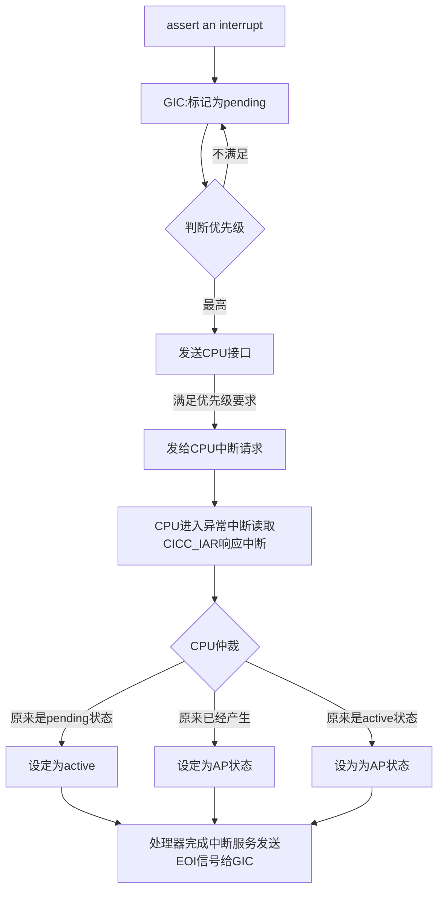

# 12_ARMv8_异常处理（三）- GICv1/v2中断处理

## 0 前言

曾经在bare-mental环境开发DSP，STM32，使用C语言注册中断之后然后就可以工作了，并没有探究过本质，最多是配置一下中断相关的寄存器，而到了学习ARCH的阶段，所有掌握的重点并不是中断如何使用和中断使用注意事项，而应该站在更底层的角度去看待，中断到底如何产生，还有中断在操作系统中如何处理的。因此本节的学习目标，以ARM64的GIC设计为基础，学习GIC的设计思想、使用方法还有Linux/freeRTOS操作系统如何去适配的，并且以树莓派4b实实在在的硬件去配置GIC，并对比TI和NXP这些二级厂商的GIC设计。

早期的ARM系统（ARM7/ARM9），采用**单核处理器**设计，中断较少，使用IER和ISR寄存器就能管理中断，这就是上一节我们提到的Legacy中断模式。随着处理器越来越复杂，多核出现，SoC设计也是越来越复杂，中断难以管理和集成，因此就需要专门设计一种机制来管理中断，这就是ARM公司设计的GIC的初衷。

GIC也并不是一成不变的，没有人能够预测未来会有什么需求，因此GIC也要随着时间去成长，现在目前最新版是GIC-V4 (IP core名：GIC-700)[^1] ，里面表格是对GIC一些发展史的总结：

| 版本     |                            GIC-V1                            | GIC-V2                         | GIC-V3                                       | GIC-V4           |
| -------- | :----------------------------------------------------------: | ------------------------------ | -------------------------------------------- | ---------------- |
| 功能     | 8核，1020个中断源，8位二进制数优先级，支持软件出发中断源，支持trustzone | 支持虚拟化，改进安全软件的支持 | 支持CPU大于8核，基于消息的中断，更多的中断ID | 支持注入虚拟中断 |
| IP核心   |                           GIC-390                            | GIC-400                        | GIC-500 / 600                                | GIC-700          |
| 应用场景 |                       Cortex-A9 MPcore                       | Cortex-A7/A9 MPCore            | Cortex-A76 MPCore                            |                  |

## 1 GIC中断硬件设计

#### 1.2 GICv2设计

##### 1.2.1 GICv2架构设计

###### soc位置

GIC-400在SoC上的位置如图所示，GIC-400的输入是一对中断信号，还有一个可编程的接口，输出是一堆FIQ和IRQ。简言之，GIC-400就是对一堆中断信号最后整理成FIQ和IRQ的系统。从一个系统角度而言，GIC-400没有对输入进行同步化处理，因此在做一些时序比较强的场景时候，输入信号（SPI PPI）必须和CLK进行同步。

*   SGI是用于多核通信之间的中断，支持16个SGI，中断号0~15，在linux内核中唤作IPI。（CPU私有）
*   PPI是每个处理器内核私有的中断，gic-400支持16个ppi，硬件中断号为16~31。（CPU私有）
*   SPI是公用的外设中断。GIC-400支持988个外设中断，硬件终端号范围32~1019。（CPU共享）

中断类型总结为下表：

| INTID                           | Interrupt Type           | Notes                                                        |
| ------------------------------- | ------------------------ | ------------------------------------------------------------ |
| 0 - 15                          | SGIs                     | Banked per PE                                                |
| 16 - 31 1056 - 1119 (GICv3.1)   | PPIs                     | Banked per PE                                                |
| 32 - 1019 4096 - 5119 (GICv3.1) | SPIs                     | -                                                            |
| 1020 - 1023                     | Special interrupt number | Used to signal special cases, see [Settings for each PE](https://developer.arm.com/architectures/learn-the-architecture/arm-corelink-generic-interrupt-controller-v3-and-v4-overview/configuring-the-arm-corelink-gic#settings_per_pe) for more information. |
| 1024 - 8191                     | Reserved                 | -                                                            |
| 8192 and greater                | LPIs                     | The upper boundary is IMPLEMENTATION DEFINED                 |

###### 内部结构

这里面一个共5个部件，distributor和cpu interface是关注的重点。

*   distributor：接收中断信号并且提交最高优先级的中断给CPU接口。而且分发器还受到IGR（interrupt Group Registers）的影响，IGR能够控制配置中断作为Group0或者Group1。(中断组影响后续CPU接口处理中断的路由，间接性地可以决定信号是作为一个FIQ或者IRQ异常请求)，分发器是允许使用寄存器配置的。
*   cpu interface：cpu接口信号可以中断相应的处理器，并且可以接收来自于对应处理器的EOI访问请求和应答。这些AXI访问携带着中断号和其他关于中断的信息，并且切换distributor的状态机。当一个中断有足够的优先级的时候，CPU接口仅仅向处理器core通知中断pending。中断的优先级在CPU接口上可配。

其他一些部件是关于虚拟化的，暂时这里不涉及。

##### 1.2.2 GICv2状态机

在GIC内部，中断信号有以下几种状态：

*   inactive，未激活状态：中断没有被asserted
*   pending，等待状态：中断已经被asserted，但是中断还没有被PE识别。
*   active，激活状态：中断已经被asserted，中断被PE识别。
*   active and pending，中断已经被PE识别，另一个同样的中断asserted

*Note1, PE是processor element, 这里视为cpu core*

*Note2, 被PE识别的意思是，Receives acknowledge and EOI accesses from that processor*

外设中断的触发类型与状态机转换的问题：

*   edge-triggered: 上升沿或下降沿触发中断

    

*   level-triggered: 高低电平触发中断。

    

##### 1.2.3 GICv2工作流程

GIC-400提供的中断时序图，设定N中断优先级高于M中断，这个是一个电平触发的中断时序图：

*   M中断和N中断在T0时刻都是idle状态，在T1时刻M中断被assert
*   M中断目前没有被PE响应，因此状态机是pending。
*   T17时刻nFIQCPU[n]信号被拉低（也就是说，在M中断信号进来之后大概15个时钟周期，nFIQCPU信号就会被拉低，nFIQCPU信号用于向CPU报告中断请求的，不过在此时CPU还没有响应M中断，该中断一直处于pending状态）
*   不巧，T42时刻更高优先级的N中断进来了，N中断也没有被PE响应，因此也处于pending状态。
*   T58时刻，N中断发生大概15个时钟周期，nFIQCPU[n]拉低通知CPU（即便是nFIQCPU之前在T17时刻处于低电平，也不影响N中断的中断信息传递，因为CPU接口更新GICC_IAR寄存器的ID字段为中断N的中断号，CPU见到电平拉低会去读取GICC_IAR寄存器）
*   T61时刻，CPU发出ack-N信号，代表着CPU已经影响应了中断N，这时候分发器转换N中断为AP状态。Linux内核中断服务程序读取GICC_IAR的值，分发器把中断设定为active状态。这中间涉及了很多软件需要去做的事情：
    *   T64，中断N被Linux内核响应， CPU完成对nFIQCPU的复位
    *   T126，外设input source开始拉低。
    *   T128，中断N退出等待状态。
    *   T131，处理器（Linux内核中断服务程序）把中断N的硬件ID写入GICC_EOIR寄存器来完成整个过程。
*   T146，开始切回M中断，重复之前的处理。

##### 1.2.4 GICv2寄存器

ARM提供了一些GIC-V2的通用寄存器：

*   一部分是分发器寄存器，以GICD_开头
*   一部分是CPU接口寄存器，以GICC_开头

###### global settings[^3]

分发器控制寄存器必须被配置用于使能中断组和设定路由模式：

*   使能Affinity routing(ARE) ： 设定GIC工作在GICv2模式，在GICv3里面是配置GICv3或者是legacy（兼容GICv2）的。
*   GICD_CTRL，这个对Group0， secure Group1和 non-secure group 1 使能配置：
    *   EnableGrp1S 使能Secure group 1
    *   EnableGrp1NS 使能Nonsecure group 1
    *   EnableGrp0 使能Group 0中断 

###### settings for each PE

*   CPU Interface Configuration

    *   使能系统寄存器访问 ICC_*_ELn
    *   设定优先级和二进制点寄存器，ICC_PMR_EL1和ICC_BPRn_EL1。
    *   设定EOI模式，ICC_CTRL_EL1和ICC_CTRL_EL3。
    *   使能每个中断组的发射信号
        *   ICC_IGRPEN1_EL1
        *   ICC_GRPEN1_EL1

*   PE配置

    *   routing controls

        SCR_EL3和HCR_EL1，这个路由控制位决定中断发生在哪个异常等级，必须被软件初始化。

    *   interrupt masks

        PE必须异常mask位在PSTATE。

    *   vector table

        VBAR_ELn寄存器必须配置。

*   SPI,PPI和SGI配置

    *   使用分发器的GICD_*配置SPIs

        

    *   Priority: GICD_IPRIORITYn, GICR_IPRIORITYn

    *    Group: GICD_IGROUPn, GICD_IGRPMODn, GICR_IGROUPn, GICR_IGRPMODn

    *   Edge-triggered or level-sensitive: GICD_ICFGRn, GICR_ICFGRn

    *   Enable: GICD_ISENABLERn, GICD_ICENABLER, GICR_ISENABLERn, GICR_ICENABLERn

    *   Non-maskable: Interrupts configured as non-maskable are treated as higher priority than all other interrupts belonging to the same Group. That is, a non-maskable Non-secure Group 1 interrupt is treated as higher priority than all other Non-secure  Group 1 interrupts.

        *   The non-maskable property is added in GICv3.3 and requires matching support in the PE.
        *   Only Secure Group 1 and Non-secure Group 1 interrupts can be marked as non-maskable.

*   为SPIs配置目标PE

    *   GICD_IROUTERn.Interrupt_Routing_Mode == 0

        The SPI is delivered to the PE A.B.C.D, which are the affinity co-ordinates specified in the register.

    *   GICD_IROUTERn.Interrupt_Routing_Mode == 1

        The SPI can be delivered to any connected PE that is participating in distribution of the interrupt group. The Distributor, rather than software, selects the target PE. The target can therefore vary each time the interrupt is signaled. This type of routing is referred to as 1-of-N.

#### 1.3 三方GICv2设计

##### 1.3.1 bcm2711

bcm2711集成了GIC-400，基于GIC-400架构。GIC-400中断号的分配和SoC设计有关。

如果在bcm2711访问中断寄存器，基地址0xFF840000。bcm2711在0xFF840000地址挂载的GIC中断控制器，然后是ARM的GIC中断控制器的地址：

| Address range     | GIC-400 functional block                                     |
| ----------------- | ------------------------------------------------------------ |
| `0x0000`-`0x0FFF` | Reserved                                                     |
| `0x1000`-`0x1FFF` | Distributor                                                  |
| `0x2000`-`0x3FFF` | CPU interfaces                                               |
| `0x4000`-`0x4FFF` | Virtual interface control block, for the processor that is performing the access |
| `0x5000`-`0x5FFF` | Virtual interface control block, for the processor selected by address bits [11:9], `0x5000`-`0x51FF``0x5200`-`0x53FF`...`0x5E00`-`0x5FFF` , |
| `0x6000`-`0x7FFF` | Virtual CPU interfaces                                       |

每个寄存器类还有自己的偏移地址[^4]，参考引用文献。

##### 1.3.2 nxp-imx.8[^5]

这个是nxp imx.8使用GIC的设计，在SoC的结构设计上，通常自己会堆叠一些逻辑，然后作为外围中断的输入到GIC，NXP还设计了IRQ Steer，由于是大小核设计，这里面不只是同一个架构的core，还包含了中断的多路复用器，使用二级厂商的芯片除了要注意配置ARM原生的GIC之外，还要注意配置二级厂商设计的RTL模块的配置，及这些模块和GIC之间的一些耦合关系。

##### 1.2.3 ti TDA4VM

TI设计的也类似，里面增加更复杂的总线仲裁机制和逻辑判断。现在我们也知道了，这些厂商拿公版的ARM做了什么处理。

## 2 GIC中断kernel设计

ARM的GIC的RTL设计，由哪个CPU来处理中断，是GIC内部的distributor机制仲裁分发给GIC的CPU interface[n]的，这里面的路由过程是由SoC设计者编好号分好组，除了ARM声明的Core级的中断预留外，其他的中断都是需要配置GICD_IROUTERn来决定由哪个PE来处理，而且还要限定Secure/Non-secure中断组。这就有两种场景，

第一种两种同类型的目标PE中断几乎同时assert，这个时候distributor会按照优先级给给CPU interface[n]通知，并且把高优先级的中断号写在GICC_IAR的ID字段，次优先级的中断挂pending，此时从Linux角度就可以读到一个中断ID，进行Linux的handler处理，处理完之后Linux handler向GICC_EOIR寄存器写这个处理完的中断ID，然后GIC的distributor开始处理次一级的中断。 Linux角度是串行处理。

第二种两种中断目标PE不同，同时assert，这个时候两个中断 distirbutor认为是两个不影响的中断，只操作自身的寄存器，中断也会被通知到相应的PE。Linux角度来看，Linux并不支持嵌套中断，否则栈会被吃空。此时，中断上半部快速序串行处理，处理第一个中断的时候，linux会mask掉中断，然后建立中断下半部的tasklet或者工作队列，紧接着开中断再处理第二个中断，建立第二个中断的下半部。

简言之，同一个PE的多个中断，排队是由GIC分发器决定的；不同PE的不同中断，排队是由Linux决定的。

我们按照[^7]的Linuxkernel分析思路对GIC在Linux上面的源代码进行分析。由于篇幅关系，对于Linux Kernel这块，我们放在Linux Kernel中进行展开讨论。

## Reference

[^1]: [[gic]-ARM gicv3/gicv4的详细介绍-2020/12 ](https://blog.csdn.net/weixin_42135087/article/details/111713444)
[^2]:[ARM64体系结构编程与实践](https://item.jd.com/13119117.html)
[^3]:[Learn the architecture: Arm CoreLink Generic Interrupt Controller v3 and v4 Version 1.0 ](https://developer.arm.com/documentation/198123/0301/Arm-CoreLink-GIC-fundamentals)
[^4]:[CoreLink GIC-400 Generic Interrupt Controller Technical Reference Manual r0p1  -  Distributor register summary ](https://developer.arm.com/documentation/ddi0471/b/programmers-model/distributor-register-summary?lang=en)
[^5]:[i.MX 8QuadMax Applications Processor Reference Manual]()
[^6]:[J721E DRA829/TDA4VM Processors  Silicon Revision 1.1 Texas Instruments  Families of Products Technical Reference Manual]()
[^7]:[linux kernel的中断子系统之（七）：GIC代码分析 ](http://www.wowotech.net/irq_subsystem/gic_driver.html)