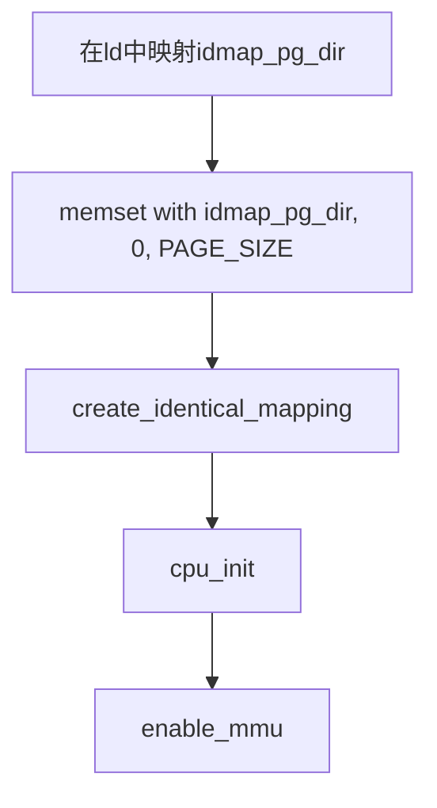

# *15_ARMv8_内存管理（三）-MMU恒等映射及Linux实现*

-   以ELF作为引子展开MMU的作用，为了和ELF做一些知识关联工作。[13_ARMv8_内存管理与MMU（一）-内存管理要素]
-   以《操作系统概念》的虚拟内存管理一节，为MMU做一些理论和基础知识的储备。[13_ARMv8_内存管理与MMU（一）-内存管理要素]
-   以《ARMv8体系架构》的MMU为例子，了解在CPU层级MMU的实现和配置。[13_ARMv8_内存管理与MMU（二） - ARMv8架构虚拟内存MMU]
-   以《Linux内核》的内存管理为例子，来研究MMU怎么实现的。[Linux_Kernel_MMU设计（一）]

# 1. 恒等映射

## 1.1 boot stage MMU

在讨论恒等映射之前，我们我们先来弄清楚一个问题，**为什么在uboot阶段需要关闭MMU[^1]？**

uboot阶段关闭MMU是一种推荐做法，这个在uboot的文档[^3]和Linux文档[^2]上都有体现。不过，uboot阶段是可以开启MMU的，可能是为了一些测试或一些可执行文件在boot环境[^2]，也有文献表明在一些加解密安全特性下，在boot环境考虑使能MMU[^4]。

如果在boot阶段使能MMU，要从两个维度考虑，第一个，**页表映射引入的问题**[^5]；第二个，**d-cache关闭和i-cache开启**[^1]的功能。

在某些处理器里面，并不是像ARMv8体系架构一样，**cache隶属于MMU下面的一个模块，而是cache和MMU是分立的两个机制**，MMU的功能仅仅是页表映射。因此这就引发了一些讨论，我们从上一个内存管理（二）里面提到ARM将内存划分，device memory和normal memeory，device memory就是一般性的存储空间，比如ROM, RAM, Flash；而device memory就是外围设备映射的空间，这个分水岭是以cacheing功能做的划分，如果此时我们并**没有打开MMU，而开了D-Cache**，这有可能那块内存刚好被映射到device memory上面，如果刚好是一些比如fifo读敏感的设备，那么就会发生很致命的错误。在这种情况下就必须要使能MMU，让MMU页表的映射（MMU内存有相应的属性和合法性检查），这就会被视为安全的访问。简而言之，**在没有MMU的保护下，cacheing设备内存是一个非常错误的操作。**

I-Cache打开没有问题，因为指令部分不会从device memory这个位置去取指，而是从normal memory去取指，就算是没有MMU的属性保护，也不会发生错误。**开启I-Cache会提高boot程序的执行效率**。**如果MMU在boot阶段关闭，且开了I-Cache**，这里需要注意的是，**当使能MMU的时候一定要对cache内的数据进行invalidate操作**，否则cache内部可能会记录在MMU没有映射之前VMA和PHY恒等映射的地址，而不是MMU映射后的地址。**还要注意在JTAG的情境下**，我们会把程序直接load到ram里面，此时i-cache没有周期性的从ram刷新数据，所以我们运行程序的时候，可能就出现，程序可能完全是ram中的，可能是ram的也可能是cache旧的，或者完全是cache中旧的，因此要注意i-cache使能情况下，jtag的cache一致性。

所以，综上考虑， MMU及cache在boot内部的推荐配置通常是：

*   **MMU关闭**
*   **D-Cache关闭**
*   **I-Cache开启**

## 1.2 恒等映射的实现

在ARMv8有个问题，无法达到我们之前说的那种MMU配置和cache分离的，使能cache功能的前置条件是必须使能MMU，我们这部分主要来讨论一下，如何来配置armv8的MMU，这部分会被应用于操作系统中。

现在处理器大多数是多级流水线体系结构，处理器会预先取多条指令到流水中。这里有个MMU的生效的上文和下文的切换需要注意，我们在配置MMU的时候，是有一些指令的，而且这些指令以物理地址的方式被预取到流水线中；当MMU生效之后，预取的指令会使用虚拟地址来访问，这时候会到MMU中找到对应的物理地址。**为了保证处理器在开启MMU后，能够完成从物理地址到虚拟地址的平滑过渡，首先会创建恒等映射（VA==PA，identity mapping）**[^6]。如图所示，在内存底部建立一个小范围的映射关系，让VA=PA。

<div align='center'>

</div>
我们这部分就在cortex-a72上面建立一个恒等映射，低512MB的内存恒等映射到虚拟地址0～512MB的地址空间，采用4KB页帧粒度，4级页表，48位的地址宽度创建该映射。（借鉴Linux内核的页表实现）。整个流程如下：




### 页表定义

在Linux内核里面页表定义和我们ARM64上面有点出入：

| arm64 | Linux kernel                             |
| ----- | ---------------------------------------- |
| L0    | 页全局目录（Page Global Directory, PGD） |
| L1    | 页上级目录（Page Upper Directory, PUD）  |
| L2    | 页中间目录（Page Middle DIrectory, PMD)  |
| L3    | 页表（Page Table, PT）                   |

上面4个页表名称，对应arm64的l0-l3我已经画出来了。

<div align='center'>

</div>
### 区域映射

```bash
    +--------+--------+--------+--------+--------+--------+--------+--------+
    |63    56|55    48|47    40|39    32|31    24|23    16|15     8|7      0|
    +--------+--------+--------+--------+--------+--------+--------+--------+
     |                 |         |         |         |         |
     |                 |         |         |         |         v
     |                 |         |         |         |   [11:0]  in-page offset
     |                 |         |         |         +-> [20:12] L3 index
     |                 |         |         +-----------> [29:21] L2 index
     |                 |         +---------------------> [38:30] L1 index
     |                 +-------------------------------> [47:39] L0 index
     +-------------------------------------------------> [63] TTBR0/1
```

我们用宏定义来描述PGD、PUD、PMD、PT的属性，`VA_BIS`代表是48位宽度的虚拟地址。

```C
#define     VA_BIS          (48UL)
#define     PGDIR_SHIFT     (39UL)
#define     PGDIR_SIZE      (1UL << PGDIR_SHIFT)
#define     PGDIR_MASK      (~(PGDIR_SIZE - 1))
#define     PTRS_PER_PGD    (1 << (VA_BITS - PGDIR_SHIFT))

#define     PUD_SHIFT       (30UL)
#define     PUD_SIZE        (1UL << PUD_SHIFT)
#define     PUD_MASK        (~(PUD_SIZE - 1))
#define     PTRS_PER_PUD    (1 << (PGDIR_SHIFT - PUD_SHIFT))

#define     PMD_SHIFT       (21UL)
#define     PMD_SIZE        (1UL << PMD_SHIFT)
#define     PMD_MASK        (~(PMD_SIZE - 1))
#define     PTRS_PER_PMD    (1 << (PUD_SHIFT - PMD_SHIFT))

#define     PTE_SHIFT       (12UL)
#define     PTE_SIZE        (1UL << PTE_SHIFT)
#define     PTE_MASK        (~(PTE_SIZE - 1))
#define     PTRS_PER_PTE    (1 << (PMD_SHIFT - PTE_SHIFT))
```

除此之外还有一种section的映射方式[^7]，ARMv8体系页表结构还支持2MB大小块类型的映射。

>1、PGD(9 bits)--->PMD(9 bits)--->PTE(9 bits)--->PAGE(12 bits)
>2、PGD(9 bits)--->PMD(9 bits)--->SECTION(21 bits)

```c
#define     SECTION_SHIFT   (21UL)
#define     SECTION_SIZE    (1UL << SECTION_SHIFT)
#define     SECTION_MASK    (~(SECTION_SIZE - 1))
```

### PTE（L3）页表属性

这个图在内存管理（二）描述**地址属性**的有，现在需要定义出关于属性的宏[^8]：

<div align='center'>

</div>
<div align='center'>

</div>

```bash
+---+--------+-----+-----+---+------------------------+---+----+----+----+----+------+----+----+
| R |   SW   | UXN | PXN | R | Output address [47:12] | R | AF | SH | AP | NS | INDX | TB | VB |
+---+--------+-----+-----+---+------------------------+---+----+----+----+----+------+----+----+
 63  58    55 54    53    52  47                    12 11  10   9  8 7  6 5    4    2 1    0

R    - reserve
SW   - reserved for software use
UXN  - unprivileged execute never
PXN  - privileged execute never
AF   - access flag
SH   - shareable attribute
AP   - access permission
NS   - security bit
INDX - index into MAIR register
TB   - table descriptor bit
VB   - validity descriptor bit
```

*   `PTE_TYPE_PAGE` : page类型： 11B
*   `PTE_USER` : 访问权限access permission: AP[6]: user
*   `PTE_RDONLY` : 访问权限access permission: AP[7]: readonly
*   `PTE_SHARED` : 共享shareable: SH[9:8]
*   `PTE_AF` : 访问表示access flag : AF[10]
*   `PTE_PXN` : 执行权限privileged execute: pxn[53]
*   `PTE_UXN` : 执行权限unprivileged execute: uxn[54]

```c
// level 3 page attribute config (PTE)
#define     PTE_TYPE_MASK   (3UL << 0)
#define     PTE_TYPE_FAULT  (0UL << 0)
#define     PTE_TYPE_PAGE   (3UL << 0)
#define     PTE_TABLE_BIT   (1UL << 1)
#define     PTE_USER        (1UL << 6)
#define     PTE_RDONLY      (1UL << 7)
#define     PTE_SHARED      (1UL << 8)
#define     PTE_AF          (1UL << 10)
#define     PTE_NG          (1UL << 11)
#define     PTE_DBM         (1UL << 51)
#define     PTE_CONT        (1UL << 52)
#define     PTE_PXN         (1UL << 53)
#define     PTE_UXN         (1UL << 54)
#define     PTE_HYP_XN      (1UL << 54)
```

以上描述的是地址属性，下面将描述内存属性，**内存属性是描述device memory与normal memory的**，内存属性没有放在页表中，而是放在MAIR_ELn寄存器中，这个寄存器把64位的内存分为了8个段，这8个段中在页表结构中第11位（AttrIndex[2:0]，占3位正好表示0-7）来索引MAIR_ELn的段号，进而就能拿到内存属性的信息。

<div align='center'>

</div>

```C
#define     PTE_ATTRINDEX(t) ((t) << 2)
#define     PTE_ATTRINDEX_MASK (7 << 2)
```

内存属性四种：

*   Device-nGnRnE
*   Device-nGnRE
*   Device-nGRE
*   Device-GRE

```c
#define PTE_VALID		(1UL << 0)
#define PTE_WRITE		(PTE_DBM)		 /* same as DBM (51) */
#define PTE_DIRTY		(1UL << 55)
#define PTE_SPECIAL		(1UL << 56)
#define PTE_PROT_NONE		(1UL << 58) /* only when !PTE_VALID */

#define _PROT_DEFAULT	(PTE_TYPE_PAGE | PTE_AF | PTE_SHARED)
#define PROT_DEFAULT (_PROT_DEFAULT)

#define PAGE_KERNEL_RO		((PROT_NORMAL & ~PTE_WRITE) | PTE_RDONLY)
#define PAGE_KERNEL_ROX		((PROT_NORMAL & ~(PTE_WRITE | PTE_PXN)) | PTE_RDONLY)
#define PAGE_KERNEL_EXEC	(PROT_NORMAL & ~PTE_PXN)

#define PROT_DEVICE_nGnRnE	(PROT_DEFAULT | PTE_PXN | PTE_UXN | PTE_DIRTY | PTE_WRITE | PTE_ATTRINDX(MT_DEVICE_nGnRnE))
#define PROT_DEVICE_nGnRE	(PROT_DEFAULT | PTE_PXN | PTE_UXN | PTE_DIRTY | PTE_WRITE | PTE_ATTRINDX(MT_DEVICE_nGnRE))
#define PROT_NORMAL_NC		(PROT_DEFAULT | PTE_PXN | PTE_UXN | PTE_DIRTY | PTE_WRITE | PTE_ATTRINDX(MT_NORMAL_NC))
#define PROT_NORMAL_WT		(PROT_DEFAULT | PTE_PXN | PTE_UXN | PTE_DIRTY | PTE_WRITE | PTE_ATTRINDX(MT_NORMAL_WT))
#define PROT_NORMAL (PROT_DEFAULT | PTE_PXN | PTE_UXN | PTE_DIRTY | PTE_WRITE | PTE_ATTRINDX(MT_NORMAL))
```

###  页表数据结构

建立页表项目pte_t, pmd_t, pud_t, pgd_t。

```c
typedef unsigned long long u64;
typedef u64 pteval_t;
typedef u64 pmdval_t;
typedef u64 pudval_t;
typedef u64 pgdval_t;

typedef struct {
    pteval_t pte;
} pte_t;
#define pte_val(x) ((x).pte)
#define __pte(x) ((pte_t) {(x)})

typedef struct {
	pteval_t pte;
} pte_t;
#define pte_val(x) ((x).pte)
#define __pte(x) ((pte_t) { (x) })

typedef struct {
	pmdval_t pmd;
} pmd_t;
#define pmd_val(x) ((x).pmd)
#define __pmd(x) ((pmd_t) { (x) })

typedef struct {
	pudval_t pud;
} pud_t;
#define pud_val(x) ((x).pud)
#define __pud(x) ((pud_t) { (x) })

typedef struct {
	pgdval_t pgd;
} pgd_t;
#define pgd_val(x) ((x).pgd)
#define __pgd(x) ((pgd_t) { (x) })
```

### 创建页表

我们要建立一个代码段、数据段还有外设段的恒等映射。

```c
static void create_identical_mapping(void)
{
    unsigned long start;
    unsigned long end;
    // code section identical mapping
    start = (unsigned long)_text_boot;
    end = (unsigned long)_etext;
    __create_pdg_mapping((pdg_t *)idmap_pg_dir,
                         start,
                         start,
                         end - start,
                         PAGE_KERNEL_ROX,
                         early_pgtable_alloc,
                         0);
    // data section identical mapping.
    start = PAGE_ALIGN((unsigned long)_etext);
    end = TOTAL_MEMORY;
    __create_pdg_mapping((pdg_t *)idmap_pg_dir,
                         start,
                         start,
                         end - start,
                         PAGE_KERNEL,
                         early_pgtable_alloc,
                         0);
    // mmio section identical mapping
    start = PBASE;
    end = 0x2000000;
    __create_pdg_mapping((pdg_t *)idmap_pg_dir,
                         start,
                         start,
                         end,
                         PROT_DEVICE_nGnRnE,
                         early_pgtable_alloc,
                         0);
}
```

首先在链接文件中为pgd页表预留出4KB的内存空间：

```ld
	/*
	 * 分配一page的空间，用来存放页表
	 *
	 * 起始地址需要以page对齐
	 */
	. = ALIGN(4096);
	idmap_pg_dir = .;
	. += 4096;
```

我们还需要制作一个函数，将ld文件中idmap_pg_dir和我们页表的数据结构联系（映射起来），这部分可以参考https://elixir.bootlin.com/linux/v4.2/source/arch/arm64/mm/mmu.c#L242 。

```c
static void __create_pdg_mapping(pgd_t *pgdir,
                                 unsigned long phys,
                                 unsigned long virt,
                                 unsigned long size,
                                 unsigned long prot,
                                 unsigned long (*alloc_pgtable)(void),
                                 unsigned long flags);
```

| 参数          | 意义                                                         |
| ------------- | ------------------------------------------------------------ |
| pgdir         | 页全局目录（Page Global Directory, PGD）的基地址             |
| phys          | 表示要映射的物理地址的起始地址                               |
| virt          | 表示要映射的虚拟地址的起始地址                               |
| size          | 映射大小                                                     |
| prot          | 内存映射属性                                                 |
| alloc_pgtable | 用来分配下一级页表的函数，PGD页表的是在ld文件中分配的，但是后面的页表是要在动态过程中分配。 |
| flags         | 传递给页表创建过程中的标识位。                               |

在这个函数中，会递进式的创建次一级的页表空间：

*   __create_pdg_mapping
    *   alloc_init_pud -> early_pgtable_alloc
        *   alloc_init_pmd -> early_pgtable_alloc
            *   alloc_init_pte -> early_pgtable_alloc

每一级页表都通过调用early_pgtable_alloc来分配页表4KB的空间。

```c
static unsigned long early_pgtable_alloc(void)
{
    unsigned long phys;
    phys = get_free_page();
    memset((void *)phys, 0, PAGE_SIZE);
    return phys;
}
```

这里面有个get_free_page()，用于获取当前操作系统的空闲页表，在内存管理里面，这部分就会用到伙伴系统和slab机制。这里我们做一个比较简陋的线性数组实现。

```C
#define NR_PAGES    (TOTAL_MEMORY/PAGE_SIZE)
static unsigned short mem_map[NR_PAGES] = {0,};

#define LOW_MEMORY (0x400000)       /*4MB*/
#define TOTAL_MEMORY (512 * 0x100000) /*512MB*/

unsigned long get_free_page(void)
{
    int i;
    for (i = 0; i < NR_PAGE; i ++) {
        if (mem_map[i] == 0) {
            mem_map[i] = 1;
            return LOW_MEMORY + i * PAGE_SIZE;
        }
    }
    return 0;
}

void free_page(unsigned long p)
{
    mem_map[(p - LOW_MEMORY)/PAGE_SIZE] = 0;
}
```

## 1.3 CPU初始化及MMU配置

### 1.3.1 CPU初始化

CPU的初始化主要是对MAIR和TCR寄存器的配置。

<div align='center'>

</div>

```c
static void cpu_init(void)
{
	unsigned long mair = 0;
	unsigned long tcr = 0;
	unsigned long tmp;
	unsigned long parang;
    // VMID以及EL1中所有的TLB表项失效
	asm("tlbi vmalle1");
    // 保证指令执行完毕。
	dsb(nsh);

	write_sysreg(3UL << 20, cpacr_el1);
	write_sysreg(1 << 12, mdscr_el1);
    // 配置MAIR寄存器
	mair = MAIR(0x00UL, MT_DEVICE_nGnRnE) |
	       MAIR(0x04UL, MT_DEVICE_nGnRE) |
	       MAIR(0x0cUL, MT_DEVICE_GRE) |
	       MAIR(0x44UL, MT_NORMAL_NC) |
	       MAIR(0xffUL, MT_NORMAL) |
	       MAIR(0xbbUL, MT_NORMAL_WT);
	write_sysreg(mair, mair_el1);
    // 配置TCR寄存器。
	tcr = TCR_TxSZ(VA_BITS) | TCR_TG_FLAGS;

	tmp = read_sysreg(ID_AA64MMFR0_EL1);
	parang = tmp & 0xf;
	if (parang > ID_AA64MMFR0_PARANGE_48)
		parang = ID_AA64MMFR0_PARANGE_48;

	tcr |= parang << TCR_IPS_SHIFT;

	write_sysreg(tcr, tcr_el1);
}

```

### 1.3.2 开启MMU

```c
static int enable_mmu(void)
{
	unsigned long tmp;
	int tgran4;
    // 检查是否支持4K页面粒度
	tmp = read_sysreg(ID_AA64MMFR0_EL1);
	tgran4 = (tmp >> ID_AA64MMFR0_TGRAN4_SHIFT) & 0xf;
	if (tgran4 != ID_AA64MMFR0_TGRAN4_SUPPORTED)
		return -1;
    // 写pgd页地址到 ttbr0_el1中
	write_sysreg(idmap_pg_dir, ttbr0_el1);
	isb();
    // 写完这个mmu就打开了
	write_sysreg(SCTLR_ELx_M, sctlr_el1);
	isb();
    // 让icache指令失效
	asm("ic iallu");
	dsb(nsh);
	isb();

	return 0;
}
```

可以写一个测试用例去测试：

```c
int test_access_map_address(void)
{
    unsigned long address = TOTAL_MEMORY - 4096;
    *(unsigned long *)address = 0x55;
    return 0;
}

int test_access_unmap_address(void)
{
    unsigned long address = TOTAL_MEMORY + 4096;
    *(unsigned long *)address = 0x55;
    return 0;
}
```

# 2. Ref

[^1]:[ARM Bootloader: Disable MMU and Caches](https://stackoverflow.com/questions/21262014/arm-bootloader-disable-mmu-and-caches)
[^2]:[PATCH 1/2\] ARM: allow booting with MMU enabled](https://www.mail-archive.com/barebox@lists.infradead.org/msg32223.html)
[^3]:[Does armv7 u-boot use MMU?](https://stackoverflow.com/questions/25152073/does-armv7-u-boot-use-mmu)
[^4]:[ARM Bootloader: Disable MMU and Caches- second comments form artless noise](https://stackoverflow.com/questions/21262014/arm-bootloader-disable-mmu-and-caches)
[^5]:[Why must I enable the MMU to use the D-Cache but not for the I-Cache? ](https://www.cnblogs.com/pengdonglin137/p/10221932.html)
[^6]:[linux内存管理笔记(三十七）----临时页表映射过程](https://blog.csdn.net/u012489236/article/details/114454232)
[^7]:[linux armv8 MMU 相关知识学习QA](http://www.wowotech.net/forum/viewtopic.php?id=104)
[^8]:[AArch64 MMU Programming](https://lowenware.com/blog/osdev/aarch64-mmu-programming/)
