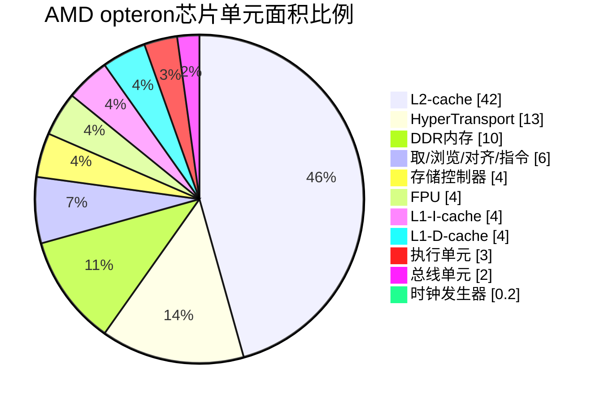

# *17_ARMv8_高速缓存（二）ARM cache设计*

>Looking at the ARM1 die, you see functional blocks such as 100 bytes of registers and a basic 32-bit ALU. On the M1 die, similar-sized functional blocks are a 12-megabyte cache and a complete 64-bit CPU core. It shows what Moore's law has done over 35 years.

<div align='center'>

</div>

图片来源[^2]，让我们看看在SoC上面cache在哪里，占面积大小多少。我们可以看到，cache占了非常大的芯片面积。我们可以从计算机接口的书籍上拿到这个数据，对于AMD opteron处理器芯片（0.13um技术，芯片大小193mm^2）：



参考关于cpu的历史文献[^1]。

# 1 cache架构设计[^3]

当ARM架构被开发的初期，CPU处理器和内存访问的速度几乎一致。而现代的处理器越来越复杂并且工作频率也大幅度的提升，然而外部总线和内存设备的工作频率并没有随着提升而限制了CPU的性能。因而，就需要设计一个“小而快”片上SRAM模块来配合CPU的速度。但是，此类SRAM的价格与同比空间的DRAM相比十分昂贵。**在很多基于ARM的处理器中，访问外存需要花费10倍甚至百倍的指令周期。**

Cache是一个放置在外存和处理器之间的“小而快”的内存模块，里面存放着内存数据的副本。访问cache的效率远高于访问内存的效率。无论是处理器向内存中读或者写数据，ARM都会先scan cache中的数据。如果ARM在cache中发现匹配的地址，ARM就会直接使用cache中的数据，而不会再去访问外存，这就降低了ARM访问外存的次数从而有效的提升了整个ARM的性能。另一方面，减少外存的访问，减少了一部分指令执行，从而也间接地降低了ARM的功耗水平。

<div align='center'>

</div>

在ARMv8-A的体系架构中的处理器通常会实现超过2级的cache，这也是经典处理器的做法，L1设定一个比较小的core独享的d-cache和i-cache，L2设定一个相比于L1要大的cache，且在L2由多个cores（集群）共享，在Cortex-A53和A72就是这样的设定。除此之外，还需要注意，在一些ARM中还会布置一个外部的L3 cache作为一个硬件模块，也是有多个cores共享。

从主存到cache传输的数据并没有比正常快多少，而在接下来访问已经在cache中的数据就会很快了。尽管一些我们已经标记了属性的例如外围设备这种无法缓存的地址，ARM的core还是会对所有的在cache中的取址和数据读写进行检查。这是因为cache中保留的数据或者指令是内存中的子集，我们需要一种手段能够快速地判断出，在cache中所查询的地址是不是我们要找的。

在某种偶然的情况下，在cache中的数据和指令和在外存中的可能不一致，例如，第一个core更新cache的内容还没有被回写到主存中，第二个core可能拿到了主存旧的数据到了自己的cache中，接着第一个core把cache回写到主存中。此时第二个core的cache和主存的core就存在了**一致性问题（coherency）** 。通常DMA和多核可能会导致这种不寻常的问题。（我们会有专门的部分来说明一致性的问题）

## 1.1 cache 术语

在冯·诺伊曼体系架构中，只有一种cache为数据和指令共享。然而，在哈佛体系架构中，存在数据总线和指令总线，因此cache也分为两种，一种是指令cache，一种是数据cache。在ARMv8处理器中，L1级的cache分为指令和数据cache，L2级cache共享。

### 1.1.1 基本术语

在cache上面存储着**[地址]、 [数据]和[状态信息]**。用下图来说明cache上面的一些术语。

<div align='center'>

</div>

**tag** 是存储在cache上的内存地址的一部分，用于区分和数据行的关联的主存地址。高64位地址用于告诉cache数据是从主存的哪里来的，我们把它称为tag。cache的总大小就是cache能存储数据的最大容量。

**cache line :**  如果让一个tag只携带一个字长的数据那么就太低效了，因此我们让tag携带多个字的数据，这组数据我们就称为**缓存行（block）**。cache line是cache访问主存最小粒度的连续的块大小。cache line应该只包含数据或者指令，其他数据视为无效。cache line通常大小是**32byte或者64byte**。每个数据行都有一个或者多个状态位，比如**有效位（valid bit）**和**脏位（dirty bits）**。有效位用于指示cache line的数据是可以被使用的；脏位（可能有多个位）用于表示当前cache line中的数据是不是和主存的数据是不是不一致（更新一些）。

**index**：在地址中的index表示在cache中哪一行数据可以被找到。**way**：组相联的cache，高速缓存分为大小相同的几个块。**set**：组相联对cache的分组，一个组里面有多个路。**offset**：处理器可以按照字或者字节来寻找cache line的内容。

**我们可以总结cache的工作流程，arm访问cache的时候对地址进行编码，根据索index来查找组，一个组中会有多个cache line对应。这时候通过tag来区分到底是哪条cache line。确定cache line之后再通过offset来找到具体的数字，完成数据的查找。**

### 1.1.2 组相联

ARM core的cache的结构采用组相联的方式，这个可以有效的减少与脏数据的冲突的可能性、提高程序执行速度还有增加数据的局部性。**不过这些都是以牺牲硬件成本位和功耗为代价的**，因为每一次都需要遍历一下tags。

ARM把cache分为几个等大小的块，称为路way。一个内存位置会被映射称为一个way，而不是一条line。index能找到确定line的位置，但是同时指向了每个way中的cache line。一般一个L1的D-Cache有2个或者4个way。在Cortex-A57中3个way的I-Cache，共用的L2 cache里面有16条ways。L3有更大的空间，会有更多的ways。

<div align='center'>

</div>

提高cache的关联性（增加每个way中的cache line行数）可以有效减少cache抖动[^4]。最理想的状态就是独占一份一对一的映射，然而这是不太可能的，cache本身就很小。通过实验表明，L2 cache 设定8-16 ways更有效一些。

## 1.2 标签和物理地址

每一条cache line上都会记录外存上的物理地址，cache line的大小可以被定义，但是要注意多核情况下的cache line大小都是一致的，因为他们在硬件连线上是连接到一起的。在ARMv8中，d-cache通常是以 **物理地址编为索引，以物理地址为标记（Physically Indexded, Physically Tagged）**，也可是**以虚拟地址为索引，以物理地址为标记（vitually Indexed, physically tagged）**

cache line由以下几个部件构成：
*	关联物理地址的标签值：tag
*	有效位：valid bit；valid bit也有可能是MESI状态位，如果cache在多核之间是一致的。
*	脏位：dirty bits：用于指示cache line中的数据是不是和外存一致。

ARM的cache采用组相联的结构。这就意味着对于一个给定的地址，cache可能映射在多个位置（再通过tag来识别映射在哪个位置）。组相联的cache可以有效减缓cache抖动，也可以提升程序的执行速度，这样做的缺点就是增加了硬件的复杂度，间接地，提升了arm处理器的功耗。以Cortex-A53为例子，Cortex-A53提供了32KB的L1-D-Cache，4-way，16word（64bytes）长度的cache line，注意，这里说的cache line的长度，不是总长度，而是数据的长度。如图所示：

<div align='center'>

</div>

### 1.2.1 访问L1 cache

我们现在假设一种可以访问到cache的场景，在单核的情况下使用：`LDR X0, [X1]`，这个指令的意思是，把X1地址中存储的数据加载到X0寄存器中。如果X1指向的地址的数据被标记为可缓存的，就会在L1的dcache中查找地址数据。如果地址在L1中被找到了，那么久直接返回数据到core里面，指令就会把这个数据存入X0寄存器。

<div align='center'>

</div>

### 1.2.2 访问L2 cache
如果数据在L1中没有发现，但是在L2中，数据就会从L2被加载到L1，然后返回给core。从L2返回L1的时候，可能会让L1驱逐出一个cache line以腾出一行的空间容纳L2加载过来的数据，而且这个数据可能依然还会存在于L2之中。

<div align='center'>

</div>

### 1.2.3 访问L3 cache
如果数据都没有在L1和L2中，数据查找就会转向外存中，外存把数据加载到L2，再从L2加载到L1，最后从L1传递到core。这时候在L2和L1层级都发生了cache line的驱逐，数据保存在外存，L2，L1上面。


以上的访问都是在一种比较简单的视角——单一核心的访问。而对于多核甚至大规模cluster，在执行从外存加载数据的时候，每个核的每一级的cache可能都会被检查。初次之外，以上的例子还没有考虑一个外置的L3cache或者系统cache。所以要有一种意识，我们考虑问题的时候不要考虑单一核的情况，更应该考虑到多个核心的影响。

### 1.2.4 VIVT / PIPT / VIPT

#### 1.2.4.1 三种基本结构

关于cache的结构，可以分为三类VIVT，PIPT和VIPT[^10]。下图参考[^11]。


早期的ARM处理器，如ARM9采用VIVT的方式，不经过MMU的翻译直接使用虚拟地址索引。CPU以虚拟内存发起寻访请求，直接访问虚拟高速缓冲（v-cache），如果命中就直接拿到数据，如果没有命中，这个虚拟地址会被移交给下一级TLB。这个方式会导致虚拟内存到物理地址的映射的重名问题。当系统改变了虚拟地址到物理地址的映射的时候，需要清空这些cache让其失效。对效率有影响。


PIPT模式是一个比较经典的模式，CPU以虚拟内存发起寻访请求，这个虚拟内存会进入到TLB查找物理地址，如果命中，再去访问cache；如果没有命中，访问MMU，从MMU拿到地址后再去访问cache。


在ARM11系列处理器采用VIPT的方式，处理器会把虚拟地址发送给TLB，同时也会把虚拟地址的index发送给物理cache。
* 	如果TLB命中，从TLB上面可以拿到PA的值，然后物理cache会查到tag，TLB输出的PA也包含tag，对比两个tag，如果匹配视为cache命中；
* 	如果TLB命中，但是tag对比失败，视为cache miss，就要从物理内存中重新load到cache，MMU不需要更新，这样下一次必然命中。
* 	如果TLB没有命中，那么物理cache根本不可能被命中，直接从物理内存load到cache，且MMU刷新TLB，下一次必然命中。

采用VIPT结构的好处之一就是在多任务操作系统中，修改了虚拟内存地址到物理内存地址的映射关系，不需要使相应的cache失效。因为这样的映射关系改变，必然tag值是不一样的，就理所应当的导致cache miss。


#### 1.2.4.2 重名问题（Aliasing, Synonym）

在一个多核系统中，并发，某个变量地址是一致的，如图所示：


从进程的视角来看，因为有MMU的存在，每个站在自己的视角都会觉得自己占用了整个系统的内存，MMU让进程产生了这样的“幻觉”，现代的操作系统是一个多任务多进程的操作系统，在不同的进程中，就可能存在一种状况，我们或许可以通过软件的压测来撞出这个低概率的问题——A进程的某一段程序和B进程的某一段程序恰巧映射到相同的物理空间了，**这就是重名问题（Aliasing, Synonym）**。


这种映射的方式如上图所示，线程1的VA1在虚拟v-cache中V1索引的存在，线程2的VA2在v-cache中的V2索引，他们恰巧都被MMU映射到了物理内存上面。假如此时VA1通过cache，write-back或者write-through数据到物理内存（红色虚线），但是VA2没有做任何的操作，那么PA和VA2就产生了coherency的问题。这种问题对于进程2来说十分危险，因为数据不可控制的被外界所改，而改的地方可能是数据，也可能是指令，当进程2刷入红色虚线的数据的时候，进程2就产生了一个不可预知的问题，幸运的话程序崩溃，程序员还能去追查这个问题；可不幸的是程序B带着这样的隐患一只运行下去，那真的是很危险了。

关于重名问题也有大学的专门去讨论了这个问题，并给出了如何anti-aliasing，参考链接[^11]: [**Computer Architecture - cache-tlb-mmu ppt.pdf 备份**](https://github.com/carloscn/doclib/blob/master/ppt/arm%20/Computer%20Architecture%20-%20cache-tlb-mmu%20ppt.pdf)

#### 1.2.4.2 同名问题 (homonyms)

同名问题是指相同的虚拟地址对应不同的物理地址。在多任务的操作系统中，会存在很多同名的虚拟地址，这些相同的虚拟地址被MMU转换为不同的物理地址。这个问题常常存在于进程切换的时候，当一个进程切换到另一个进程的时候，进程2就会访问到就进程1遗留下来的cache中（在TLB内同样存在这个问题），而这个数据对于进程2来说是错误的没有用处的。因此，在切换进程的时候先使用flush（写回内存后无效cache数据）cache，且TLB也要使无效操作。

所有采用v-cache的结构都会遇到这个问题，而采用p-cache结构的可以避免这个问题，因为p-cache的索引是依赖于MMU地址得到的。


## 1.3 cache控制器

cache主要就是管理cache存储的，这个控制器对于软件编程人员来说是透明的。我们上面说的load/check的行为的发起者就是cache的控制器。当cache控制器收到core的带着一个地址的读写的的请求，它就会来检查这个地址低位子集能不能在cache里面发现，这个过程有个专业的术语叫做 *cache look-up* ，接着cache控制器就会去访问这个地址tag的子集位，如果符合就称为cache hit，再如果这个cache line被标记为valid，那么就可以发生读写。这些行为都是cache控制器做的。

cache控制器还有一个需要注意的地方，在发生miss的时候，我们都知道，会从L2来读取数据。但这个读取过程cache控制器还是做了一些提高效率的处理的，这部分处理对程序员来说是透明的，无法感知到的，但是我们作为科普明白cache控制器在load的过程中是如何表现的。当一个cache没有被命中，或者cache line标记为无效的之后，就会从从L2或者external memory读取数据。与此同时，这也需要cache linefill（cache行填充），cache linefill导致主存中的一些数据内容被复制到cache中。与此同时，请求的数据或者指令以数据流的形式进入到core中，core在使用这些数据之前不需要等待linefill完成。例如，我们在执行load指令的时候，没有命中，触发了cache的行填充 ，此时core即使发现没有linefill，也会取回已经包含的请求的数据部分，剩余的部分会在背后默默的执行。

## 1.4 cache策略

cache的策略用来描述，什么时候一个cache line应该被分配数据，当命中数据cache的存储指令被执行的时候会发生什么。

### 1.4.1 cache 分配策略

读写cache有一个理想的目标，就是我们读和写的时候要保持外存和cache的数据是一致的，所以在缺失的时候，就需要去维护这个事情。cache的分配策略实际上就是在说明，在发生读和写的时候要不要和主存中保持严格地一致。

#### Write allocation (WA)

CPU在写的时候面临两个选择，就是我是直接往外存里面写，还是写到cache里面，让cache去维护外存，还是我不管不顾直接都写了。这个行为就是由WA来控制。如果我们使能了WA，在发生miss + write的时候，一个cache line会被分配。CPU怎么分配呢？CPU会把数据加载到cache中（分配了一个cacheline，这个时候里面还是旧的数据），然后把准备写的数据刷入cache；然而，WA没有开启，那么CPU直接绕过cache，把数据写入主存中。

这就意味着执行一个存储指令可能造成比其需要的更多的数据访问，因为cache操作是按照cache line为最小单元，即使我们访问的是一个字节，也会引起一个cache line大小的数据的变换。

#### Read allocation (RA)

读分配就是先把主存数据加载到cache，然后从cache读（我理解只要开cache必然是RA属性）

### 1.4.2 cache 更新策略

#### Write Back (WB)

我们在cache要素里面[^4]讲到write back，指示cpu和cache之间的数据交换，而cpu和cache不会每一次都把数据放在外存中，只有在cache line被驱逐的时候，被改的数据才会更新到下一级存储器。在硬件上这样的技术就要有一个标识位，来指示是不是已经和内存的数据不一致了。

<div align='center'>

</div>

#### Write through (WT)

我们在cache要素里面[^4]讲到write through，这种模式CPU比较累，也比较低效，同时更新cache和外存。这个时候就不需要dirty bits来指示是不是旧数据了，因为每一次都更新了。

<div align='center'>

</div>

**注意，RT和RB策略和WB和WT完全一致。**

我们在内存管理（二）中提到内存分为normal memory和device memory，normal内存是可缓存的，而device momroy是不可缓存的。对于normal内存，还可以分为*inner*和*outer*属性。通常inner属性使用集成的cache中，而outer属性通过外设总线访问外部内存。

<div align='center'>

</div>

normal memory能够被处理器预测性地访问，这就意味着在没有程序员的精准操作下，normal memory能够被潜在的自动的被load内存中。但ARM也给程序员一些机会，能够按照自己的意愿预先指示哪些数据会在未来能够被使用到。ARMv8-A提供了预先命中指令。

*   在AArch64： `PRFM PLDL1KEEP ,[Xm, #imm]`，这个就指定一个从`Xm + offset`到L1 cache的Prefetch。
*   在AArch32：`PLD Rm`，preload data from address in Rm to cache

>More generally, the A64 instruction to prefetch memory has the following form:
>
>PRFM <prfop>, addr 
>
>**Where:** 
>
>*   <prfop> <type><target><policy> | #uimm5
>
>*   <type> PLD for prefetch for load / PST for prefetch for store
>
>*   <target> L1 for L1 cache, L2 for L2 cache, L3 for L3 cache
>
>*   <policy> KEEP for retain or temporal prefetch means allocate in cache normally STRM for streaming or non-temporal prefetch means the memory is used only once
>
>*   uimm5 Represents the hint encodings as a 5-bit immediate. These are optional.

## 1.5 PoC和PoU

在ARM这边我们引入一个概念，方便我们后面理解一致性的问题。一致性实际上是由范围的，这个范围就是观测者可以看到的角度，一个机制的设定是有可视范围的，同样也是有盲区的。cpu作为一宫之主并不是所有的信息都及时的掌握。

<div align='center'>

</div>

一致性角度（Point of Coherency），一致性的角度可以说是整SoC的全局角度，这里包含CPU、DSPs、GPU或者DMA这些，意图是描述所有能够访问内存的单元。如果有人说PoC一致，那么那么就要保证整个系统的内存都是一致的。如图上图和下图所示，外部内存（总线访问，且总线上还挂着别的器件）和红色圈起来的区域的一致性是PoC一致性。如果外设设备通过AMBA总线修改了内存的数据，此时Core是无法感知到的，因此就出现cache coherency的问题。

<div align='center'>

</div>

统一性角度（Point of Unification），统一性是站在core层级而言的，core能看见的是i-cache，d-cache、TLB、MMU这些。

<div align='center'>

</div>

对于这些划分，实际上是帮助理解一些cache维护指令的范围（有无效操作和清理操作），另一方面在内存屏障中会使用到共享属性的性质。ARM架构并没有要求硬件来保证指令cache和内存的一致性，因此需要软件操作指令来维护。

## 1.6 cache维护

有的时候软件有必要对cache进行维护，对其进行无效(invalidate)及清除(clean)操作。一般这种情景是，外存设备的内容发生改变了，我们有必要需要在cache上面清除掉数据。另一种场景，在MMU相关的操作之后，比如变成内存访问权限、cache策略变换、或者虚拟地址映射的时候需要对cache进行维护。还有一种场景是，在使用了JIT-compilers动态产生代码和动态库的loader的时候，I-cache和D-cache必须被同步。

我们上面看cache的结构的时候，cache line上面有Valid bit，dirty bits，data bits这三个位置，维护操作相当于暴露出一个可以对这三种类的功能位进行修改和访问的接口：

*   invalidate
*   clean
*   zero

### 1.6.1 base operations

**invalidate**

对cache使无效（或者对cache line使无效）意思是清空数据是通过复位valid bit来达到目的的。cache在复位之后的初始状态必须是无效状态。

**clean**

清除cache或者cache line的意思是标记dirty bits来写回到下一级的cache或者主存中，然后清除cache line中的脏位。使得cache line的数据和下一级的内存的数据保持一致。这种情况只适合于write-back策略的cache。这也是一种方法用于用户能够从外部的内存中观察到cache里面的数据。

**Zero**

zero只针对于d-cache。把cache内的内存块写0。在某些情况洗，比如在初始化阶段对某些块内存进行清0操作，cache就会预先写0，然后对内存清0速度就很快。在ARMv8架构里面提出了一个新的指令`DC ZVA`，用于预加载cache的数据。 

**Flush**（独特）

ARM64提供了一个混合操作，flush操作，flush = clean + invalidate。

### 1.6.2 指令支持

ARMv8体系结构可以支持7级cache的访问。当对一个cache进行操作的时候，我们需要时刻提醒自己，访问的范围在哪里：

*   PoC
*   PoU

AArch64的cache维护操作可以使用指令来执行，按照格式：

`<cache> <operation>{, <Xt>}`

| Cache | Operation | Description                                                  | AArch32Equivalent |
| ----- | --------- | ------------------------------------------------------------ | ----------------- |
| `DC`  | `CISW`    | Clean and invalidate by Set/Way                              | `DCCISW`          |
|       | `CIVAC`   | Clean and Invalidate by Virtual Address to Point of Coherency | `DCCIMVAC`        |
|       | `CSW`     | Clean by Set/Way                                             | `DCCSW`           |
|       | `CVAC`    | Clean by Virtual Address to Point of Coherency               | `DCCMVAC`         |
|       | `CVAU`    | Clean by Virtual Address to Point of Unification             | `DCCMVAU`         |
|       | `ISW`     | Invalidate by Set/Way                                        | `DCISW`           |
|       | `IVAC`    | Invalidate by Virtual Address, to Point of Coherency         | `DCIMVAC`         |
| `DC`  | `ZVA`     | Cache zero by Virtual Address                                | -                 |
|       | `IALLUIS` | Invalidate all, to Point of Unification, Inner Sharable      | `ICIALLUIS`       |
| `IC`  | `IALLU`   | Invalidate all, to Point of Unification, Inner Shareable     | `ICIALLU`         |
|       | `IVAU`    | Invalidate by Virtual Address to Point of Unification        | `ICIMVAU`         |

Xt用于传递参数，例如虚拟内存地址，对这个地址没有没有严格的对齐要求。所有指令缓存维护指令都可以按照与其他指令缓存维护指令相关的任何顺序执行（可能会无序），除非使用DSB指令强制memory orders。

**Flush cache to PoU**

```assembly
  IC IVAU, X0        // Instruction Cache Invalidate by address to Point of Unification
  DC CVAC, X0        // Data Cache Clean by address to Point of Coherency
  IC IVAU, X1        // Might be out of order relative to the previous operations if 
                     // x0 and x1 differ
```

前两个指令如果他们X0是一样的地址，他们则是顺序的执行。然后最后一条指令可能会被re-order，假如X1是一个不一样的地址。

**Invalidate cache to PoC**

```assembly
IC IVAU, X0 		// I cache Invalidate by address to Point of Unification 
IC IALLU 			// I cache Invalidate All to Point of Unification 
 					// Operations execute in order
```

下面的代码展示一个clear数据或者统一cache（PoC）通用的机制：

```assembly
       MRS X0, CLIDR_EL1
       AND W3, W0, #0x07000000  // Get 2 x Level of Coherence
       LSR W3, W3, #23
       CBZ W3, Finished
       MOV W10, #0              // W10 = 2 x cache level
       MOV W8, #1               // W8 = constant 0b1
Loop1: ADD W2, W10, W10, LSR #1 // Calculate 3 x cache level
       LSR W1, W0, W2           // extract 3-bit cache type for this level
       AND W1, W1, #0x7
       CMP W1, #2
       B.LT Skip                // No data or unified cache at this level
       MSR CSSELR_EL1, X10      // Select this cache level
       ISB                      // Synchronize change of CSSELR
       MRS X1, CCSIDR_EL1       // Read CCSIDR
       AND W2, W1, #7           // W2 = log2(linelen)-4
       ADD W2, W2, #4           // W2 = log2(linelen)
       UBFX W4, W1, #3, #10     // W4 = max way number, right aligned
       CLZ W5, W4               /* W5 = 32-log2(ways), bit position of way in DC                                    operand */
       LSL W9, W4, W5           /* W9 = max way number, aligned to position in DC
                                   operand */
       LSL W16, W8, W5          // W16 = amount to decrement way number per iteration
Loop2: UBFX W7, W1, #13, #15    // W7 = max set number, right aligned
       LSL W7, W7, W2           /* W7 = max set number, aligned to position in DC
                                   operand */
       LSL W17, W8, W2          // W17 = amount to decrement set number per iteration
Loop3: ORR W11, W10, W9         // W11 = combine way number and cache number...
       ORR W11, W11, W7         // ... and set number for DC operand
       DC CSW, X11              // Do data cache clean by set and way
       SUBS W7, W7, W17         // Decrement set number
       B.GE Loop3
       SUBS X9, X9, X16         // Decrement way number
       B.GE Loop2
Skip:  ADD W10, W10, #2         // Increment 2 x cache level
       CMP W3, W10
       DSB                      /* Ensure completion of previous cache maintenance
                                  operation */
       B.GT Loop1
Finished:
```

*   在正常的状况下，clean或者invalidate整个cache指示在上电和下电的时候才去做的，因为L2的cache通常比较大，所以需要一些时间。因此使用这种clean就明确的限于这种场景。
*   cache必须关闭在启动的序列中。
*   在SMP系统中，另一个核kennel会拿到一个脏的cacheline，应该防止他们进入PoC。Cortex-A53和Cortex- A7处理器能做这个。
*   如果有EL3，cache的无效必须是在安全世界进行，normal世界不具备这个能力。如果在安全世界没有使无效，那么当这些安全世界的数据从cache被逐出的时候，会把数据泄漏到外存中。在硬件上，安全世界和非安全世界是共用一个cache的。

如果软件需要指令执行和内存中保持一致性，就必须使用ISB和DSB的内存屏障指令保证执行顺序，也必须注意使用cache维护指令。

```assembly
  /* Coherency example for data and instruction accesses within the same Inner
     Shareable domain. Enter this code with <Wt> containing a new 32-bit instruction,
     to be held in Cacheable space at a location pointed to by Xn. */
     
  STR Wt, [Xn]
  DC CVAU, Xn     // Clean data cache by VA to point of unification (PoU)
  DSB ISH         // Ensure visibility of the data cleaned from cache
  IC IVAU, Xn     // Invalidate instruction cache by VA to PoU
  DSB ISH         // Ensure completion of the invalidations
  ISB             // Synchronize the fetched instruction stream
```

>The code cleans and invalidates data and instruction caches by Virtual Address for a region starting at the base address given in x0 and length given in x1.

```assembly
  //
  // X0 = base address
  // X1 = length (we assume the length is not 0)
  //
  // Calculate end of the region
  ADD x1, x1, x0                // Base Address + Length
  //
  // Clean the data cache by MVA
  //
  MRS X2, CTR_EL0               // Read Cache Type Register
  // Get the minimun data cache line
  //
  UBFX X4, X2, #16, #4          // Extract DminLine (log2 of the cache line)
  MOV X3, #4                    // Dminline iss the number of words (4 bytes)
  LSL X3, X3, X4                // X3 should contain the cache line
  SUB X4, X3, #1                // get the mask for the cache line
  BIC X4, X0, X4                // Aligned the base address of the region
clean data cache:
  DC CVAU, X4                   // Clean data cache line by VA to PoU
  ADD X4, X4, X3                // Next cache line
  CMP X4, X1                    // Is X4 (current cache line) smaller than the end 
                                // of the region
  B.LT clean_data_cache         // while (address < end_address)
  DSB ISH                       // Ensure visibility of the data cleaned from cache
  //
  //Clean the instruction cache by VA
  //
  // Get the minimum instruction cache line (X2 contains ctr_el0)
  AND X2, X2, #0xF             // Extract IminLine (log2 of the cache line)
  MOV X3, #4                   // IminLine is the number of words (4 bytes)
  LSL X3, X3, X2               // X3 should contain the cache line
  SUB x4, x3, #1               // Get the mask for the cache line
  BIC X4, X0, X4               // Aligned the base address of the region
clean_instruction_cache:
  IC IVAU, X4                  // Clean instruction cache line by VA to PoU
  ADD X4, X4, X3               // Next cache line
  CMP X4, X1                   // Is X4 (current cache line) smaller than the end 
                               // of the region
  B.LT clean_instruction_cache // while (address < end_address)
  DSB ISH                      // Ensure completion of the invalidations
  ISB                          // Synchronize the fetched instruction stream
```

## 1.7 cache自举

### 1.7.1 相关寄存器

对于ARM处理器，需要知道cache的有关信息：

*   系统支持多级cache？
*   cache line大小？
*   多少set，多少way？

<div align='center'>

</div>


*   CLIDR_EL1 (Cache Level ID Register)[^5]: 这个寄存器用来表示cache的类型，以及系统最多支持多少级的cache。

*   CTR_EL0 (**Cache Type Register**)[^6]: 记录cache的相关信息，比如cache line大小，cache策略等等。

*   CCSIDR_EL1 (Current Cache Size ID Register ) [^7]:软件需要它来查询每一级cache的相关信息。

*   CSSELR_EL1 (Cache Size Selection Register)[^8]: 同CCSIDR

*   DCZID_EL0 (Data Cache Zero ID register)[^9]:指定清理操作DC ZVA的数据块大小。

### 1.8.2 实验

为了熟悉ARMv8的cache的自举的过程，我们需要基于Cortex-A72的树莓派进行cache信息的自举。主要dump出以下数据：

*   系统包含了几级cache？
*   每一级cache是独立的cache还是统一的cache？（是否是同一个cpu共用的）
*   每一级cache的路和组分别是说少？cache的容量是多少？
*   PoC指的是哪一级cache？
*   单处理器的PoU是哪一级的cache？
*   内部共享的PoU指的是哪一级cache？
*   L1指令cache是实现的VIPT还是PIPT？

```c
#include "io.h"
#include "type.h"

#define ICACHE_POLICY_VPIPT 0
#define ICACHE_POLICY_VIPT 2
#define ICACHE_POLICY_PIPT 3

static const char *icache_policy_str[] = {
    [0 ... ICACHE_POLICY_PIPT] = "RESERVED/UNKNOWN",
    [ICACHE_POLICY_VIPT] = "VIPT",
    [ICACHE_POLICY_PIPT] = "PIPT",
    [ICACHE_POLICY_VPIPT] = "VPIPT"
};

/*
 * CTR_EL0, Cache Type Register
 * https://developer.arm.com/documentation/ddi0601/2022-03/
 * AArch64-Registers/CTR-EL0--Cache-Type-Register?lang=en
 *
 * -    IminLine, bits [3:0]:
 *      Log2 of the number of words in the smallest cache line of
 *      all the instruction caches that are controlled by the PE.
 *
 * -    L1Ip, bits [15:14]:
 *      Level 1 instruction cache policy. Indicates the indexing and
 *      tagging policy for the L1 instruction cache. Possible values
 *      of this field are:
 *      -   00: VMID aware Physical Index, Physical tag (VPIPT).
 *      -   01: ASID-tagged Virtual Index, Virtual Tag (AIVIVT).
 *              (ARMv8 only)
 *      -   10: Virtual Index, Physical Tag (VIPT).
 *      -   11: Physical Index, Physical Tag (PIPT).
 *
 * -    DminLine, bits [19:16]:
 *      Log2 of the number of words in the smallest cache line of
 *      all the data caches and unified caches that are controlled
 *      by the PE.
 *
 * -    ERG, bits [23:20]
 *      Exclusives reservation granule, and, if FEAT_TME is implemented,
 *      transactional reservation granule. Log2 of the number of words of
 *      the maximum size of the reservation granule for the Load-Exclusive
 *      and Store-Exclusive instructions, and, if FEAT_TME is implemented,
 *      for detecting transactional conflicts.
 *
 * -    CWG, bits [27:24]
 *      Cache writeback granule. Log2 of the number of words of the
 *      maximum size of memory that can be overwritten as a result of
 *      the eviction of a cache entry that has had a memory location
 *      in it modified.
 *      -   A value of 0b0000 indicates that this register does not provide
 *          Cache writeback granule information and either:
 *          -   The architectural maximum of 512 words (2KB) must be assumed.3
 *          -   The Cache writeback granule can be determined from maximum
 *              cache line size encoded in the Cache Size ID Registers.
 *      -   Values greater than 0b1001 are reserved.
 *
 * -    IDC, bit [28]
 *      Data cache clean requirements for instruction to data coherence.
 *      The meaning of this bit is:
 *      -   0:  Data cache clean to the Point of Unification is required
 *              for instruction to data coherence,
 *              unless CLIDR_EL1.LoC == 0b000 or
 *              (CLIDR_EL1.LoUIS == 0b000 && CLIDR_EL1.LoUU == 0b000).
 *      -   1:  Data cache clean to the Point of Unification is not
 *              required for instruction to data coherence.
 *
 * -    DIC, bit [29]
 *      Instruction cache invalidation requirements for data to
 *      instruction coherence.
 *      -   0: Data cache clean to the Point of Unification is
 *             required for instruction to data coherence,
 *             unless CLIDR_EL1.LoC == 0b000 or
 *             (CLIDR_EL1.LoUIS == 0b000 && CLIDR_EL1.LoUU == 0b000).
 *      -   1: Data cache clean to the Point of Unification is not
 *             required for instruction to data coherence.
 *
 * -    TminLine, bits [37:32]
 *      Tag minimum Line. Log2 of the number of words covered by
 *      Allocation Tags in the smallest cache line of all caches
 *      which can contain Allocation tags that are controlled by
 *      the PE.
 *      -   For an implementation with cache lines containing 64
 *          bytes of data and 4 Allocation Tags, this will be
 *          log2(64/4) = 4.
 *      -   For an implementation with Allocations Tags in separate
 *          cache lines of 128 Allocation Tags per line, this will
 *          be log2(128*16/4) = 9.
 */
#define CTR_L1IP_SHIFT 14
#define CTR_L1IP_MASK 3
#define CTR_DMINLINE_SHIFT 16
#define CTR_IMINLINE_SHIFT 0
#define CTR_ERG_SHIFT 20
#define CTR_CWG_SHIFT 24
#define CTR_CWG_MASK 15
#define CTR_IDC_SHIFT 28
#define CTR_DIC_SHIFT 29
#define CTR_L1IP(ctr)		(((ctr) >> CTR_L1IP_SHIFT) & CTR_L1IP_MASK)

/*
 * CSSELR_EL1, Cache Size Selection Register
 *
 * Selects the current Cache Size ID Register, CCSIDR_EL1,
 * by specifying the required cache level and the cache type
 * (either instruction or data cache).
 *
 * https://developer.arm.com/documentation/ddi0601/2022-03/
 * AArch64-Registers/CCSIDR-EL1--Current-Cache-Size-ID-Register?lang=en
 *
 * -    TnD, bit [4]
 *      -   0: Data, Instruction or Unified cache.
 *      -   1: Separate Allocation Tag cache.
 *
 * -    Associativity, bits [12:3]
 *      (Associativity of cache) - 1, therefore a value of
 *      0 indicates an associativity of 1. The associativity
 *      does not have to be a power of 2.
 *
 * -    Level, bits [3:1]
 *      Cache level of required cache.
 *      -   0b000 : Level 1 cache.
 *      -   0b001 : Level 2 cache.
 *      -   0b010 : Level 3 cache.
 *      -   0b011 : Level 4 cache.
 *      -   0b100 : Level 5 cache.
 *      -   0b101 : Level 6 cache.
 *      -   0b110 : Level 7 cache.
 * -    InD, bit [0]
 *      Instruction not Data bit.
 *      -   0 : Data or unified cache.
 *      -   1 : Instruction cache.
 */
#define CSSELR_IND_I BIT(0)
#define CSSELR_LEVEL_SHIFT 1

/*
 * CCSIDR_EL1, Current Cache Size ID Register
 * Provides information about the architecture of
 * the currently selected cache.
 *
 * https://developer.arm.com/documentation/ddi0601/2022-03/
 * AArch64-Registers/CCSIDR-EL1--Current-Cache-Size-ID-Register?lang=en
 *
 * -    NumSets, bits [27:13]
 *      (Number of sets in cache) - 1, therefore a value of
 *      0 indicates 1 set in the cache. The number of sets
 *      does not have to be a power of 2.
 *
 * -    Associativity, bits [12:3]
 *      (Associativity of cache) - 1, therefore a value of
 *      0 indicates an associativity of 1. The associativity
 *      does not have to be a power of 2.
 *
 * -    LineSize, bits [2:0]
 *      (Log2(Number of bytes in cache line)) - 4. For example:
 *      -   For a line length of 16 bytes: Log2(16) = 4,
 *          LineSize entry = 0. This is the minimum line length.
 *      -   For a line length of 32 bytes: Log2(32) = 5,
 *          LineSize entry = 1.
 */
#define CCSIDR_NUMSETS_SHIFT 13
#define CCSIDR_NUMSETS_MASK (0x1fff << CCSIDR_NUMSETS_SHIFT)
#define CCSIDR_ASS_SHIFT 3
#define CCSIDR_ASS_MASK (0x3ff << CCSIDR_ASS_SHIFT)
#define CCSIDR_LINESIZE_MASK (0x7)

/*
 * CLIDR_EL1, Cache Level ID Register
 *
 * Identifies the type of cache, or caches, that are implemented
 * at each level and can be managed using the architected cache
 * maintenance instructions that operate by set/way,
 * up to a maximum of seven levels.
 *
 * Also identifies the Level of Coherence (LoC) and Level of
 * Unification (LoU) for the cache hierarchy.
 *
 * https://developer.arm.com/documentation/ddi0601/2022-03/
 * AArch64-Registers/CLIDR-EL1--Cache-Level-ID-Register?lang=en
 *
 * -    Ttype<n>, bits [2(n-1)+34:2(n-1)+33], for n = 7 to 1
 *      When FEAT_MTE2 is implemented:
 *          - 00 no tag cache
 *          - 01 separate allocation tag cache
 *          - 10 unified allocation tag and data cache
 *              allocation tags and data in unified lines.
 *          - 11 unified allocation tag and data cache
 *              allocation tags and data in separate lines.
 *
 * -    ICB, bits [32:30]
 *      Inner cache boundary. This field indicates the boundary
 *      for caching Inner Cacheable memory regions.
 *          -  0b000 : Not disclosed by this mechanism.
 *          -  0b001 : L1 cache is the highest Inner Cacheable level.
 *          -  ....  : Lx cache is the highest Inner Cacheable level.
 *          -  0b111 : L7 cache is the highest Inner Cacheable level.
 *
 * -    LoC, bits [26:24]
 *      Level of Unification Uniprocessor for the cache hierarchy.
 *
 * -    LoUIS, bits [23:21]
 *      Level of Unification Inner Shareable for the cache hierarchy.
 *
 * -    Ctype<n>, bits [3(n-1)+2:3(n-1)], for n = 7 to 1
 *      Cache Type fields. Indicate the type of cache that is implemented
 *      and can be managed using the architected cache maintenance instructions
 *      that operate by set/way at each level, from Level 1 up to a maximum of
 *      seven levels of cache hierarchy. Possible values of each field are:
 *          -   0b000: No cache.
 *          -   0b001: Instruction cache only.
 *          -   0b010: Data cache only.
 *          -   0b011: Separate instruction and data caches.
 *          -   0b100: Unified cache.
 */
enum cache_type {
    CACHE_TYPE_NOCACHE = 0,
    CACHE_TYPE_INST = BIT(0),
    CACHE_TYPE_DATA = BIT(1),
    CACHE_TYPE_SEPARATE = CACHE_TYPE_INST | CACHE_TYPE_DATA,
    CACHE_TYPE_UNIFIED = BIT(2),
};

static const char *cache_type_string[] = {
    "nocache",
    "i-cache",
    "d-cache",
    "separate cache",
    "unifed cache"
};

#define MAX_CACHE_LEVEL		7

#define CLIDR_ICB_SHIFT     30
#define CLIDR_LOUU_SHIFT	27
#define CLIDR_LOC_SHIFT		24
#define CLIDR_LOUIS_SHIFT	21

#define CLIDR_ICB(clidr)	(((clidr) >> CLIDR_ICB_SHIFT) & 0x7)
#define CLIDR_LOUU(clidr)	(((clidr) >> CLIDR_LOUU_SHIFT) & 0x7)
#define CLIDR_LOC(clidr)	(((clidr) >> CLIDR_LOC_SHIFT) & 0x7)
#define CLIDR_LOUIS(clidr)	(((clidr) >> CLIDR_LOUIS_SHIFT) & 0x7)

/* Ctypen, bits[3(n - 1) + 2 : 3(n - 1)], for n = 1 to 7 */
#define CLIDR_CTYPE_SHIFT(level)	(3 * (level - 1))
#define CLIDR_CTYPE_MASK(level)		(7 << CLIDR_CTYPE_SHIFT(level))
#define CLIDR_CTYPE(clidr, level)	\
	(((clidr) & CLIDR_CTYPE_MASK(level)) >> CLIDR_CTYPE_SHIFT(level))

/*
 * Getting the value of cwg by read CTR_EL0.
 * The value is log2(x).
 */
static inline unsigned int cache_type_cwg(void)
{
    return (read_sysreg(CTR_EL0) >> CTR_CWG_SHIFT) & CTR_CWG_MASK;
}
static inline unsigned int cache_line_size(void)
{
    u32 cwg = cache_type_cwg();
    return 4 << cwg;
}

static inline enum cache_type get_cache_type(int level)
{
    unsigned long clidr_reg = 0;

    if (level > MAX_CACHE_LEVEL)
        return CACHE_TYPE_NOCACHE;

    clidr_reg = read_sysreg(clidr_el1);
    return CLIDR_CTYPE(clidr_reg, level);
}

/*
 * get the ways and sets on each levels.
 *
 * We can get the information from the raspi maunal.
 * https://www.raspberrypi.org/documentation/hardware/raspberrypi/bcm2711/README.md
 *
 * Caches: 32 KB data + 48 KB instruction L1 cache per core. 1MB L2 cache.
 */
static void get_cache_set_way(unsigned int level, unsigned int ind)
{
    unsigned long val = 0;
    unsigned int line_size, set, way;
    int temp;

    /* 1. Ensure the target cache by writing the CSSELR_EL1 register */
    temp = (level - 1) << CSSELR_LEVEL_SHIFT | ind;
    write_sysreg(temp, CSSELR_EL1);

    /* 2. Read CCSIDR_EL1 register
     * note, the register is implemented two layouts.
     **/
    val = read_sysreg(CCSIDR_EL1);
    set = (val & CCSIDR_NUMSETS_MASK) >> CCSIDR_NUMSETS_SHIFT;
    set ++;
    way = (val & CCSIDR_ASS_MASK) >> CCSIDR_ASS_SHIFT;
    line_size = 1 << ( (val & CCSIDR_LINESIZE_MASK) + 4 );

	printk("          %s: set %u way %u line_size %u size %uKB\n",
			ind ? "i-cache":"d/u cache", set, way, line_size,
			(line_size * way * set)/1024);
}

int cache_self_test(void)
{
    int level;
    unsigned long ctype;
    unsigned long reg_val;

    printk("parse cache info:\n");

    for (level = 1; level <= MAX_CACHE_LEVEL; level ++) {
        /* get cache type */
        ctype = get_cache_type(level);
        /* when the cache type is nocache, return. */
        if (CACHE_TYPE_NOCACHE == ctype) {
            level --;
            break;
        }
		printk("   L%u: %s, cache line size %u\n",
				level, cache_type_string[ctype], cache_line_size());
        if (CACHE_TYPE_SEPARATE == ctype) {
            get_cache_set_way(level, 1);
            get_cache_set_way(level, 0);
        } else if (CACHE_TYPE_UNIFIED == ctype) {
            get_cache_set_way(level, 0);
        }
    }

    /*
     * Get ICB, LOUU, LOC and LOUIS
     * ICB: inner cache boundary.
     * LOUU: Single core PoU cache boundary.
     * LOC: PoC cache boundary.
     * LOUIS: PoU for inner sharing cache boundary.
     */
    reg_val = read_sysreg(clidr_el1);
	printk("   IBC:%u LOUU:%u LoC:%u LoUIS:%u\n",
			CLIDR_ICB(reg_val), CLIDR_LOUU(reg_val),
			CLIDR_LOC(reg_val), CLIDR_LOUIS(reg_val));
    reg_val = read_sysreg(ctr_el0);
    printk("   Detected %s I-cache\n", icache_policy_str[CTR_L1IP(reg_val)]);

    return level;
}
```


# 2 REF

[^1]:[Pentium M and Core Interlude ](http://www.qdpma.com/CPU/CPU_Core2.html)
[^2]:[Ken Shirriff-twitter - how it started and  how it’s going](https://twitter.com/kenshirriff/status/1327022266186559488)
[^3]:[ARM Cortex-A Series Programmer's Guide for ARMv8-A - . Caches ](https://developer.arm.com/documentation/den0024/a/Caches)
[^4]:[16_ARMv8_高速缓存（一）cache要素 #57](https://github.com/carloscn/blog/issues/57)
[^5]:[Arm A-profile Architecture Registers  - CLIDR_EL1, Cache Level ID Register ](https://developer.arm.com/documentation/ddi0601/2022-03/AArch64-Registers/CLIDR-EL1--Cache-Level-ID-Register?lang=en)
[^6]:[Arm A-profile Architecture Registers - CTR_EL0, Cache Type Register](https://developer.arm.com/documentation/ddi0601/2022-03/AArch64-Registers/CTR-EL0--Cache-Type-Register?lang=en)
[^7]:[Arm A-profile Architecture Registers  - CCSIDR_EL1, Current Cache Size ID Register ](https://developer.arm.com/documentation/ddi0601/2022-03/AArch64-Registers/CCSIDR-EL1--Current-Cache-Size-ID-Register?lang=en)
[^8]:[Arm A-profile Architecture Registers  - CSSELR_EL1, Cache Size Selection Register ](https://developer.arm.com/documentation/ddi0601/2022-03/AArch64-Registers/CSSELR-EL1--Cache-Size-Selection-Register?lang=en)
[^9]:[Arm A-profile Architecture Registers - DCZID_EL0, Data Cache Zero ID register ](https://developer.arm.com/documentation/ddi0601/2022-03/AArch64-Registers/DCZID-EL0--Data-Cache-Zero-ID-register?lang=en)
[^10]:[Virtually Indexed Physically Tagged (VIPT) Cache](https://www.geeksforgeeks.org/virtually-indexed-physically-tagged-vipt-cache/)
[^11]:[Computer Architecture Recitation 3 - Carnegie Mellon](http://course.ece.cmu.edu/~ece447/s15/lib/exe/fetch.php?media=18447_recitation3.pdf)