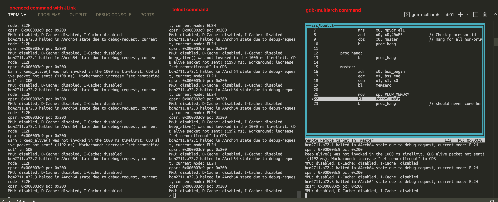

# Starting with JLink debugger or QEMU (ARMv8)

* Debugger: JLink V11
* Target Hardware: raspiberry 4b
* Host: Ubuntu 20.04-amd64

Note, the openocd installed by `sudo apt-get install openocd` is not work on ubuntu 20.04. The error prompted `Error: invalid command name "dap"`. So you shall compile the openocd by yourself. Please refer to the link  https://hackaday.io/page/4991-compiling-openocd-from-source-on-ubuntu-1604. (Though it is targetting for ubuntu 16.04, the 20.04 still follow these build steps.)

## 1. JLink Brief

We should use the three command terminals to launch the Jlink debugger. They are openocd/telnet/gbd-multiarch separately. 

40-pin gpio connect

gpio22-27 Alternative Function Assignments all are ALT4.

connect following gpio pin to jlink pin.

| PIN NAME | GPIO Function ALT |
| -------- | ----------------- |
| GPIO22   | ARM_TRST          |
| GPIO23   | ARM_RTCK          |
| GPIO24   | ARM_TDO           |
| GPIO25   | ARM_TCK           |
| GPIO26   | ARM_TDI           |
| GPIO27   | ARM_TMS           |
| 3.3v     | Vref              |
| GPIO09   | GND               |



On the openocd command line, should type the cmd is:

```bash
sudo openocd -f jlink.cfg -f raspi4.cfg
```

On the telnet command line, should type the cmds are:

```bash
telnet localhost 4444
> halt
> load_image /home/carlos/work/uncleben/armv8_trainning/lab01/benos.bin 0x80000
> step 0x80000
```

On the gdb command line, should ytpe the cmds are:

```bash
gdb-multiarch --tui benos.elf
> target remote localhost:3333
> b ldr_start
> c
> n
> layout regs
```

## 2. QEMU Brief

The QEMU is more simple and more quicker than the JLink debugger env.

On the QEMU side, just type the `qemu-system-aarch64 -machine raspi4 -nographic -kernel benos.bin -S -s` to launch the QEMU. For the gdb-multiarch side, `gdb-multiarch --tui benos.elf`


gdb-multiarch --tui benos.elf, the localhost port is 1234.
```
gdb-multiarch --tui benos.elf
> target remote localhost:1234
> b ldr_start
> c
> n
> layout regs
```

For the config files, you can get them by https://gist.github.com/carloscn/538d57d36b828e52bf8f88d6362b1528


```
gdb-multiarch --tui benos.elf
gdb> file benos.elf
gdb> target remote localhost:1234
gdb> b ldr_test // 设定断点
gdb> c
gdb> n
gdb> next //下一步
gdb> info register // 查看所有寄存器
gdb> info x1 x2 x3 // 查看x1/x2/x3寄存器
gdb> x 0x80000 // 读取内存0x80000值 32位
gdb> x/xg 0x80000 // 读取内存0x80000值64位
gdb> layout src
gdb> layout regs
gdb> layout split
```

