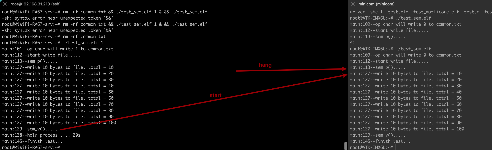

# Linux进程之间的通信-信号量（System V and POSIX IPC）

* 信号量 (sem) ： 管理资源的访问
* 共享内存 (shm)： 高效的数据分享
* 消息队列 (msg)：在进程之间简易的传数据的方法
* 互斥算法（Dekker, Peterson, Filter, Szymanski, Lamport面包店算法)

IPC（Inter-Process Communication，进程间通讯）包含三种通信方式，信号量、共享内存和消息队列。在linux编程里面可以有两个不同的标准，一个是SYSTEM-V标准，一个是POSIX标准。以下是两个标准之间的区别[^1]。简单的说，POSIX更轻量，常面向于线程；SYSTEM-V更重一些，需要深陷Linux内核之中，面向于进程。

## 1. POSIX和SYSTEM-V的区别

Following table lists the differences between System V IPC and POSIX IPC[^2].

| SYSTEM V                                                     | POSIX                                                        |
| :----------------------------------------------------------- | :----------------------------------------------------------- |
| AT & T introduced (1983) three new forms of IPC facilities namely message queues, shared memory, and semaphores. | Portable Operating System Interface standards specified by IEEE to define application programming interface (API). POSIX covers all the three forms of IPC |
| SYSTEM V IPC covers all the IPC mechanisms viz., pipes, named pipes, message queues, signals, semaphores, and shared memory. It also covers socket and Unix Domain sockets. | Almost all the basic concepts are the same as System V. It only differs with the interface |
| Shared Memory Interface Calls shmget(), shmat(), shmdt(), shmctl() | Shared Memory Interface Calls shm_open(), mmap(), shm_unlink() |
| Message Queue Interface Calls msgget(), msgsnd(), msgrcv(), msgctl() | Message Queue Interface Calls mq_open(), mq_send(), mq_receive(), mq_unlink() |
| Semaphore Interface Calls semget(), semop(), semctl()        | Semaphore Interface Calls Named Semaphores sem_open(), sem_close(), sem_unlink(), sem_post(), sem_wait(), sem_trywait(), sem_timedwait(), sem_getvalue() Unnamed or Memory based semaphores sem_init(), sem_post(), sem_wait(), sem_getvalue(),sem_destroy() |
| Uses keys and identifiers to identify the IPC objects.       | Uses names and file descriptors to identify IPC objects      |
| NA                                                           | POSIX Message Queues can be monitored using select(), poll() and epoll APIs |
| Offers msgctl() call                                         | Provides functions (mq_getattr() and mq_setattr()) either to access or set attributes 11. IPC - System V & POSIX |
| NA                                                           | Multi-thread safe. Covers thread synchronization functions such as mutex locks, conditional variables, read-write locks, etc. |
| NA                                                           | Offers few notification features for message queues (such as mq_notify()) |
| Requires system calls such as shmctl(), commands (ipcs, ipcrm) to perform status/control operations. | Shared memory objects can be examined and manipulated using system calls such as fstat(), fchmod() |
| The size of a System V shared memory segment is fixed at the time of creation (via shmget()) | We can use ftruncate() to adjust the size of the underlying object, and then re-create the mapping using munmap() and mmap() (or the Linux-specific mremap()) |

我从文献里面得到几个进程持续性概念，我觉得这个角度分类比较好。直接抄文献：从IPC的持续性角度而言，可以把进程通信分为以下几类[^3]：

>* 随进程持续 (Process-Persistent IPC)
>
>  * IPC对象一直存在，直到最后拥有他的进程被关闭为止，典型的IPC有pipes（管道）和FIFOs（先进先出对象）
>
>  * Pipe, FIFO, Posix的mutex（互斥锁）, condition variable（条件变量）, read-write lock（读写锁），memory-based semaphore（基于内存的信号量） 以及 fcntl record lock，TCP和UDP套接字，Unix domain socket
>
>* 随内核持续 (Kernel-Persistent IPC)
>
>  * IPC对象一直存在直到内核被重启或者对象被显式关闭为止，在Unix中这种对象有System V 消息队列，信号量，共享内存。（注意Posix消息队列，信号量和共享内存被要求为至少是内核持续的，但是也有可能是文件持续的，这样看系统的具体实现）。
>  * Posix的message queue（消息队列）, named semaphore（命名信号量）, System V Message queue, semaphore, shared memory。
>
>* 随文件系统持续  (FileSystem-Persistent IPC)
>
>  * 除非IPC对象被显式删除，否则IPC对象会一直保持（即使内核才重启了也是会留着的）。如果Posix消息队列，信号量，和共享内存都是用内存映射文件的方法，那么这些IPC都有着这样的属性。
>  * 要注意的是，虽然上面所列的IPC并没有随文件系统的，但是我们就像我们刚才所说的那样，Posix IPC可能会跟着系统具体实现而不同（具有不同的持续性），举个例子，写入文件肯定是一个文件系统持续性的操作，但是通常来说IPC不会这样实现。很少有IPC会实现文件系统持续，因为这会降低性能，不符合IPC的设计初衷。
>
>**System V IPC不是随进程持续的，是随内核持续的。**

**上面是摘录的，下面谈下我的理解：**我们在Linux编程里面，关于线程可以使用pthread_mutex, spinlock这些工具，这些工具都是在一个进程中的，守护的是进程内部的资源，因此作者提到随进程持续的概念；而两个无关进程之间对于访问同一个资源，比如文件，也是可能会有临界区，只是相比于进程内部的临界区，扩展到了系统内部的临界区，因此这里有随内核持续的概念。这也是为什么POSIX是一个轻量级的常用于线程的，而System V IPC是一个深陷内核的常用于进程的标准。我相信IPC在进程层级和线程层级既有相似的点也有不同的点。

## 2. 信号量

在[Linux-用户空间-多线程与同步](https://github.com/carloscn/blog/issues/9)[^14]中，引用了sem_xxx()的接口，根据上面的信息我们也可以知道这是POSIX IPC的接口。我们在那个文章中并没有阐述信号量和spinlock的区别，在网上大多数人只谈论到信号量和锁之间的用法上的区别，或者是意义上的区别。我这里想更进一步的解释信号量的实现和锁是有差别的。**还有pthread_xxx里面的spinlock和内核的spinlock理念是一样的，但是调度完全不一样，pthread_xxx的可以关注这个实验[^14]。**

* 互斥锁用于互斥（弹走另一个线程），信号量用于同步（不同的level，不同的同步）[^10]，pthread用户接口并没有提供信号量的相关接口
* 独占访问1，可以使用Dekker算法，但是算法依赖于spinlock忙等待，极大的耗费CPU资源（传统设备）。
* 独占访问2，高级一点硬件上面支持独占访问（ARMv8独占指令LDXR/STXR，ARM的独占监视器机制）[^12]，可以原子性的增加寄存器的值，节约了CPU的资源[^11]。
* spin_lock底层实现在ARM架构上面使用了内存独占的LDXR和STXR指令，也使用了WFE指令，让ARM进入到低功耗状态[^10][^11], 而x86架构是PAUSE指令。
* 在信号量内也使用了spin_lock，但是是raw_spinlock （arch_spin_lock）[^10][^13]。raw_spinlock禁止内核抢占，然后调用spin_lock。

System V中提供的信号量接口更通用相比于POSIX标准的信号量[^15]。我们从后面的API介绍上面可以看出，system V中的提供的信号量接口是非常复杂和繁琐的，虽然接口少，但是标识符，标志位特别多，而且里面定义了很多自己的结构体的结构，甚至出现了变长参数。根据文献[^15]，我们大分部使用的都是二进制的信号量，但我相信，这些接口都不是白给的，肯定有更多的使用场景，可能需要以后工作情景上面进行挖掘了。

### 2.1 APIs

#### 2.1.1 semctl[^16]

> **semctl**() performs the control operation specified by *cmd* on the System V semaphore set identified by *semid*, or on the *semnum*-th semaphore of that set. (The semaphores in a set are numbered starting at 0.)

```C
#include <sys/sem.h>

int semctl(int semid, int semnum, int cmd, ...);
```

**Parameters:**

| Params     | I/O   | Details                                                      |
| ---------- | ----- | ------------------------------------------------------------ |
| int semid  | Input | semid是由semget接口返回的标识符                              |
| int semnum | Input | sem_num参数是信号量的编号，当需要用到成组的信号量时候，就需要合格参数，一般取值为0，表示这是一个也是唯一一个信号量。 |
| int cmd    | Input | 将要采取动作，参考宏定义SETVAL, IPC_RMID, IPC_SET            |
| ...        | Input | 为一个union结构体，根据X/OPEN规范的定义包含 val, *buf, *array |

**Return:**

根据cmd不同，返回值也不同。对于 SETVAL和IPC_RMID而言，成功时返回0，失败时返回-1。

#### 2.1.2 semget[^17]

创建一个新的信号量或取得一个已有的信号量的key。

> The **semget**() system call returns the System V semaphore set identifier associated with the argument *key*. It may be used either to obtain the identifier of a previously created semaphore set (when *semflg* is zero and *key* does not have the value **IPC_PRIVATE**), or to create a new set.
>
> A new set of *nsems* semaphores is created if *key* has the value **IPC_PRIVATE** or if no existing semaphore set is associated with *key* and **IPC_CREAT** is specified in *semflg*.
>
> If *semflg* specifies both **IPC_CREAT** and **IPC_EXCL** and a semaphore set already exists for *key*, then **semget**() fails with *errno* set to **EEXIST**. (This is analogous to the effect of the combination **O_CREAT | O_EXCL** for [open(2)](https://man.archlinux.org/man/open.2.en).)

```C
#include <sys/sem.h>

int semget(key_t key, int nsems, int semflg);
```

**Parameters:**

| Params     | I/O   | Details                                                      |
| ---------- | ----- | ------------------------------------------------------------ |
| key_t key  | Input | 不相关的进程可以通过它访问同一个信号量。程序对所有的信号量访问都是间接的，先提供个key，接着系统生成一个对应的信号量标识符，只有semget函数直接使用key，其他的函数都适用semget返回的值。 |
| int nsems  | Input | 指定需要的信号量数目，它几乎总是1                            |
| int semflg | Input | 一组标识，和open类似，低9bit该信号的权限。可以通过联合使用IPC_CREAT和IPC_EXCL来确保创建一个新的，唯一的信号量。如果该信号量已经存在，则返回一个错误。 |

**Return:**

返回非零整数，为semctl,semop的标识符，返回<0失败。

#### 2.1.3 semop[^18]

改变信号量的值。

> **semop**() performs operations on selected semaphores in the set indicated by *semid*. Each of the *nsops* elements in the array pointed to by *sops* is a structure that specifies an operation to be performed on a single semaphore. The elements of this structure are of type *struct sembuf*, containing the following members:

```C
#include <sys/sem.h>

struct sembuf {
  unsigned short sem_num;  /* semaphore number */
	short          sem_op;   /* semaphore operation */
	short          sem_flg;  /* operation flags */
};

int semop(int semid, struct sembuf *sops, size_t nsops);
int semtimedop(int semid, struct sembuf *sops, size_t nsops,
               const struct timespec *timeout);    // _GNU_SOURCE
```

**Parameters:**

| Params              | I/O   | Details                                                      |
| ------------------- | ----- | ------------------------------------------------------------ |
| nt semid            | Input | semid是由semget接口返回的标识符                              |
| struct sembuf* sops | Input | sem_num:信号量编号，一般取值为0，除非使用一组信号；sem_op:一次操作中需要改变的数值，+1为V操作，-1为P操作；sem_flg:通常被设置为SEM_UNDO，将使得操作系统跟踪当前进程对这个信号量的使用情况，如果一个进程没有释放该信号量终止，操作系统将自动释放进程持有的信号量。如果对信号量没有特殊要求，记得将sem_flg设置为SEM_UNDO，如果决定使用一个非SEM_UNDO的值，那就一定要注意保持设置的一致性，否则会搞不清楚内核在进程退出的时候是否清理信号。 |
| size_t nsops        | Input | *nsops* elements in the array pointed to by *sops* is a structure that specifies an operation to be performed on a single semaphore. |

**Return:**

> On successful completion, the *sempid* value for each semaphore specified in the array pointed to by *sops* is set to the caller's process ID.

### 2.2 Example

根据文献[^15]提供的示例，完成使用System V级别的信号量，创建简单的二进制信号量，满足以下条件：

* 创建一个进程，允许该进程多次reentrant，塑造临界区竞争的场景。
* 在系统上创建一个文件common.txt，一个分行写入10x10的1, 一个分行写入10x10的0，通过输入参数实现。
* 写入操作使用信号量进行保护。
* 最后打开文件，需要看见1矩阵不会被破坏，0矩阵也不会被破坏。

关于semun.h请参考https://man7.org/tlpi/code/online/dist/svsem/semun.h.html, MACOS里面自带了定义，但是在Ubuntu和ARM-Linux上面并没有这个定义。

这里还要说一下，因为是使用的系统上的资源竞争（同一个文件），因此必须使用System V级别的信号量才能完成，而posix提供的同步的信号量的内存都是存在一个进程里面的。

这个例子划分 写入文件十次为一个临界区。

```C
#include <stdint.h>
#include <stdio.h>
#include <stdlib.h>
#include <string.h>
#include <unistd.h>

#include <sys/file.h>
#include <sys/sem.h>

#define debug_log printf("%s:%d--", __FUNCTION__, __LINE__);printf

#if defined(__linux__)
union semun {                   /* Used in calls to semctl() */
    int                 val;
    struct semid_ds *   buf;
    unsigned short *    array;
#if defined(__linux__)
    struct seminfo *    __buf;
#endif
};
#endif

static int set_semvalue(int sem_id)
{
    int ret = 0;
    union semun su;
    su.val = 1;
    ret = semctl(sem_id, 0, SETVAL, su);
    if (ret != 0) {
        debug_log("failed on semctl, ret = %d\n", ret);
        goto finish;
    }
finish:
    return ret;
}

static void del_semvalue(int sem_id)
{
    int ret = 0;
    union semun su;
    ret = semctl(sem_id, 0, IPC_RMID, su);
    if (ret != 0) {
        debug_log("failed on semctl, ret = %d\n", ret);
    }
}

static int sem_p(int sem_id)
{
    struct sembuf sem_b;
    int ret = 0;

    sem_b.sem_num = 0;
    sem_b.sem_op = -1;  /* P() */
    sem_b.sem_flg = SEM_UNDO;
    ret = semop(sem_id, &sem_b, 1);
    if (ret != 0) {
        debug_log("semop failed, ret = %d\n", ret);
    }
    return ret;
}

static int sem_v(int sem_id)
{
    struct sembuf sem_b;
    int ret = 0;

    sem_b.sem_num = 0;
    sem_b.sem_op = 1;  /* V() */
    sem_b.sem_flg = SEM_UNDO;
    ret = semop(sem_id, &sem_b, 1);
    if (ret != 0) {
        debug_log("semop failed, ret = %d\n", ret);
    }
    return ret;
}

int main(int argc, char *argv[])
{
    int i, ret;
    char op_chars[20];
    FILE *fd = NULL;
    int count = 0;
    int sem_id = 0;

    fd = fopen("common.txt", "a+");
    if (NULL == fd) {
        debug_log("failed on fopen\n");
        goto finish1;
    }
    sem_id = semget((key_t)1234, 1, 0666|IPC_CREAT);

    if (sem_id < 0) {
        debug_log("failed on semget\n");
        goto finish2;
    }

    if (argc > 1) {
        strcpy(op_chars, "111111111\n");
        debug_log("op char will write 1 to common.txt\n");
        ret = set_semvalue(sem_id);
        if (ret != 0) {
            debug_log("set_semvalue failed\n");
            goto finish2;
        }
    } else {
        strcpy(op_chars, "000000000\n");
        debug_log("op char will write 0 to common.txt\n");
    }

    debug_log("start write file.....\n");
    debug_log("sem_p().....\n");
    ret = sem_p(sem_id);
    if (ret != 0) {
        debug_log("failed on sem_p\n");
        goto finish3;
    }
    for (i = 0; i < 10; i++) {
        ret = fwrite(op_chars, 1, strlen(op_chars), fd);
        if (ret < 0) {
            debug_log("failed on fwrite\n");
            goto finish3;
        }
        count += ret;
        sleep(1);
        debug_log("write 10 bytes to file. total = %d\n", count);
    }
    debug_log("sem_v().....\n");
    ret = sem_v(sem_id);
    if (ret != 0) {
        debug_log("failed on sem_v\n");
    }

finish3:
    if (argc > 1) {
        // it is very important for another process using the semvalue.
        debug_log("hold process .... 20s\n");
        sleep(20);
        del_semvalue(sem_id);
    }
finish2:
    fclose(fd);
finish1:
    debug_log("finish test...\n");
    return ret;
}
```

`$ rm -rf common.txt`

`$ ./test_sem.elf 1`

`$ ./test_sem.elf`




## Reference

[^1]: [System V IPC vs POSIX IPC - Stack Overflow](https://stackoverflow.com/questions/4582968/system-v-ipc-vs-posix-ipc)
[^2]:[System V & Posix (tutorialspoint.com)](https://www.tutorialspoint.com/inter_process_communication/inter_process_communication_system_v_posix.htm)
[^3]:[UNIX 进程间通讯（IPC）概念（Posix，System V IPC）](https://www.cnblogs.com/Philip-Tell-Truth/p/6284475.html)
[^4]:[临界区互斥实现：Dekker互斥算法 - 知乎 (zhihu.com)](https://zhuanlan.zhihu.com/p/122544351)
[^5]: [操作系统原理——Dekker互斥算法详解_wsw875421872的博客-CSDN博客_dekker算法](https://blog.csdn.net/wsw875421872/article/details/17222219)
[^6]:[如何更好理解Peterson算法？ - 知乎 (zhihu.com)](https://zhuanlan.zhihu.com/p/374287625)
[^7]: [Peterson算法 - 维基百科，自由的百科全书 (wikipedia.org)](https://zh.wikipedia.org/wiki/Peterson算法)
[^8]: [Szymanski算法 - 维基百科，自由的百科全书 (wikipedia.org)](https://zh.wikipedia.org/wiki/Szymanski算法)
[^9]: [Lamport面包店算法 - 维基百科，自由的百科全书 (wikipedia.org)](https://zh.wikipedia.org/wiki/Lamport面包店算法)
[^10]: [一文搞懂 | Linux 同步管理（上） ](https://www.modb.pro/db/130382)
[^11]: [ARM WFI和WFE指令](http://www.wowotech.net/armv8a_arch/wfe_wfi.html)
[^12]:[06_ARMv8_指令集_一些重要的指令 · Issue #12 · carloscn/blog (github.com)](https://github.com/carloscn/blog/issues/12)
[^13]:[自旋锁spin_lock和raw_spin_lock](https://blog.csdn.net/DroidPhone/article/details/7395983)
[^14]:[Linux-用户空间-多线程与同步](https://github.com/carloscn/blog/issues/9)
[^15]:[Linux系统编程（第四版）- page490]()
[^16]:[archlinux man page - semctl](https://man.archlinux.org/man/semctl.2) ↩
[^17]:[archlinux man page - semget](https://man.archlinux.org/man/semget.2) ↩
[^18]:[archlinux man page - semop](https://man.archlinux.org/man/semop.2) ↩

