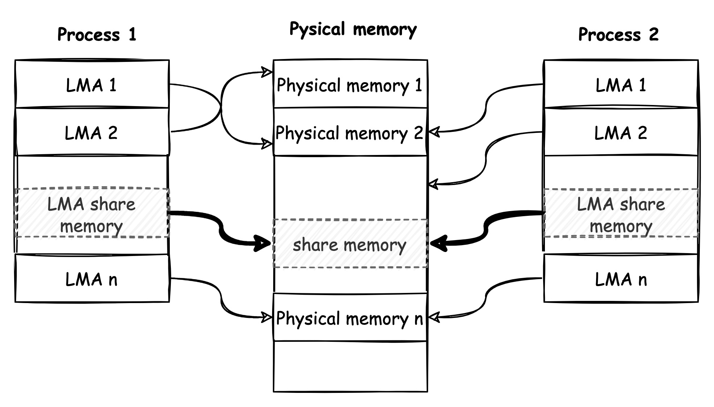
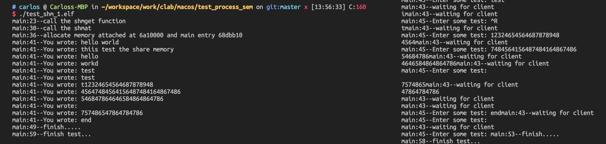

# Linux进程之间的通信-内存共享（System V）

* 信号量 (sem) ： 管理资源的访问
* 共享内存 (shm)： 高效的数据分享
* 消息队列 (msg)：在进程之间简易的传数据的方法
* 互斥算法（Dekker, Peterson, Filter, Szymanski, Lamport面包店算法)

IPC（Inter-Process Communication，进程间通讯）包含三种通信方式，信号量、共享内存和消息队列。在linux编程里面可以有两个不同的标准，一个是SYSTEM-V标准，一个是POSIX标准。以下是两个标准之间的区别[^1]。简单的说，POSIX更轻量，常面向于线程；SYSTEM-V更重一些，需要深陷Linux内核之中，面向于进程。

## 1. 内存共享

在大数据量的交换领域，使用memcpy是一个十分占据CPU和内存带宽的方法，共享内存作为Linux进程之间的通信是一个比较高效和节约资源的方法。现代多核心处理器，还有一个处理方法，比如对于视频的处理VPU，设定专门VDMA的RTL来处理。

### 1.1 原理

内存共享是随内核持续的，在两个毫无关系的进程中在userspace区域创建一个一块共享的内存，使两个进程都有读写的权限。既然是共享，必然涉及资源的竞争问题，故还要引入随内核持续的进程同步机制，来辅助访问共享的内存空间。如图所示，为进程的LMA在共享同一块share memory。



既然是内存，这里就不得不提到，shm机制到底从哪里分配的内存，是heap还是stack。这里借用一个这个人的问题：[^1]

>**Understand-shmat-and-attachment-to-the-process-memory?**
>
>It is recommended/conventional that the second argument to `shmat(int id , void * addr,int flg)` should be NULL.
>
>But if i want to give it a specific address (`void* addr`), *should that address be from the stack or the heap?*
>
>I mean do i have to malloc() and then pass that address to shmat or i can just declare void * adrr(or char * addr) and pass it to shmat.


>If **addr** is NULL, the system selects the first available address without corrupting the BSS segment. Most probably that will be in the heap. So you don't need to allocate.
>
>If **addr** is from the stack segment of your application, calling *shmat* will corrupt the stack. Most probably that will result in a segmentation fault in your program. shmat will overwrite the variables on the stack, located at addresses lower than the one you gave as parameter.

* 如果addr是NULL，系统紧凑选择不会覆盖BSS段展开的地址空间，最可能的是heap。
* 如果addr是一个栈地址，shmat将会覆盖栈空间，可能会造成段错误。

因此，shmat会绕开BSS展开的空间，**紧凑地在HEAP上分配空间**。

### 1.2 APIs

#### 1.2.1 shmat, shmdt[^2]

> **shmat**() attaches the System V shared memory segment identified by *shmid* to the address space of the calling process.

```C
#include <sys/shm.h>
void *shmat(int shmid, const void *shmaddr, int shmflg);
int shmdt(const void *shmaddr);
```

**Parameters:**

| Params              | I/O   | Details                                                      |
| ------------------- | ----- | ------------------------------------------------------------ |
| int shmid           | Input | 由shmget返回的id值                                           |
| const void *shmaddr | Input | 指定共享内存连接到当前进程中的地址的位置。下面引用手册中的，可以看到shmaddr是NULL或者是其他情况。 |
| int shmflg          | Input | SHM_RND[与addr联合使用，用于控制共享内存的连接地址] 或者 SHM_RDONLY[连接的内存只读] |

>- If *shmaddr* is NULL, the system chooses a suitable (unused) page-aligned address to attach the segment.
>- If *shmaddr* isn't NULL and **SHM_RND** is specified in *shmflg*, the attach occurs at the address equal to *shmaddr* rounded down to the nearest multiple of **SHMLBA**.
>- Otherwise, *shmaddr* must be a page-aligned address at which the attach occurs.

**Return:**

>On success, **shmat**() returns the address of the attached shared memory segment; on error, *(void \*) -1* is returned, and *errno* is set to indicate the error.
>
>On success, **shmdt**() returns 0; on error -1 is returned, and *errno* is set to indicate the error.

**Note:**

* After a [fork(2)](https://man.archlinux.org/man/fork.2.en), the child inherits the attached shared memory segments.
* After an [execve(2)](https://man.archlinux.org/man/execve.2.en), all attached shared memory segments are detached from the process.
* Upon [_exit(2)](https://man.archlinux.org/man/_exit.2.en), all attached shared memory segments are detached from the process.

#### 1.2.2 shmget[^3]

> **shmget**() returns the identifier of the System V shared memory segment associated with the value of the argument *key*. It may be used either to obtain the identifier of a previously created shared memory segment (when *shmflg* is zero and *key* does not have the value **IPC_PRIVATE**), or to create a new set.
>
> A new shared memory segment, with size equal to the value of *size* rounded up to a multiple of **PAGE_SIZE**, is created if *key* has the value **IPC_PRIVATE** or *key* isn't **IPC_PRIVATE**, no shared memory segment corresponding to *key* exists, and **IPC_CREAT** is specified in *shmflg*.
>
> If *shmflg* specifies both **IPC_CREAT** and **IPC_EXCL** and a shared memory segment already exists for *key*, then **shmget**() fails with *errno* set to **EEXIST**. (This is analogous to the effect of the combination **O_CREAT | O_EXCL** for [open(2)](https://man.archlinux.org/man/open.2.en).)

```C
#include <sys/shm.h>
int shmget(key_t key, size_t size, int shmflg);
```

**Parameters:**

| Params      | I/O   | Details                                                      |
| ----------- | ----- | ------------------------------------------------------------ |
| key_t key   | Input | 提供一个key                                                  |
| size_t size | Input | 需要共享内存的容量                                           |
| int shmflg  | Input | **IPC_CREAT **/**IPC_EXCL** /**SHM_HUGETLB **/**SHM_HUGE_2MB** /**SHM_HUGE_1GB**/ **SHM_NORESERVE** |

>- If *shmaddr* is NULL, the system chooses a suitable (unused) page-aligned address to attach the segment.
>- If *shmaddr* isn't NULL and **SHM_RND** is specified in *shmflg*, the attach occurs at the address equal to *shmaddr* rounded down to the nearest multiple of **SHMLBA**.
>- Otherwise, *shmaddr* must be a page-aligned address at which the attach occurs.

**Return:**

>On success, a valid shared memory identifier is returned. On error, -1 is returned, and *errno* is set to indicate the error.

**Note:**

The following limits on shared memory segment resources affect the **shmget**() call:

* SHMALL，系统宽度限制总共的资源系统页大小统计。
* SHMMAX，共享最大段空间
* SHMMIN，共享最小段空间大小，1byte

具体参考文献[^3]

#### 1.2.3 shmctl[^4]

> **shmctl**() performs the control operation specified by *cmd* on the System V shared memory segment whose identifier is given in *shmid*.

```C
#include <sys/shm.h>

struct shmid_ds {
    struct ipc_perm shm_perm;    /* Ownership and permissions */
    size_t          shm_segsz;   /* Size of segment (bytes) */
    time_t          shm_atime;   /* Last attach time */
    time_t          shm_dtime;   /* Last detach time */
    time_t          shm_ctime;   /* Creation time/time of last
                                    modification via shmctl() */
    pid_t           shm_cpid;    /* PID of creator */
    pid_t           shm_lpid;    /* PID of last shmat(2)/shmdt(2) */
    shmatt_t        shm_nattch;  /* No. of current attaches */
    ...
};
int shmctl(int shmid, int cmd, struct shmid_ds *buf);
```

**Parameters:**

| Params               | I/O   | Details                                                      |
| -------------------- | ----- | ------------------------------------------------------------ |
| int shmid            | Input | get返回的shmid                                               |
| int cmd              | Input | 采取的命令行动。 IPC_STAT，把shmid_ds结构中的数据设置为共享内存的当前关联值； IPC_SET，如果进程有足够的权限，就把共享内存的当前关联值设定为shmid_ds结构中给出的值；IPC_RMID，删除共享内存段。 |
| struct shmid_ds *buf | Input | 指向包含共享内存模式和访问权限的结构，具体参考[^4]           |

>- If *shmaddr* is NULL, the system chooses a suitable (unused) page-aligned address to attach the segment.
>- If *shmaddr* isn't NULL and **SHM_RND** is specified in *shmflg*, the attach occurs at the address equal to *shmaddr* rounded down to the nearest multiple of **SHMLBA**.
>- Otherwise, *shmaddr* must be a page-aligned address at which the attach occurs.

**Return:**

0 成功， -1失败。

### 1.3 Example

**test_shm_1.c: server,消耗数据client的数据**

```C
#include <stdint.h>
#include <stdio.h>
#include <stdlib.h>
#include <string.h>
#include <unistd.h>

#include <sys/shm.h>
#include "test_shm.h"

#define debug_log printf("%s:%d--", __FUNCTION__, __LINE__);printf

int main(int argc, char *argv[])
{
    int i, ret;
    char op_chars[20];
    int count = 0;
    int shm_id = 0;
    int running = 1;

    void *share_memory = NULL;
    struct shared_use_st *share_stuff = NULL;

    debug_log("call the shmget function\n");
    shm_id = shmget((key_t)1234, sizeof(struct shared_use_st), 0666|IPC_CREAT);
    if (shm_id < 0) {
        debug_log("failed on semget\n");
        goto finish2;
    }

    debug_log("call the shmat\n");
    share_memory = shmat(shm_id, NULL, 0);
    if (share_memory == NULL - 1) {
        debug_log("failed on shmat\n");
        goto finish2;
    }
    debug_log("allocate memory attached at %x and main entry %x\n", (int)share_memory, (int)&main);
    share_stuff = (struct shared_use_st *)share_memory;
    share_stuff->written_by_you = 0;
    while(running) {
        if (share_stuff->written_by_you) {
            debug_log("You wrote: %s", share_stuff->some_text);
            sleep( rand() % 4);
            share_stuff->written_by_you = 0;
            if (strncmp(share_stuff->some_text, "end", 3) == 0) {
                running = 0;
            }
        }
    }
    debug_log("finish.....\n");
finish2:
    if (shmdt(share_memory) == -1) {
        debug_log("failed on share_memory\n");
        goto finish1;
    }
finish1:
    if (shmctl(shm_id, IPC_RMID, 0) == -1) {
        debug_log("failed on shmctl\n");
    }
    debug_log("finish test...\n");
    return ret;
}
```

**test_shm_2.c: client,从stdin读入数据传送给server**

```C
#include <stdint.h>
#include <stdio.h>
#include <stdlib.h>
#include <string.h>
#include <unistd.h>

#include <sys/shm.h>
#include "test_shm.h"

#define debug_log printf("%s:%d--", __FUNCTION__, __LINE__);printf

int main(int argc, char *argv[])
{
    int i, ret;
    char op_chars[20];
    int count = 0;
    int shm_id = 0;
    int running = 1;
    char buffer[BUFSIZ];

    void *share_memory = NULL;
    struct shared_use_st *share_stuff = NULL;

    debug_log("call the shmget function\n");
    shm_id = shmget((key_t)1234, sizeof(struct shared_use_st), 0666|IPC_CREAT);
    if (shm_id < 0) {
        debug_log("failed on semget\n");
        goto finish2;
    }

    debug_log("call the shmat\n");
    share_memory = shmat(shm_id, NULL, 0);
    if (share_memory == NULL - 1) {
        debug_log("failed on shmat\n");
        goto finish2;
    }
    debug_log("allocate memory attached at %x and main entry %x\n", (int*)share_memory, (int)&main);
    share_stuff = (struct shared_use_st *)share_memory;
    share_stuff->written_by_you = 0;
    while (running) {
        while (share_stuff->written_by_you == 1) {
            sleep(1);
            debug_log("waiting for client\n");
        }
        debug_log("Enter some test: ");
        fgets(buffer, BUFSIZ, stdin);
        strncpy(share_stuff->some_text, buffer, TEXT_SZ);
        share_stuff->written_by_you = 1;
        if (strncmp(buffer, "end", 3) == 0) {
            running = 0;
        }
    }
    debug_log("finish.....\n");
finish2:
    if (shmdt(share_memory) == -1) {
        debug_log("failed on share_memory\n");
    }
    debug_log("finish test...\n");
    return ret;
}
```

`$ ./test_shm_1.elf`

`$ ./test_shm_2.elf`



## Ref

[^1]: [Stackoverflow: understand-shmat-and-attachment-to-the-process-memory](https://stackoverflow.com/questions/29580251/understand-shmat-and-attachment-to-the-process-memory)
[^2]: [Linux Programmer's Manual - shmat, shmdt - System V shared memory operations ](https://man.archlinux.org/man/core/man-pages/shmdt.2.en)
[^3]:[Linux Programmer's Manual - shmget - allocates a System V shared memory segment](https://man.archlinux.org/man/shmget.2)
[^4]: [Linux Programmer's Manual - shmctl - System V shared memory control](https://man.archlinux.org/man/shmctl.2.en)

