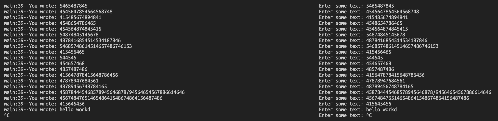

# Linux进程之间的通信-消息队列（System V）

* 信号量 (sem) ： 管理资源的访问
* 共享内存 (shm)： 高效的数据分享
* 消息队列 (msg)：在进程之间简易的传数据的方法
* 互斥算法（Dekker, Peterson, Filter, Szymanski, Lamport面包店算法)

## 1. 消息队列

### 1.1 消息队列和管道的区别

消息队列是System V的通信机制，排行老三，用于无关进程之间高效传递少量数据块。它和管道有一些类似，但是也有一些不一样[^1]。这里列举一些消息队列和管道通信的不同点：

* 管道是基于文件系统的，一个进程写，一个进程读，匿名管道是半双工的，限于亲缘进程；命名管道可以在无关进程之间通信，可以双向。
* 消息通信方式以消息缓冲区为中间介质，通信双方的发送和接收操作均以消息为单位[^2]。在存储器中，消息缓冲区被组织成队列，通常称之为消息队列。消息队列是随内核持续的，与有名管道（随进程持续）相比，生命力更强，应用空间更大。

* 消息队列允许许多的消息排队，而每个信息可以有不同长度，而传统管道中的数据仅仅是一个数据流没有边界。

**Difference between Pipes and Message Queues:[^3]**

| S.NO | Pipes                                                        | Message Queues                                               |
| :--- | :----------------------------------------------------------- | :----------------------------------------------------------- |
| 1.   | Pipe is a form of Unix IPC that provides flow of data in one direction. | Message queues is a form of system VIPC that store a linked list of messages |
| 2.   | Creating a pipe using pipe() function, returns two file descriptors, one for reading another for writing. | Creating a message queues using msgget() function returns a message queue identifier. |
| 3.   | Pipes and FIFOs are unidirectional, i.e., the data can flow in one direction only. | Message queues are bidirectional i.e., the data can flow in both directions. |
| 4.   | With Pipes and FIFOs, the data must be fetched in first in first out order. | With message queues the messages can be read in any order that is consistent with the values associ ated with the message types. |
| 5.   | Priorities can’t be assigned to the messages.                | Priorities can assigned to the messages by associ ating a priority to a type or range of types. |
| 6.   | With Pipes and FIFOs, there must be some process waiting for a message to be written over the pipes and FIFOs i.e., both a reader process and a writer must exist. | With message queues a process can write the messages to a queue then exit, so that the messages can be read by another process at a later time. |
| 7.   | Pipes are completely deleted from the system, when the last process having reference to it terminates. | Message queue and its contents remain in the system on process termination until they are specifically read or deleted by some process calling mcgregor magento, by executing the ipcrm(1) command or by rebooting the system. |
| 8.   | The maximum number of bytes that can be written to a pipe of FIFO is 4096 bytes. | The maximum message size that can be written to a message queue is 8192 bytes. |
| 9.   | A major advantage of using named pipes is that they provide a useful way to send one-line requests to an OpenEdge background session running a message handler procedure | better Performance. Message queues enable asynchronous communication, which means that the endpoints that are producing and consuming messages interact with the queue, not each other. |
| 10.  | Multiple users can send requests through the same named pipe and each request is removed from the pipe as it is received. | Increased Reliability.                                       |

### 1.2 消息队列与内存共享

消息队列和内存共享都有互相传递消息的可能性，但这个话题主要是想讨论的是什么时候用内存共享合适，什么时候用消息队列合适。我们从文献[^5]中可以得到很好的论证：

>- As understood, once the message is received by a process it would be no longer available for any other process. Whereas in shared memory, the data is available for multiple processes to access.
>- If we want to communicate with small message formats.
>- Shared memory data need to be protected with synchronization when multiple processes communicating at the same time.
>- Frequency of writing and reading using the shared memory is high, then it would be very complex to implement the functionality. Not worth with regard to utilization in this kind of cases.
>- What if all the processes do not need to access the shared memory but very few processes only need it, it would be better to implement with message queues.
>- If we want to communicate with different data packets, say process A is sending message type 1 to process B, message type 10 to process C, and message type 20 to process D. In this case, it is simplier to implement with message queues. To simplify the given message type as 1, 10, 20, it can be either 0 or +ve or –ve as discussed below.
>- Ofcourse, the order of message queue is FIFO (First In First Out). The first message inserted in the queue is the first one to be retrieved.

文献里面还提供了两个场景：

场景一：一对一的A->B的通信


场景二：一对多的通信，可以指定优先级


**Step 1** − Create a message queue or connect to an already existing message queue (msgget())

**Step 2** − Write into message queue (msgsnd())

**Step 3** − Read from the message queue (msgrcv())

**Step 4** − Perform control operations on the message queue (msgctl())

## 2. APIs

* msgctl
* msgget
* msgrcv
* msgsnd

### 2.1 msgget[^5]

> The **msgget**() system call returns the System V message queue identifier associated with the value of the *key* argument. It may be used either to obtain the identifier of a previously created message queue (when *msgflg* is zero and *key* does not have the value **IPC_PRIVATE**), or to create a new set.
>
> A new message queue is created if *key* has the value **IPC_PRIVATE** or *key* isn't **IPC_PRIVATE**, no message queue with the given key *key* exists, and **IPC_CREAT** is specified in *msgflg*.
>
> If *msgflg* specifies both **IPC_CREAT** and **IPC_EXCL** and a message queue already exists for *key*, then **msgget**() fails with *errno* set to **EEXIST**. (This is analogous to the effect of the combination **O_CREAT | O_EXCL** for [open(2)](https://man.archlinux.org/man/open.2.en).)

```C
#include <sys/msg.h>
int msgget(key_t key, int msgflg);
```

**Parameters:**

| Params     | I/O   | Details                                                      |
| ---------- | ----- | ------------------------------------------------------------ |
| key_t key  | Input | 提供一个key                                                  |
| int shmflg | Input | **IPC_CREAT **/**IPC_EXCL** /**SHM_HUGETLB **/**SHM_HUGE_2MB** /**SHM_HUGE_1GB**/ **SHM_NORESERVE** |

**Return:**

* \> 0 成功
* -1 失败

### 2.2 msgsnd/msgrcv[^6]

> The **msgsnd**() and **msgrcv**() system calls are used to send messages to, and receive messages from, a System V message queue. The calling process must have write permission on the message queue in order to send a message, and read permission to receive a message.
>
> The *msgp* argument is a pointer to a caller-defined structure of the following general form:
>
> ```
> struct msgbuf {
>     long mtype;       /* message type, must be > 0 */
>     char mtext[1];    /* message data */
> };
> ```
>
> The *mtext* field is an array (or other structure) whose size is specified by *msgsz*, a nonnegative integer value. Messages of zero length (i.e., no *mtext* field) are permitted. The *mtype* field must have a strictly positive integer value. This value can be used by the receiving process for message selection (see the description of **msgrcv**() below).

```C
#include <sys/msg.h>
int msgsnd(int msqid, const void *msgp, size_t msgsz, int msgflg);
ssize_t msgrcv(int msqid, void *msgp, size_t msgsz, long msgtyp,
               int msgflg);
```

### 2.3 msgctl[^8]

> **msgctl**() performs the control operation specified by *cmd* on the System V message queue with identifier *msqid*.
>
> The *msqid_ds* data structure is defined in *<sys/msg.h>* as follows:
>
> ```
> struct msqid_ds {
>     struct ipc_perm msg_perm;   /* Ownership and permissions */
>     time_t          msg_stime;  /* Time of last msgsnd(2) */
>     time_t          msg_rtime;  /* Time of last msgrcv(2) */
>     time_t          msg_ctime;  /* Time of creation or last
>                                    modification by msgctl() */
>     unsigned long   msg_cbytes; /* # of bytes in queue */
>     msgqnum_t       msg_qnum;   /* # number of messages in queue */
>     msglen_t        msg_qbytes; /* Maximum # of bytes in queue */
>     pid_t           msg_lspid;  /* PID of last msgsnd(2) */
>     pid_t           msg_lrpid;  /* PID of last msgrcv(2) */
> };
> ```
>
> The fields of the *msgid_ds* structure are as follows:

```C
#include <sys/msg.h>
int msgctl(int msqid, int cmd, struct msqid_ds *buf);
```

对于command，依然有IPC_STAT/IPC_SET/IPC_RMID三个命令。

## 3. Example

创建两个程序，test_process_msg1.c用于接收消息，test_process_msg2.c用于发送消息。我们将允许两个程序都可以创建消息队列，但只有接受者在接受完最后一个消息之后可以删除他。

test_process_msg1.c: 用于接收消息：

```C
#include <stdint.h>
#include <stdio.h>
#include <stdlib.h>
#include <string.h>
#include <unistd.h>

#include <sys/msg.h>

#define debug_log printf("%s:%d--", __FUNCTION__, __LINE__);printf

struct my_msg_st {
    long int my_msg_type;
    char some_text[BUFSIZ];
};

int main(int argc, char *argv[])
{
    int i, ret;
    char op_chars[20];
    int count = 0;
    int msg_id = 0;
    int running = 1;

    struct my_msg_st data;
    long int msg_to_recv = 0;

    debug_log("call the msgget function\n");
    msg_id = msgget((key_t) 1234, 0666 | IPC_CREAT);
    if (msg_id < 0) {
        debug_log("failed on semget\n");
        goto finish2;
    }
    while(running) {
        ret = msgrcv(msg_id, (void*)&data, BUFSIZ, msg_to_recv, 0);
        if (ret == -1) {
           debug_log("failed on msgrcv\n");
           goto finish2;
        }
        debug_log("You wrote: %s", data.some_text);
        if (strncmp(data.some_text, "end", 3) == 0) {
            running = 0;
        }
    }
    debug_log("finish.....\n");
finish2:
finish1:
    if (msgctl(msg_id, IPC_RMID, 0) == -1) {
        debug_log("failed on msgctl\n");
    }
    debug_log("finish test...\n");
    return ret;
}
```

test_process_msg2.c: 用于发送消息：

```C
#include <stdint.h>
#include <stdio.h>
#include <stdlib.h>
#include <string.h>
#include <unistd.h>

#include <sys/msg.h>

#define debug_log printf("%s:%d--", __FUNCTION__, __LINE__);printf
#define MAX_TEXT 512
struct my_msg_st {
    long int my_msg_type;
    char some_text[MAX_TEXT];
};

int main(int argc, char *argv[])
{
    int i, ret;
    char op_chars[20];
    int count = 0;
    int msg_id = 0;
    int running = 1;
    char buffer[BUFSIZ];

    struct my_msg_st data;
    long int msg_to_recv = 0;

    debug_log("call the msgget function\n");
    msg_id = msgget((key_t) 1234, 0666 | IPC_CREAT);
    if (msg_id < 0) {
        debug_log("failed on semget\n");
        goto finish2;
    }
    while(running) {
        printf("Enter some text: ");
        fgets(buffer, BUFSIZ, stdin);
        data.my_msg_type = 1;
        strcpy(data.some_text, buffer);
        ret = msgsnd(msg_id, (void*)&data, MAX_TEXT, 0);
        if (ret == -1) {
           debug_log("failed on msgsnd\n");
           goto finish2;
        }
        if (strncmp(data.some_text, "end", 3) == 0) {
            running = 0;
        }
    }
    debug_log("finish.....\n");
finish2:
finish1:
    debug_log("finish test...\n");
    return ret;
}
```



## Ref

[^1]: [消息队列和管道的区别(转载)](https://www.cnblogs.com/qqivoryqq/archive/2009/09/24/1573125.html)
[^2]: [管道和消息队列的区别](https://www.jianshu.com/p/6153195b1030)
[^3]:[Difference between Pipes and Message Queues ](https://www.tutorialspoint.com/difference-between-pipes-and-message-queues)
[^4]:[Message Queues ](https://www.tutorialspoint.com/inter_process_communication/inter_process_communication_message_queues.htm)
[^5]:[The Usefulness of POSIX Message Queues](https://www.opensourceforu.com/2021/05/the-usefulness-of-posix-message-queues/)
[^6]: [Linux Programmer's Manual - msgget - get a System V message queue identifier](https://man.archlinux.org/man/msgget.2)
[^7]: [Linux Programmer's Manual - msgrcv, msgsnd - System V message queue operations ](https://man.archlinux.org/man/msgsnd.2)
[^8]:[ Linux Programmer's Manual - msgctl - System V message control operations ](https://man.archlinux.org/man/core/man-pages/msgctl.2.en)

