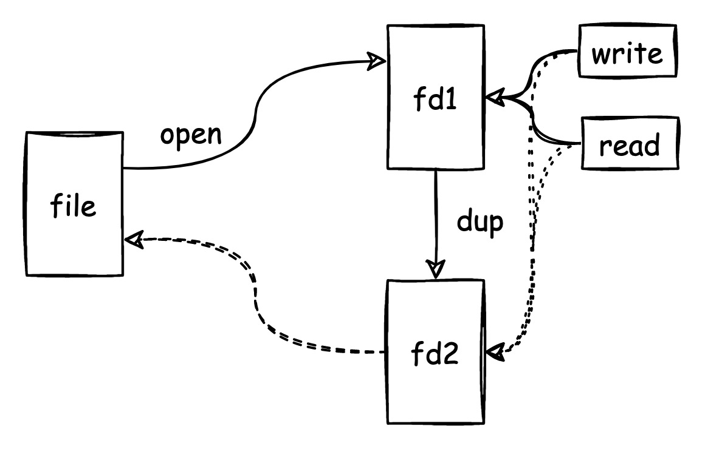
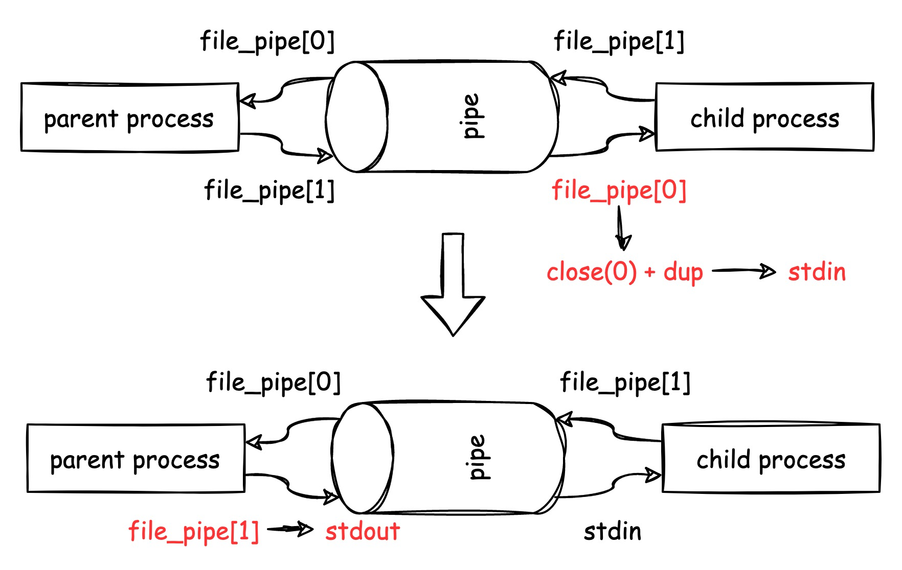
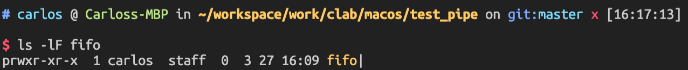
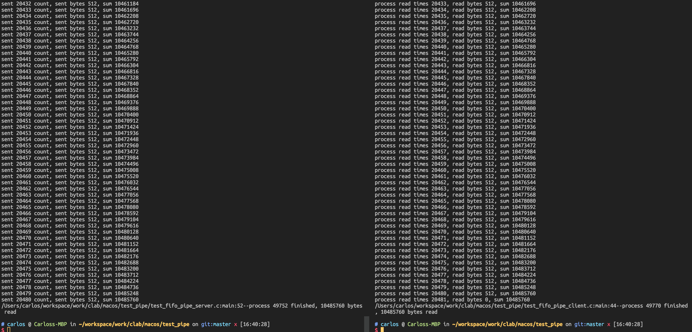

# Linux进程之间的通信-管道（下）

* dup和管道函数
* 命名管道：FIFO
* 客户/服务器架构

## 1 dup和管道函数

### 1.1 dup

dup函数，复制文件句柄映射，fd2 = dup(fd1)：

* fd1和fd2是不一样的值；
* write和read使用fd1和fd2是等效的；
* close(fd1)不会影响fd2的使用。



dup2函数，fd3 = dup2(fd1, fd2)：

* fd3和fd2是一样的值；
* 如果fd2是一个已经打开的session，会被关闭，再复制fd1的链接；
* fd2的值需要自己设定，并不是系统分配的，注意不要和已经open的fd重复了。

Note, std的文件描述符总是在使用最小可用的数字，例如，关闭掉std的文件描述符，那么文件描述符就会找到除了0以外最小的描述符。如下表格，如果我们close(0)之后，stdin的文件描述符被关闭，此时管道文件描述符使用stdin。

| 文件描述符 | 初始值         | 关闭文件描述符0后 | dup调用之后    |
| ---------- | -------------- | ----------------- | -------------- |
| 0          | stdin          | [已关闭]          | 管道文件描述符 |
| 1          | stdout         | stdout            | stdout         |
| 2          | stderr         | stderr            | stderr         |
| 3          | 管道文件描述符 | 管道文件描述符    | 管道文件描述符 |

```c
#include <unistd.h>
int dup(int oldfd);
int dup2(int oldfd, int newfd);
#define _GNU_SOURCE             /* See feature_test_macros(7) */
#include <fcntl.h>              /* Definition of O_* constants */
#include <unistd.h>
int dup3(int oldfd, int newfd, int flags);

```

**Example：**

```c
#include <stdio.h>
#include <stdlib.h>
#include <unistd.h>
#include <fcntl.h>
#include <string.h>

#define debug_log printf("%s:%s:%d--",__FILE__, __FUNCTION__, __LINE__);printf

int main(int argc, char **argv)
{
    int ret = 0;
    const char *buf1 = "hello my name is Carlos\n";
    const char *buf2 = "this is the string 2\n";
    const char *buf3 = "this is the string 3\n";
    const char *buf4 = "this is the string 4\n";
    const char *buf5 = "tfjfksdjflkdsjlkfjlksdjflkj\n";

    int origin_fd = 4, fd2 = 5, fd3 = 6, fd4 = 7, fd5 = 8, origin_fd_1 = 9;

    origin_fd = open("out_file.txt", O_RDWR|O_CREAT,0644);
    if (origin_fd == -1) {
        debug_log("origin_fd open failed, ret = %d\n", origin_fd);
        goto exit;
    }
    origin_fd_1 = open("out_file_2.txt", O_RDWR|O_CREAT,0644);
    if (origin_fd_1 == -1) {
        debug_log("origin_fd open failed, ret = %d\n", origin_fd);
        goto exit;
    }
    ret = write(origin_fd_1, buf1, strlen(buf1));
    debug_log("origin_fd write %d bytes on the file, origin_fd = %d\n", ret, origin_fd);

    // test dup, it is doesn't matter that close the original fd.
    fd2 = dup(origin_fd_1);                   // dup doesn't close the original fd.
    ret = write(fd2, buf2, strlen(buf2));
    debug_log("fd2 write %d bytes on the file, fd2 = %d\n", ret, fd2);
    ret = write(origin_fd, buf2, strlen(buf2));
    debug_log("origin_fd write %d bytes on the file\n", ret);

    // test dup2
    fd4 = dup2(fd2, fd3);                   // dup2, fd3 is fd4
    debug_log("fd2 = %d fd3 = %d, fd4 = %d\n", fd2, fd3, fd4);
    ret = write(fd3, buf3, strlen(buf3));
    debug_log("fd3 write %d bytes on the file\n", ret);
    ret = write(fd4, buf4, strlen(buf4));
    debug_log("fd4 write %d bytes on the file, fd3 = %d, fd4 = %d\n", ret, fd3, fd4);
    ret = write(fd2, "using fd2 rewrite file", 22);
    debug_log("fd2 write %d bytes on the file, fd2 = %d\n", ret, fd2);

    // re-directing the stdin
    fd5 = dup2(fileno(stdout), fd4);
    ret = write(fd5, buf5, strlen(buf5));
    debug_log("fd5 write %d bytes on the file, fd5 = %d\n", ret, fd5);


    close(fd2);
    close(fd3);
    close(fd4);
    close(fd5);
    debug_log("test finish!");

exit:
    return 0;
}
```

### 1.2 管道和dup

这里面可以利用fd的最小可用属性可以实现fork进程之间的stdout -> stdin管道通信。这里需要注意的是：

* 进程fork之后，fd数量也会被复制，必须两个进程都要关闭才算真正意义的关闭。



```c
int test_pipe_rw_fork_dup()
{
    int ret = 0;
    int data_process = 0;
    int file_pipes[2];
    const char some_data[] = "hello world";
    char buffer[BUFSIZ + 1];
    pid_t pid = 0;
    memset(buffer, '\0', sizeof buffer);

    ret = pipe(file_pipes);
    if (ret != 0) {
        debug_log("pipe failed, ret = %d\n", ret);
        goto exit;
    }

    pid = fork();
    if (pid == -1) {
        debug_log("fork failed, ret = %d\n", ret);
        goto exit;
    }
    // child process
    else if (pid == 0) {
        // close STDIN
        close(0);
        // dup pipes[0] -> STDIN_FILENO
        dup(file_pipes[0]);
        close(file_pipes[0]);
        close(file_pipes[1]);
        execlp("od", "od", "-c", (char*) 0);
        debug_log("child wrote the bytes\n");
    }
    // parent process
    else {
        close(file_pipes[0]);
        data_process = write(file_pipes[1], some_data, strlen(some_data));
        close(file_pipes[1]);
        debug_log("parent write %d bytes: %s\n", data_process, some_data);
    }

exit:
    return ret;
}

```

输出：

```zsh
# carlos @ Carloss-MBP in ~/workspace/work/clab/macos/test_pipe on git:master x [14:37:49] 
$ ./test.elf
/Users/carlos/workspace/work/clab/macos/test_pipe/test_pipe.c:test_pipe_rw_fork_dup:161--parent write 11 bytes: hello world
0000000    h   e   l   l   o       w   o   r   l   d                                                                            
0000013
```

## 2 命名管道：FIFO

之前的管道我们可以叫做匿名管道，匿名管道有个比较重要的特点：两个进程之间必须有共同的祖先进程，也就是必须要fork或者exec才能完成管道之间的通信。为了打破这个限制，Linux提供了命名FIFO管道，允许两个毫无关系的进程相互通信，而且这种通信的传输速率还是很高的。我们在Linux命令行中可以轻易的使用命名管道FIFO。

### 2.1 shell中的命名管道

* 创建管道

  `$ mkfifo ./fifo`

  

* 读入管道的内容

  `$ cat < ./fifo`

  此时cat命令被阻塞，因为没有任何的数据被写入管道。

* 写入管道内容

  `$ echo "Hallow world! > ./fifo"`

  此时在cat的命令终端就可以看到写入的数据了。

### 2.2 FIFO PIEP APIs

```C
#include <sys/types.h>
#include <sys/stat.h>
int mkfifo(const char *pathname, mode_t mode);
```

这里面的mode还是有个点说法的:

* O_RDONLY: 这种情况下open一个管道将会被阻塞，除非有一个进程以写的方式打开同一个FIFO。
* O_RDONLY | O_NONBLOCK：没有任何进程以写的方式打开FIFO，open调用也立即成功并且返回。
* O_WRONLY：这种情况下open一个管道会被阻塞，除非有一个进程以读的方式打开同一个FIFO。
* O_WRONLY | O_NONBLOCK: 立刻返回，如果没有进程以读的方式打开FIFO，open调用将返回一个错误-1，并且FIFO不会被打开。

注意，在调用write和read函数对FIFO进行写读操作的时候，要注意对写进行“原子化”，每个写的长度保证小于等于PIPE_BUF(在limits.h文件中)字节，系统可以保证数据不会交错在一起，所以单次长度限制长度小于PIPE_BUF。

### 2.3 Example

实现两个进程之间使用FIFO管道交互：

* 一个进程：创建FIFO，并且向FIFO管道中不断的写入数据
* 一个进程，读FIFO管道的数据。

**Server : Write data**

```C
#include <stdio.h>
#include <stdlib.h>
#include <unistd.h>
#include <string.h>
#include <limits.h>
#include <fcntl.h>
#include <sys/stat.h>
#include <sys/types.h>

#define debug_log printf("%s:%s:%d--",__FILE__, __FUNCTION__, __LINE__);printf


#define FIFO_NAME "./fifo"
#define BUFFER_SIZE PIPE_BUF
#define TEN_MEG (1024*1024*10)

int main(void)
{
    char buffer[BUFFER_SIZE + 1];
    int chars_read;
    int ret = 0;
    int fd = ~0;
    int bytes_sent = 0;
    int count = 0;

    if (access(FIFO_NAME, F_OK) == -1) {
        ret = mkfifo(FIFO_NAME, 0777);
        if (ret != 0) {
            debug_log("mkfifo failed ret = %d\n", ret);
            goto exit;
        }
    }
    debug_log("process %d opening fifo with O_WR_ONLY\n", getpid());
    fd = open(FIFO_NAME, O_WRONLY);
    if (fd < 0) {
        debug_log("open fifo file failed, ret = %d\n", fd);
        ret = -1;
        goto exit;
    }
    debug_log("process %d will send data by fifo\n", getpid());
    while(bytes_sent < TEN_MEG) {
        ret = write(fd, buffer, BUFFER_SIZE);
        if (ret == -1) {
            debug_log("write failed, ret = %d\n", ret);
            goto exit;
        }
        bytes_sent += ret;
        count ++;
        printf("sent %d count, sent bytes %d, sum %d\n", count, ret, bytes_sent);
    }
    close(fd);
    debug_log("process %d finished, %d bytes read\n", getpid(), bytes_sent);
exit:
    return 0;
}
```

**Client: Read data**

```C
#include <stdio.h>
#include <stdlib.h>
#include <unistd.h>
#include <string.h>
#include <limits.h>
#include <fcntl.h>
#include <sys/stat.h>
#include <sys/types.h>

#define debug_log printf("%s:%s:%d--",__FILE__, __FUNCTION__, __LINE__);printf


#define FIFO_NAME "./fifo"
#define BUFFER_SIZE PIPE_BUF

int main(void)
{
    char buffer[BUFFER_SIZE + 1];
    int chars_read;
    int ret = 0;
    int fd = ~0;
    int bytes_read = 0;
    int count = 0;

    if (access(FIFO_NAME, F_OK) == -1) {
        debug_log("mkfifo failed ret = %d\n", ret);
        goto exit;
    }
    debug_log("process %d opening fifo with O_WR_ONLY\n", getpid());
    fd = open(FIFO_NAME, O_RDONLY);
    if (fd < 0) {
        debug_log("open fifo file failed, ret = %d\n", fd);
        ret = -1;
        goto exit;
    }
    debug_log("process %d will read data by fifo\n", getpid());
    do {
        ret = read(fd, buffer, BUFFER_SIZE);
        bytes_read += ret;
        count ++;
        printf("process read times %d, read bytes %d, sum %d\n", count, ret, bytes_read);
    } while(ret > 0);

    debug_log("process %d finished, %d bytes read\n", getpid(), bytes_read);
    close(fd);
exit:
    return 0;
}
```



