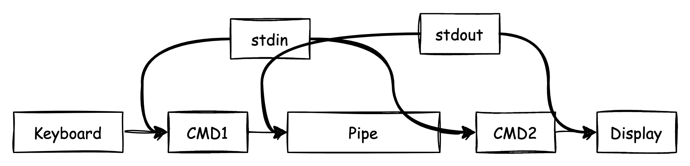
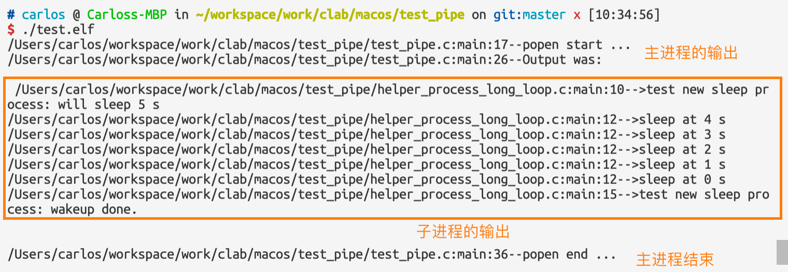
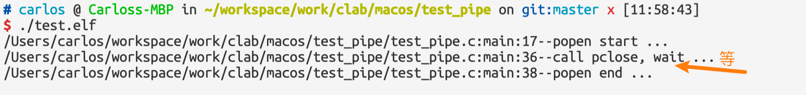
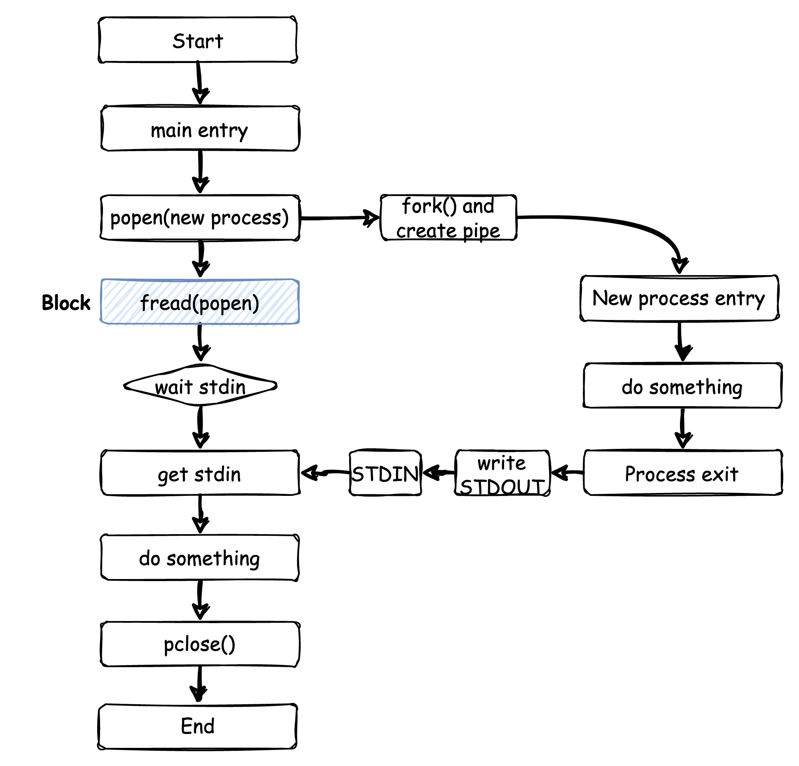
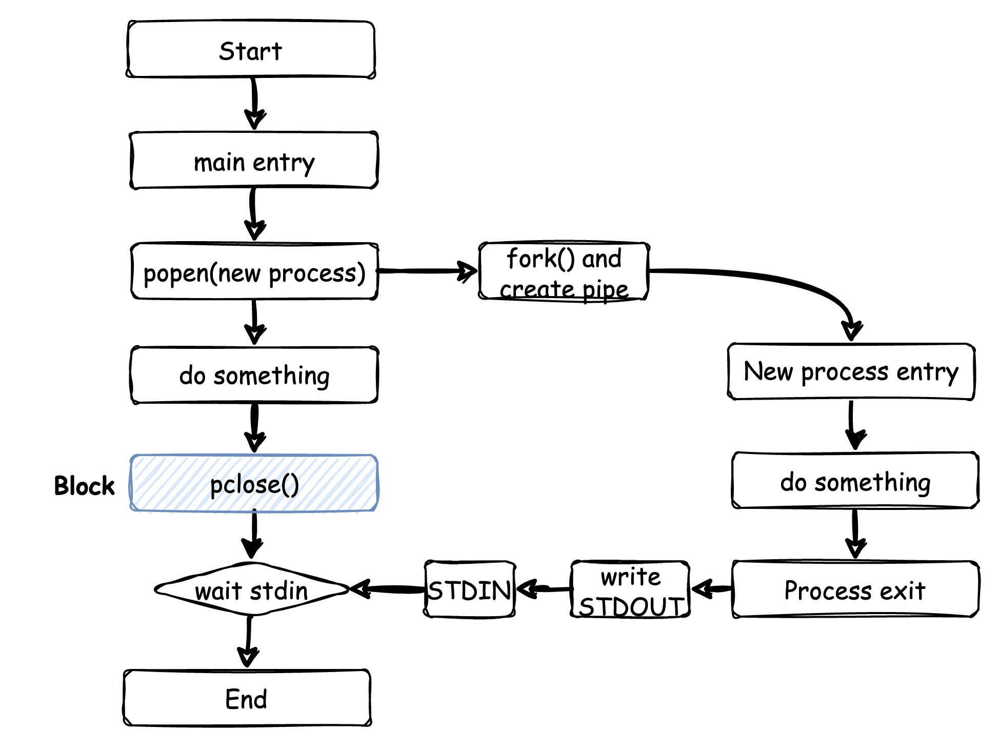
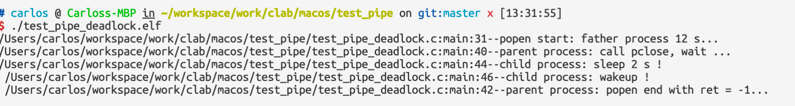
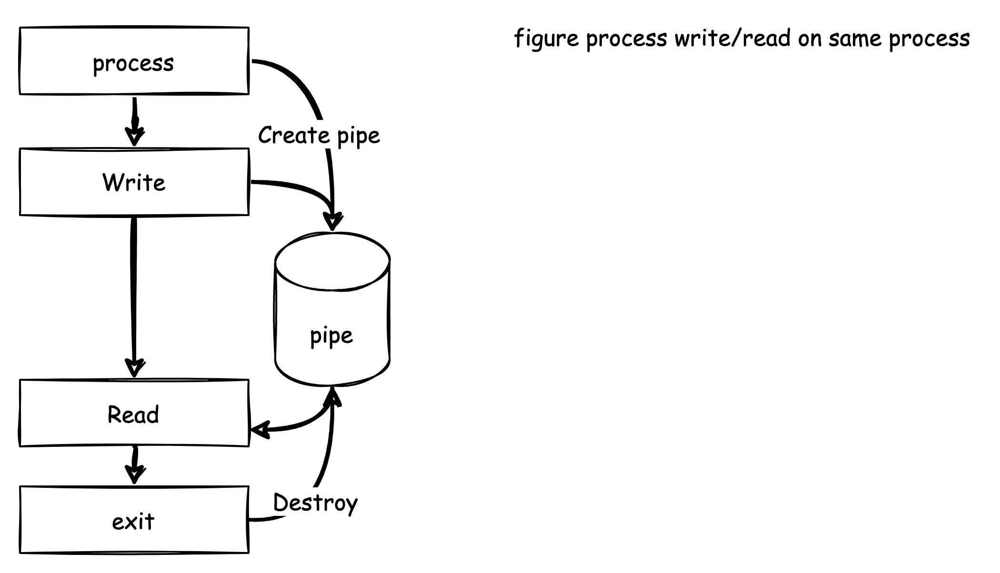
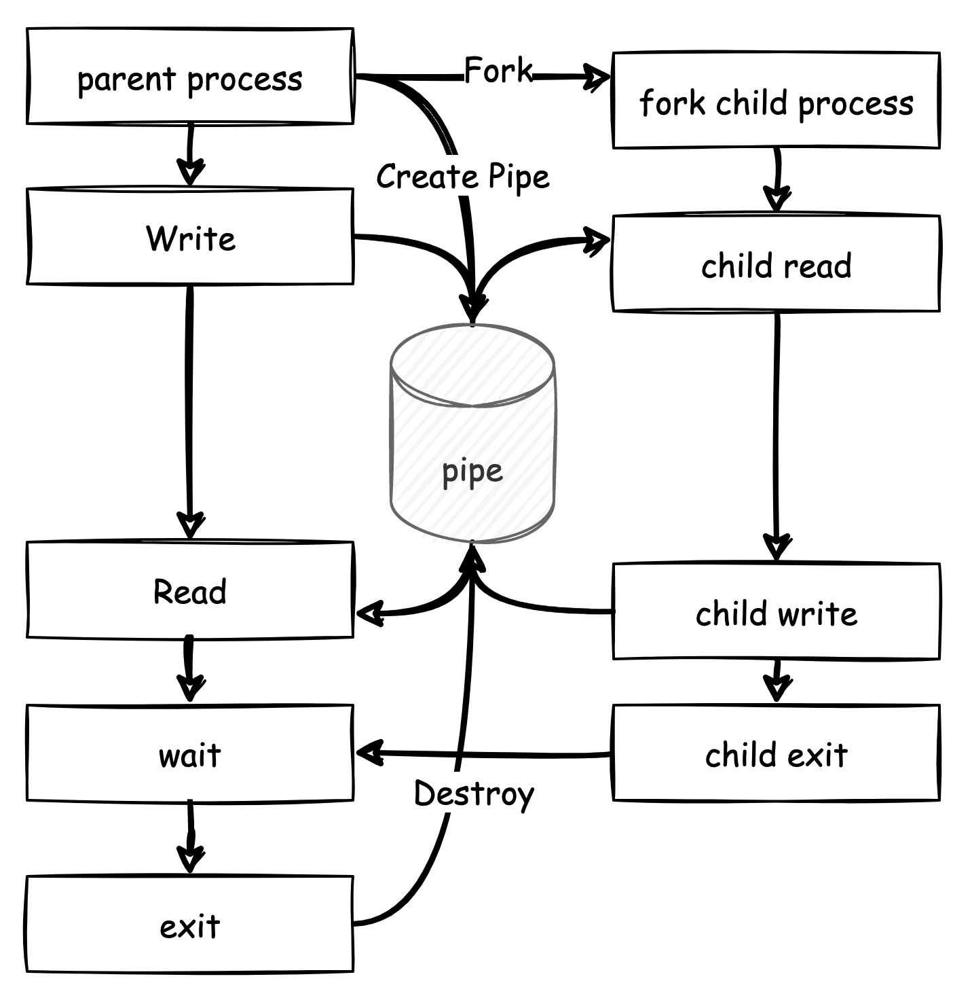
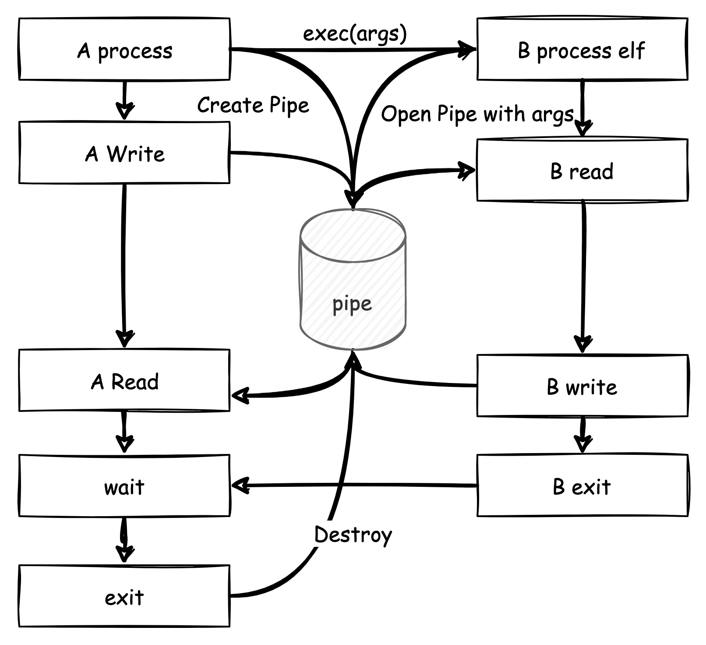
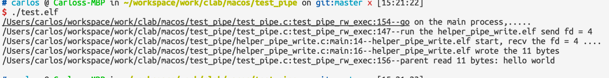

# Linux进程之间的通信-管道（上）

* 标准输入、标准输出和标准错误
* 进程管道
* popen
* pipe调用
* 父进程和子进程

## 1. stdin, stdout, stderr

作为Linux进程之间通信的基础，标准输入、输出和标准错误是必须了解的概念。我们在Linux的userspace层面shell上的机制每天都要和这三个东西打交道。我直接抄文献[^1]了：

>* stdin: Stands for standard input. It takes text as input.
>* stdout: Stands for standard output. The text output of a command is stored in the stdout stream.
>* stderr: Stands for standard error. Whenever a command faces an error, the error message is stored in this stream.

### 1.1 /dev/stdxxx和stdxxx的区别

基础的使用按照参考文献[^1]，这里需要补充的是，在Linux上`/dev/stdin`,`/dev/stdout`和`/dev/stderr`三个文件符号分别链接`/proc/self/fd/0`, `/proc/self/fd/1`,`/proc/self/fd/2`文件描述符(file descriptor)，他们并不是stdin,stdout好stderr本身，他们只是一个特殊的文件标识用于指示stdxx的[^2]，Jim通过fopen打开函数获取文件句柄返回值的实验也可以看到，如果打开open("/dev/stdin")这类的文件，并不能获取真正的输入流，而是打开的链接文件本身[^3]。关于/dev/stdxxx特殊文件和stdxxx做了区分，就到这里了。下面对pipe在shell上面的使用做一个整理，方便更好理解pipe通信的内部原理和接口使用。

### 1.2 Piping and Redirecting



**Piping:**

* `$ echo "hello world" | grep hello` :  echo的输出 -> stdout -> stdin -> grep
* `$ echo “hello world” |& cat` : echo输出 -> stdout + stderr -> stdin -> grep
* `$ anything |& cat ` stderr -> stdin -> cat

**Redirecting:**

* `$ echo “hello world” > hello.txt` 追加新的一行字
* `$ echo "hello world" >> hello.txt` 清空后复写一行字
* `$ cat < hello.txt` ：把文件展开，喂给cat作为stdin

```python
$ # pyin.py
$ name = input("Enter name\n")
$ email = input("Enter email\n")
$ print("Your name is %s and email is %s" % (name, email))
```

hello.txt 

```
carlos
carlos.wei.hk@gmail.com
```

`$ cat < hello.txt ` 可以得到结果为:

```
Enter name
Enter email
Your name is carlos and email is carlos.wei.hk@gmail.com
```

不要被迷惑：

`$ cat < hello.txt >output.txt`

这个情况就是上面结果被写到了output.txt文件里面了。

`$ echo “hello world” 1>output.log 2>debug.log`  stdout被写入output.log， stderr被重定向到debug.log

感谢Sidratul Muntaha[^1]整了标准输出和标准输入在shell层级的使用，后面将会引出在Linux程序设计中C语言接口中的对pipe的处理，对于pipe进程之间的通信，我们也可以看到存在的局限性，需要其中一个进程运行完得到标准输出之后才能被第二个进程使用，并且从性能角度来考虑，透过stdin, stdout文件符号（需要起一个shell）再加上文件索引，**传输吞吐的效率并不会太高**。

## 1.2 进程管道（Pipe）

### 1.2.1 API定义[^4]

```C
#include <stdio.h>

FILE *popen(const char *command, const char *type);
int pclose(FILE *stream);
```

**Parameters:**

| Params              | I/O    | Details                                                      |
| ------------------- | ------ | ------------------------------------------------------------ |
| const char *command | Input  | The *command* argument is a pointer to a null-terminated string containing a shell command line. This command is passed to */bin/sh* using the **-c** flag; interpretation, if any, is performed by the shell. |
| const char *type    | Output | The *type* argument is a pointer to a null-terminated string which must contain either the letter 'r' for reading or the letter 'w' for writing. Since glibc 2.9, this argument can additionally include the letter 'e', which causes the close-on-exec flag (**FD_CLOEXEC**) to be set on the underlying file descriptor; see the description of the **O_CLOEXEC** flag in [open(2)](https://man.archlinux.org/man/open.2.en) for reasons why this may be useful. |

**Return:**

The return value from **popen**() is a normal standard I/O stream in all respects save that it must be closed with **pclose**() rather than [fclose(3)](https://man.archlinux.org/man/fclose.3.en). Writing to such a stream writes to the standard input of the command; the command's standard output is the same as that of the process that called **popen**(), unless this is altered by the command itself. Conversely, reading from the stream reads the command's standard output, and the command's standard input is the same as that of the process that called **popen**().

### 1.2.2 读取

使用popen，返回一个文件句柄，然后通过fread函数就可以得到另一个进程里面输出到标准输出的返回值。

```C
#include <stdio.h>
#include <stdlib.h>
#include <unistd.h>
#include <string.h>

#define debug_log printf("%s:%s:%d--",__FILE__, __FUNCTION__, __LINE__);printf

#define P_CMD "./helper_process_long_loop.elf 10"

int main(void)
{
    FILE *read_fp = NULL;
    char buffer[BUFSIZ + 1];
    int chars_read;
    memset(buffer, '\0', sizeof buffer);
    read_fp = popen(P_CMD, "r");
    debug_log("popen start ...\n");
    if (NULL == read_fp) {
        debug_log("popen failed\n");
        return -1;
    }
    // read one time.
#if 1
    //chars_read = fread(buffer, sizeof(char), BUFSIZ, read_fp);
    if (chars_read > 0) {
        debug_log("Output was:  \n\n %s \n\n", buffer);
    }
#else
    // read multi times.
    do {
        chars_read = fread(buffer, sizeof(char), 32, read_fp);
        buffer[chars_read - 1] = '\0';
        debug_log("Output was:  \n\n %s \n\n", buffer);
    } while (chars_read > 0);
#endif
    pclose(read_fp);
    debug_log("popen end ...\n");
    return 0;
}
```

### 1.2.3 写入

```c
int test_pipe_write()
{
    FILE *write_fp = NULL;
    char buffer[BUFSIZ + 1];
    int chars_read;
    sprintf(buffer, "hello my name is Carlos\n");
    write_fp = popen("od -c", "w");
    debug_log("popen start ...\n");
    if (NULL == write_fp) {
        debug_log("popen failed\n");
        return -1;
    }
    chars_read = fwrite(buffer, sizeof(char), strlen(buffer), write_fp);
    debug_log("call pclose, wait ...\n");
    pclose(write_fp);
    debug_log("pclose end ...\n");

    return 0;
}
```

### 1.2.4 system与popen

我觉得这个话题还是蛮重要的，我也查了不少的资料，网上有很多人做了system和popen的使用对比，也有人做了system和popen的性能对比。我们研究popen的过程，来确定linux对管道创建的进程调度这是非常重要的。system()函数是一个阻塞式的调用API，里面的过程大体是: fork() + execl() + waitpid()[^6]，如果我们不想要创建的子进程阻塞式影响到我们自己进程的程序，我们也可以单独的使用fork execl及waitpid，或许还可以和各种信号配合。然而，popen创建进程只是使用了fork()并没有waitpid()的操作，从popen的源代码里面也可以看到[^7],因此，**popen是一个非阻塞式的调用，system是一个阻塞式的调用**。

system和popen的调用控制流也是不一样的，popen创建的进程，虽然不在popen进行阻塞，但是是在fread()函数，或者是pclose()的时候才进行阻塞的。换句话说，如果我们希望从popen创建的子进程的标准输出里面拿到数据，就一定要等子进程执行完毕之后才可以拿到。我也做了相关的实验，得到的结论两种情况：

* 如果使用fread函数读取子进程的标准输出，那么会在fread阻塞。
* 如果没有使用fread函数，主进程会等待子进程结束之后，在pclose位置阻塞。

我这里设计一个例子，helper进程，会循环方式sleep 10秒的时间，主进程会调用这个helper进程，主进程最终会等待子进程结束之后完成。

```C
// helper_process_long_loop.c

#include <stdio.h>
#include <stdlib.h>
#include <unistd.h>

#define debug_log printf("%s:%s:%d--",__FILE__, __FUNCTION__, __LINE__);printf

int main(int argc, char *argv[])
{
    int i = atoi(argv[1]); // 10 seconds
    debug_log(">test new sleep process: will sleep %d s\n", i);
    while(i --) {
        debug_log(">sleep at %d s\n", i);
        sleep(1);
    }
    debug_log(">test new sleep process: wakeup done.\n");
    return 0;
}
```

如果使用了fread()会阻塞在fread()函数



如果去掉了fread()函数，则会在调用pclose之前，等待子进程的调用。



因此，可以将上述过程绘制出来， 调用fread的控制流如图所示：



没有调用fread的控制流如图所示：



我们这里对popen进程创建进行对比，并不是说popen是一个创建进程的方法，**popen的确有创建进程的功能，但是我们应该把关注点放在建立管道通信上面**。

### 1.2.5 popen与SIGCHLD信号

system()接口一直让人诟病，因为其返回值太多，而且依赖于Linux内核做一个初始条件的初始化，例如，一些防止子进程成为僵尸进程的案例中，有人粗暴的喜欢把 signal(SIGCHLD, SIG_IGN)注册为IGN，这样的话，我们不需要在自己的程序里面对子进程的结束进行处理，而依赖于系统进程周期性的回收，而这对system()的使用是致命的，**system的使用依赖于Linux内核将SIGCHLD注册为SIG_DFL，否则在wait_pid的时候将找不到子进程而报错ECHILD**[^8]，而且使用system还需要注意SIGINT和SIGQUIT这两个信号。而对于popen对SIGCHLD并没有依赖于Linux内核对信号做一些初始化，但是有种场景也是又waitpid引起的——错误的pclose的错误的error状态[^9]：

* 注册信号signal(SIGCHLD, handler)
* 主线程popen一个长时间的进程，使其阻塞在pclose()
* fork一个线程，执行时间比主线程短。

#### 1.2.5.1 注册SIGCHLD->handler

此时，可以看到一个错误，在fork()线程退出后，pclose()的阻塞结束了，换句话说，fork进程的退出结束了pclose对线程的阻塞。

```C
#include <stdio.h>
#include <stdlib.h>
#include <unistd.h>
#include <string.h>

#define debug_log printf("%s:%s:%d--",__FILE__, __FUNCTION__, __LINE__);printf

#define P_CMD "./helper_process_long_loop.elf "
#define CFG_PARENT_PROCESS_EXEC_TIME  12
#define CFG_CHILD_PROCESS_EXEC_TIME 2

void handler(int sig)
{
    (void)sig;
	pid_t id;
	while((id = waitpid(-1, NULL, WNOHANG)) > 0)
		debug_log("wait child success : %d\n", id);
}

int main(void)
{
    FILE *read_fp = NULL;
    char buffer[BUFSIZ + 1];
    char cmd[BUFSIZ];
    int chars_read;
    pid_t pid = 1;
    int ret = 0;
    memset(buffer, '\0', sizeof buffer);
    sprintf(cmd, "%s%d", P_CMD, CFG_PARENT_PROCESS_EXEC_TIME);
    read_fp = popen(cmd, "r");
    debug_log("popen start: father process %d s...\n", CFG_PARENT_PROCESS_EXEC_TIME);
    if (NULL == read_fp) {
        debug_log("popen failed\n");
        return -1;
    }
    signal(SIGCHLD, handler);
    //signal(SIGCHLD, SIG_IGN);
    pid = fork();
    if (pid != 0) {
        debug_log("parent process: call pclose, wait ...\n");
        ret = pclose(read_fp);
        debug_log("parent process: popen end with ret = %d...\n", ret);
    } else {
        debug_log("child process: sleep %d s !\n ",CFG_CHILD_PROCESS_EXEC_TIME);
        sleep(CFG_CHILD_PROCESS_EXEC_TIME);
        debug_log("child process: wakeup !\n ");
    }
    return 0;
}
```


从实验结果看，pclose已经拿到了一个错误的返回值。

#### 1.2.5.1 注册SIGCHLD->ignore

此时，可以看到一个错误，在fork()线程退出后，pclose()的阻塞结束了，换句话说，fork进程的退出结束了pclose对线程的阻塞。

```C
#include <stdio.h>
#include <stdlib.h>
#include <unistd.h>
#include <string.h>

#define debug_log printf("%s:%s:%d--",__FILE__, __FUNCTION__, __LINE__);printf

#define P_CMD "./helper_process_long_loop.elf "
#define CFG_PARENT_PROCESS_EXEC_TIME  12
#define CFG_CHILD_PROCESS_EXEC_TIME 2

void handler(int sig)
{
    (void)sig;
	pid_t id;
	while((id = waitpid(-1, NULL, WNOHANG)) > 0)
		debug_log("wait child success : %d\n", id);
}

int main(void)
{
    FILE *read_fp = NULL;
    char buffer[BUFSIZ + 1];
    char cmd[BUFSIZ];
    int chars_read;
    pid_t pid = 1;
    int ret = 0;
    memset(buffer, '\0', sizeof buffer);
    sprintf(cmd, "%s%d", P_CMD, CFG_PARENT_PROCESS_EXEC_TIME);
    read_fp = popen(cmd, "r");
    debug_log("popen start: father process %d s...\n", CFG_PARENT_PROCESS_EXEC_TIME);
    if (NULL == read_fp) {
        debug_log("popen failed\n");
        return -1;
    }
    //signal(SIGCHLD, handler);
    signal(SIGCHLD, SIG_IGN);
    pid = fork();
    if (pid != 0) {
        debug_log("parent process: call pclose, wait ...\n");
        ret = pclose(read_fp);
        debug_log("parent process: popen end with ret = %d...\n", ret);
    } else {
        debug_log("child process: sleep %d s !\n ",CFG_CHILD_PROCESS_EXEC_TIME);
        sleep(CFG_CHILD_PROCESS_EXEC_TIME);
        debug_log("child process: wakeup !\n ");
    }
    return 0;
}
```



从实验结果看，pclose还是拿到了一个错误的返回值。

**因此，建议popen不要和其他进程同步使用，否则会拿到一个错误的状态。除了状态的错误，运行的时序调度都是正确的。**

**此外，如果我们没有屏蔽掉SIG_CHLD信号，此时没有调用pclose()，那么就->可能<-会出现僵尸进程**。

### 1.2.6 底层pipe调用

上层的popen和pclose内部实际上是调用pipe，我们来看一下pipe的使用，popen对应的文件读写fread，fwrite，而pipe这个层级相应的需要用底层的read和write函数来读写操作。

```C
#include <unistd.h>
int pipe(int pipefd[2]);

#define _GNU_SOURCE             /* See feature_test_macros(7) */
#include <fcntl.h>              /* Definition of O_* constants */
#include <unistd.h>

int pipe2(int pipefd[2], int flags);
/* On Alpha, IA-64, MIPS, SuperH, and SPARC/SPARC64, pipe() has the
   following prototype; see NOTES */
#include <unistd.h>
struct fd_pair {
    long fd[2];
};
struct fd_pair pipe(void);
```

**Parameters:**

| Params        | I/O   | Details                                                      |
| ------------- | ----- | ------------------------------------------------------------ |
| int pipefd[2] | Input | *pipefd[0]* refers to the read end of the pipe. *pipefd[1]* refers to the write end of the pipe. Data written to the write end of the pipe is buffered by the kernel until it is read from the read end of the pipe. |

**Return:**

On success, zero is returned. On error, -1 is returned, *errno* is set to indicate the error, and *pipefd* is left unchanged.

On Linux (and other systems), **pipe**() does not modify *pipefd* on failure. A requirement standardizing this behavior was added in POSIX.1-2008 TC2. The Linux-specific **pipe2**() system call likewise does not modify *pipefd* on failure.

**Example 1 **: 管道建立在同一个进程上面



```C 
int test_pipe_rw()
{
    int ret = 0;
    int data_process = 0;
    int file_pipes[2];
    const char some_data[] = "hello world";
    char buffer[BUFSIZ + 1];
    memset(buffer, '\0', sizeof buffer);

    ret = pipe(file_pipes);
    if (ret != 0) {
        debug_log("pipe failed, ret = %d\n", ret);
        goto exit;
    }
		// write some_data to pipe
    data_process = write(file_pipes[1], some_data, strlen(some_data));
    debug_log("Wrote the %d bytes\n", data_process);
  	// read buffer from pipe
    data_process = read(file_pipes[0], buffer, BUFSIZ);
    debug_log("read %d bytes: %s\n", data_process, buffer);
exit:
    return ret;
}
```

**Example 2 **: 父进程和fork的子进程共用pipe，子进程写，父进程读。



这里要注意的是：

* 子进程故意延迟了5s的时间再写，会发现父进程会阻塞在read函数。

```c 
int test_pipe_rw_fork()
{
    int ret = 0;
    int data_process = 0;
    int file_pipes[2];
    const char some_data[] = "hello world";
    char buffer[BUFSIZ + 1];
    pid_t pid = 0;
    memset(buffer, '\0', sizeof buffer);

    ret = pipe(file_pipes);
    if (ret != 0) {
        debug_log("pipe failed, ret = %d\n", ret);
        goto exit;
    }

    pid = fork();
    if (pid == -1) {
        debug_log("fork failed, ret = %d\n", ret);
        goto exit;
    }
    // child process
    else if (pid == 0) {
        sleep(5);
        data_process = write(file_pipes[1], some_data, strlen(some_data));
        debug_log("child wrote the %d bytes\n", data_process);
    }
    // parent process
    else {
        data_process = read(file_pipes[0], buffer, BUFSIZ);
        debug_log("parent read %d bytes: %s\n", data_process, buffer);
    }

exit:
    return ret;
}
```

**Example 3 **: 并行进程共用pipe，A进程写，B进程读。



* fd的顺序，为读写顺序， 这里需要先操作file_description[1]，再操作file_descirptin[0]。先操作[1]写入，再去用[0]读，是可以读到东西的。而先写0，从1读，是读不到东西的，这是FIFO结构。
* 栈是LIFO结构，

A进程：

```C
int test_pipe_rw_exec()
{
    int ret = 0;
    int data_process = 0;
    int file_pipes[2];
    char buffer[BUFSIZ + 1];
    char cmd[BUFSIZ];
    pid_t pid = 0;
    memset(buffer, '\0', sizeof buffer);

    ret = pipe(file_pipes);
    if (ret != 0) {
        debug_log("pipe failed, ret = %d\n", ret);
        goto exit;
    }

    pid = fork();
    if (pid == -1) {
        debug_log("fork failed, ret = %d\n", ret);
        goto exit;
    }
    // child process
    else if (pid == 0) {
        debug_log("run the helper_pipe_write.elf send fd = %d\n", file_pipes[1]);
        cmd[0] = file_pipes[1];
        (void)execl("helper_pipe_write.elf", "helper_pipe_write.elf", cmd, (char *)0);
        debug_log("call the helper_pipe_write.elf wrote the bytes\n");
    }
    // parent process
    else {
        debug_log("go on the main process,.....\n");
        data_process = read(file_pipes[0], buffer, BUFSIZ);
        debug_log("parent read %d bytes: %s\n", data_process, buffer);
    }

exit:
    return ret;
}
```

B进程：

```C
int main(int argc, char **argv)
{
    int ret = 0;
    int data_process = 0;
    int file_pipes = (int) *(char *)argv[1];
    const char some_data[] = "hello world";
    debug_log("helper_pipe_write.elf start, recv the fd = %d ....\n",file_pipes);
    data_process = write(file_pipes, some_data, strlen(some_data));
    debug_log("helper_pipe_write.elf wrote the %d bytes\n", data_process);
    return 0;
}
```



### 


## Ref

[^1]: [What are stdin, stderr and stdout in Bash, Sidratul Muntaha](https://linuxhint.com/bash_stdin_stderr_stdout/)
[^2]:[echo or print /dev/stdin /dev/stdout /dev/stderr](https://unix.stackexchange.com/questions/400849/echo-or-print-dev-stdin-dev-stdout-dev-stderr)
[^3]: [What are `/dev/stdout` and `/dev/stdin`? What are they useful for?](https://jameshfisher.com/2018/03/31/dev-stdout-stdin/)
[^4]:[man3-popen](https://man.archlinux.org/man/popen.3)
[^5]: [What is difference between popen and system? ](https://www.pursuantmedia.com/2019/03/10/what-is-difference-between-popen-and-system/)
[^6]:[Popen/system, understand the difference between these two functions and fork. ](https://topic.alibabacloud.com/a/popensystem-understand-the-difference-between-these-two-functions-and-fork_8_8_10251141.html)
[^7]: [openBSD: popen.c,v 1.17 2005/08/08 08:05:34 espie Exp](https://android.googlesource.com/platform/bionic/+/3884bfe9661955543ce203c60f9225bbdf33f6bb/libc/unistd/popen.c)
[^8]:[Linux下system()函数引发的错误 ](https://my.oschina.net/renhc/blog/54582)
[^9]:[Linux的system()和popen()差异](https://blog.csdn.net/liuxingen/article/details/47057539)

