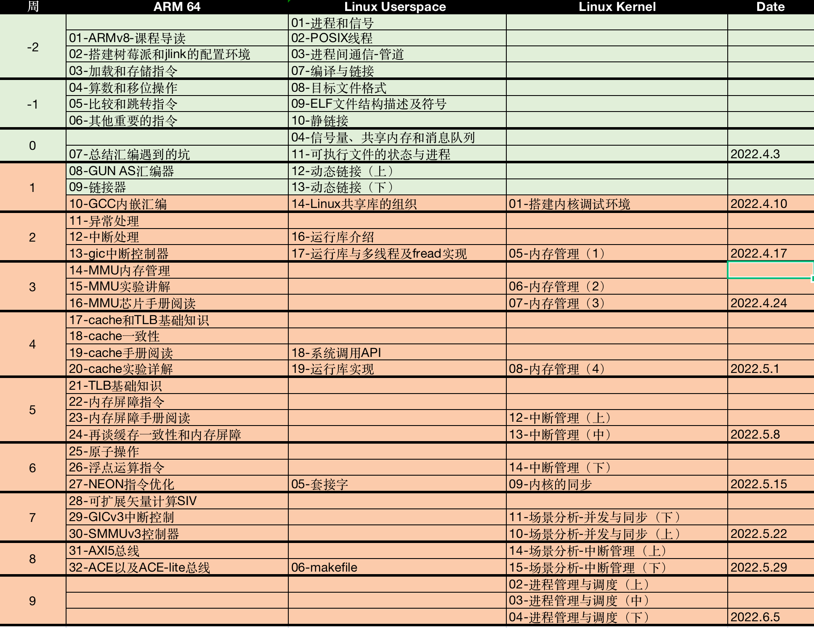
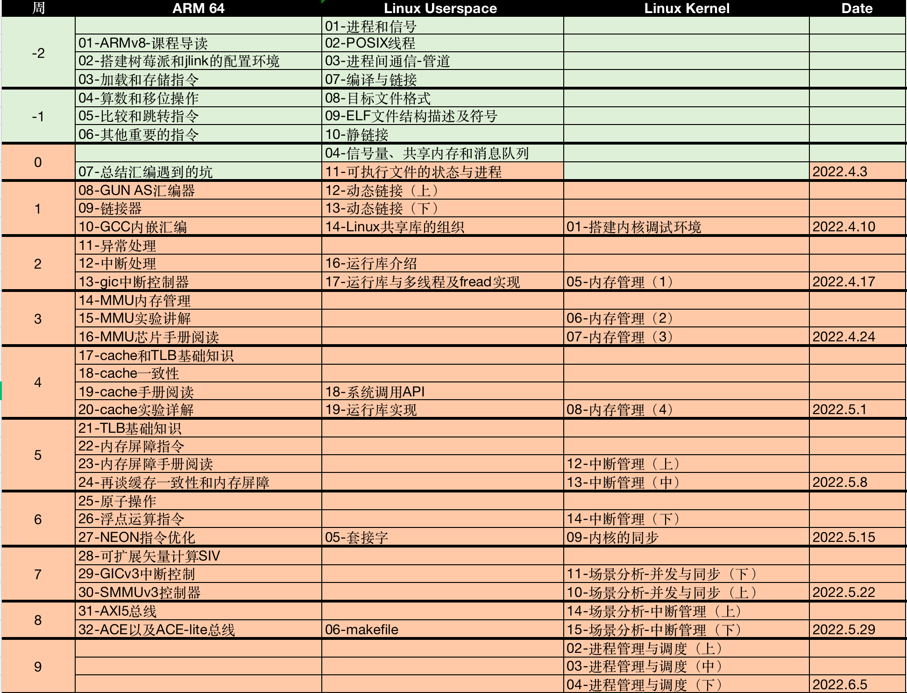

# 2022 SP Promotion

## 1 plan and scope

时间2月中旬-6月中旬，学习scope需要包含以下内容，任务跟进使用Git Project管理。

* ARM64 : https://github.com/users/carloscn/projects/2
* Linux kernel: https://github.com/users/carloscn/projects/4
* Compiler linker: https://github.com/users/carloscn/projects/3

## 2 weekly summary

### 04月11日-04月17日

这周进入到内嵌汇编、ARM的异常处理的介绍还有linux的共享库，进度并不多，ARM的异常处理十分复杂，调试的时候经常遇到问题，所以并没有太多的进展。下周进MMU有点费劲，能把GIC中断和运行库搞定就不错了！

### 04月04 - 04月10日

这周生了场病，发烧十分难受，只完成了一部分。下周需要补齐该部分。

### 03月28 - 04月03日

这周主要是工作交接，所以在study-2022计划上没有投入7天的精力，算上工作摸鱼的时间差不多4天整的时间投入。这周有把关于Linux Userspace的程序放在嵌入式系统里面做，分别选择cortex-A7的armv7指令集的单核的，还有Cortex-A53的armv8指令集多核程序，相当于对比MAC-OS的Lang，还有Ubuntu，还有arm-linux-gcc。上周打通了MACBOOK开发嵌入式的全部场景仅限于bare-mental，可是arm编译linux程序还是不可以，挂虚拟机真的很烦。

#### 本周总结：

##### [ARM64]

* 总结：汇编遇到的坑[done]

##### [Linux Userspace]

* Linux进程通信机制-信号量[done]
* Linux进程通信机制-共享内存[done]
* Linux进程消息队列(System V IPC) [done]
* 可执行文件的状态与进程

##### [Embedded]

* 搭建了Cortex-A7的单核嵌入式开发环境。
* 搭建了Cortex-A53的多核嵌入式开发环境。

#### 下周计划：

ARM64的常用汇编指令算是section 1了。Linux Userspace的部分也进入到了尾声，socket部分暂时往后放一放。Linux ELF关注重点也转移到动态链接的部分，正好和ARM64即将进入到链接器有很大的关联性，而且Linux ELF中也有涉及一些关于内存管理方面的知识，算是为ARM64第三部分（MMU+CACHE）打一些基础。下周重点关注Linux ELF的动态链接 + ARM64的各种链接器。

##### [ARM64]

* GNU-AS汇编器
* ARM64链接器
* GCC内嵌汇编

##### [Linux ELF]

* 动态链接
* Linux共享库的组织
* 栈与调用惯例及Linux进程堆惯例

#####  [Embedded]

* Git工程整理

### 03月18 - 03月27日

总体上本周收获不小，而且非常惊叹的是，linux elf居然和ARM64的指令集互相联系和交应起来，加深了知识的理解。下周是在ARM中国工作的最后一周，有一些交接工作事宜，没有办法全身心的投入学习，下周安排任务比较轻松，能输出两课时就行。**建议下周关于Linux Userspace的程序放在嵌入式系统里面去做，host的linux可能和embedded的Linux不太一样，现象不一样，（ARMv7-32bits）**

#### 本周总结：

##### [ARM64]

* 指令集，学习完毕运算指令集
* 指令集，学习完毕跳转和比较还有返回指令集
* 指令集，其他一些重要的指令集

##### [Linux Userspace]

* ELF-静态链接
* Linux-多线程与同步
* Linux-进程通信之管道

#####  [Embedded]

* 在MACBOOK上搭建ARMv8架构的arm开发环境

#### 下周计划：

##### [ARM64]

* 总结：汇编遇到的坑

##### [Linux Userspace]

* Linux进程通信机制-信号量、共享内存和消息队列(System V IPC)

#####  [Embedded]

* Git工程整理

