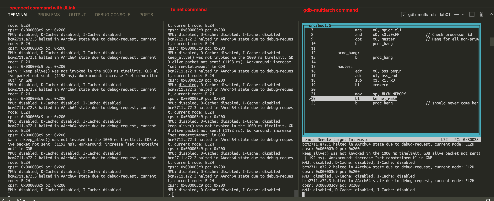

# Starting with JLink debugger (ARMv8)

* Debugger: JLink V11
* Target Hardware: raspberry 4b
* Host: Ubuntu 20.04-amd64

Note, the openocd installed by `sudo apt-get install openocd` is not work on ubuntu 20.04. The error prompted `Error: invalid command name "dap"`. So you shall compile the openocd by yourself. Please refer to the link  https://hackaday.io/page/4991-compiling-openocd-from-source-on-ubuntu-1604. (Though it is targetting for ubuntu 16.04, the 20.04 still follow these build steps.)

## 1. The Brief

We should use the three command terminals to launch the Jlink debugger. They are openocd/telnet/gbd-multiarch separately. 



On the openocd command line, should type the cmd is:

```bash
sudo openocd -f jlink.cfg -f raspi4.cfg
```

On the telnet command line, should type the cmds are:

```bash
telnet localhost 4444
> halt
> load_image /home/carlos/work/uncleben/armv8_trainning/lab01/benos.bin 0x80000
> step 0x80000
```

On the gdb command line, should ytpe the cmds are:

```bash
gdb-multiarch --tui benos.elf
> target remote localhost:3333
> b ldr_start
> c
> n
> layout regs
```

